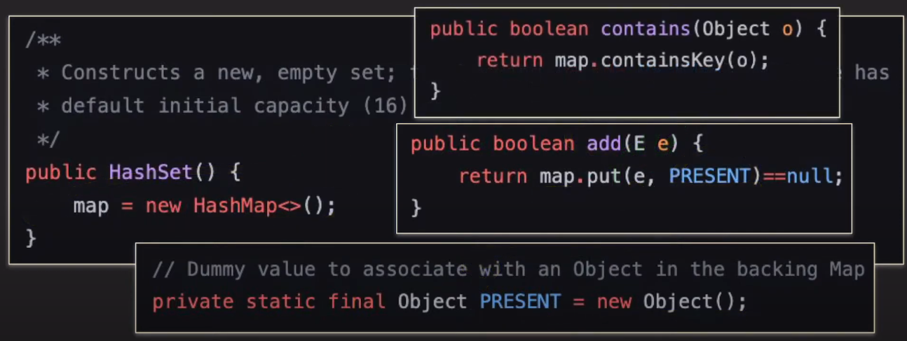
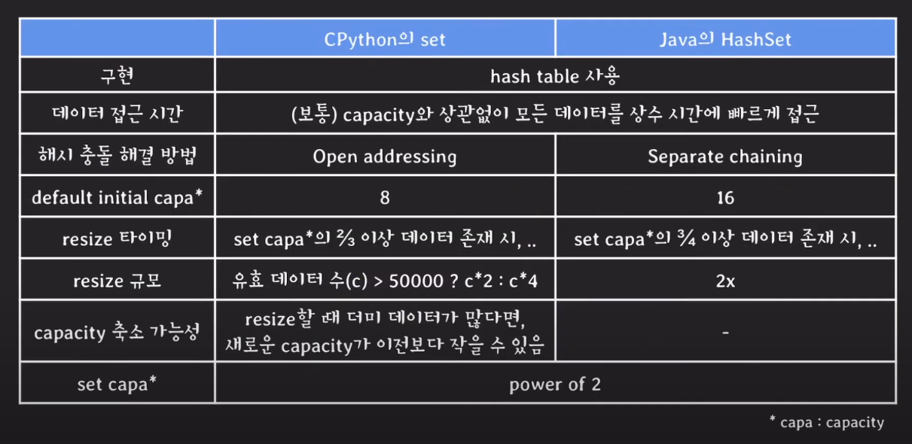
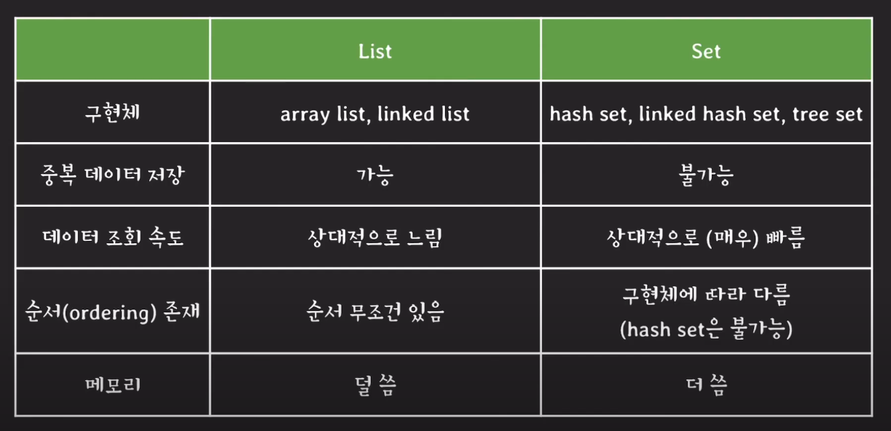

### Set

- 데이터를 저장하는 추상 자료형 (ADT)
- 순서를 보장하지 않음
- 데이터의 중복을 허용하지 않음
- 데이터 조회가 List 보다 빠름

### HashSet

`Hash Table` 을 사용해 구현한 Set

- HashSet은 내부적으로 HashMap을 이용해서 구현
- map에 (key, empty Object) 형태로 삽입
- 조회할 때는 map의 key 값을 조회하는 형태

##### CPython vs Java

### Set vs List

순서가 상관 없고 주어진 데이터에 중복이 없다면 데이터를 순회하며 조회할 때는 Set과 List 중 아무거나 사용해도 되는가?

> **list가 메모리도 적게쓰고 구현 특성상 list가 단순하여 iteration이 더 빠르기 때문에 list, array list를 사용하는 것을 추천**

