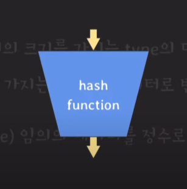
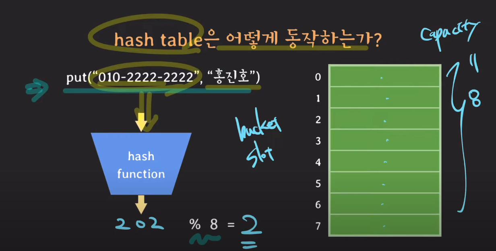
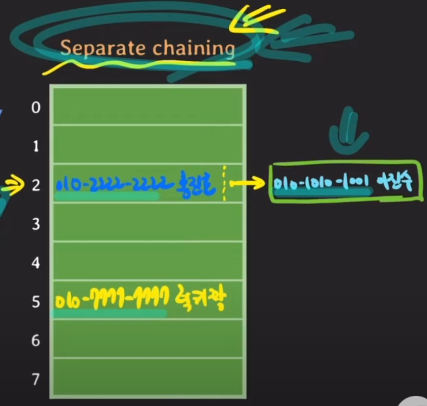
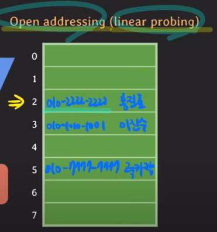
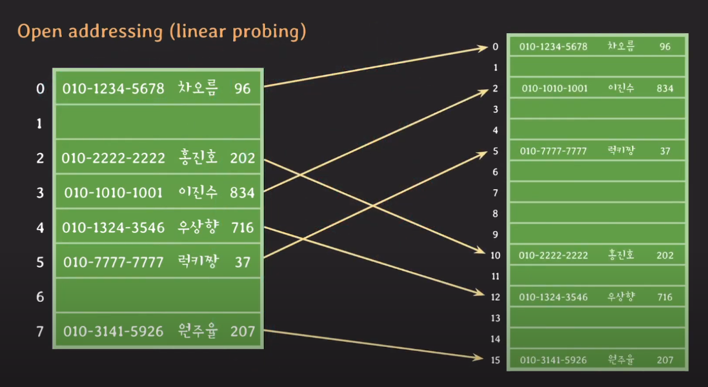
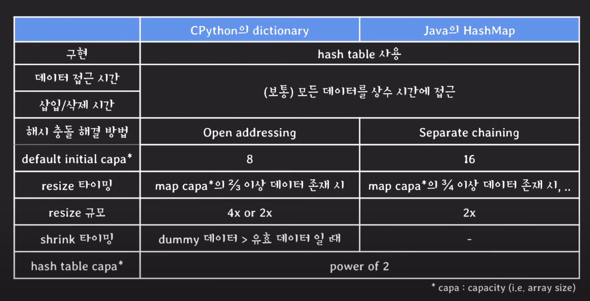

# Hash Table

배열과 해시 함수를 사용해 map을 구현한 자료구조이다.

일반적으로 상수 시간으로 데이터에 접근하기 때문에 빠르다는 장점이 있다.

#### Hash function

- 임의의 크기를 가지는 type의 데이터를 고정된 크기를 가지는 type의 데이터로 변환하는 함수

- hash table에서는 임의의 데이터를 `정수`로 변환하는 함수이다. (`input` -> `hash`)

#### Hash table 동작 과정

- `capacity` : hash table의 크기
- `bucket`, `slot` : hash table의 각 칸

1. `(key, value)` 형태의 데이터를 hash table에 삽입한다.
2. key 값을 `hash function`을 사용해 hash 값을 도출한다.
3. hash 값을 `capacity` 값으로 모듈러 연산을 한다. 이 값이 hash table의 `index` 값이 된다.
4. hash table에는 `key, value, hash` 값이 삽입된다.

### Hash Collision

key 값의 hash 값이 같거나, hash를 모듈러 연산한 값(index) 값이 같은 경우를 `hash collision`이라 한다.

hash table에서 가리키는 index 값이 같다면 어떤 value를 반환해야하는지 명확하지 않으므로 이 러한 해시 충돌 문제를 해결해야 한다.

##### Seperate Chaining

hash table의 각 bucket을 LinkedList로 관리하는 방법이다.

각 bucket에 key, value, hash 값 외에 다음 노드의 참조를 저장하여 구현할 수 있다.

1. hash table에 데이터를 삽입한다.
2. **삽입 index 값이 2이고 이미 데이터가 존재한다면** key 값을 비교한다.
3. 만약 key 값이 다르다면 bucket의 참조 값을 활용하여 다음 노드 key 값과 비교한다.

##### Open addressing (linear probing)

삽입할 bucket에 데이터가 존재하면**(hash collision이 발생하면)** 다음 bucket에 데이터를 저장하는 방법이다.

 

위 그림에서 `(010-1010-1001, 이진수)` 데이터의 hash function, 모듈러 연산 결과는 2이다. 하지만 hash table의 index가 2인 bucket에 이미 데이터가 존재하므로 그 다음 빈 bucket인 3번 bucket에 데이터가 저장되었다.

- `Open addressing` 방식에서 key 값에 해당하는 bucket에 데이터가 존재하고, 만약 해당 bucket의 key와 조회하는 key의 값이 같지 않다면 그 다음 bucket도 조회하고 비교한다. (**Open addressing 방식에 의해 다음 bucket에 저장되었을 수도 있기 때문**)
- `Open addressing`방식으로 구현된 hash table에서 데이터를 삭제한 경우에는 삭제했다는 표시를 남겨줘야 한다. 
  - 만약 2번 bucket의 데이터를 삭제하고 아무런 표식이 없다면 `(010-1010-1001, 이진수)` 데이터를 조회했을 때 index 값은 2번이고 2번 bucket의 데이터는 빈 값이기 때문에 데이터를 반환할 수 없다. 하지만, **삭제된 표시를 해둔다면 다음 bucket을 조회할 수 있다.**

### hash table resizing

hash table의 bucket에 일정 비율 이상 데이터가 존재하면 hash table의 크기를 resizing 한다.

- Java에서는 3/4, CPython에서는 2/3

1. hash table의 capacity 2배의 새로운 hash table을 준비한다.

2. 각 bucket에 저장된 `hash`를 새로운 capacity (**16**)로 모듈러 연산하여 index를 구하고 데이터를 삽입한다. 

   

