### Anomaly (이상 현상)

- 데이터 모델링에서 가장 중요한 것은 무결성을 보장하는 것
- Anomaly
  - 데이터의 이상 현상
  - `중복`때문에 anomaly가 발생한다. (의도하지 않은 이상 현상 발생 가능)
  - 삽입(Insert), 삭제(Delete), 수정(Update)에서 발생할 수 있다.

### 1정규형 (1NF)

- 모든 속성은 반드시 하나의 값을 가져야 한다.
- 값이라는 것은 원자성을 가져야 한다. 즉, 더 이상 쪼갤 수 없는 하나의 값만을 가져야 한다.
  - 다가 속성 x
  - 복합 속성 x

##### 1정규화 대상

- 다가 속성이 사용된 릴레이션 
  - 한 컬럼에 값이 여러 개 -> 풀어서 보면 pk가 중복된다.
  - 문제를 해결하기 위해 중복되는 부분을 따로 테이블로 분리
- 복합 속성이 사용된 릴레이션
  - 성명을 예시로 들면 `성, 이름` 으로 나눌 수 있음.
  - 비즈니스에서 나눌 필요가 있다면 나누는 것이 좋고, 아니면 굳이 나눠서 사용할 필요 없다.
  - 즉, 필요한 경우만 복합 속성을 테이블로 분리
- 유사한 속성이 반복된 릴레이션
- 중첩 릴레이션

- 동일 속성이 여러 릴레이션에 사용되는 경우

### 2정규형 (2NF)

- 두 개 이상으로 구성된 PK에서 발생
- R의 모든 속성이 후보 식별자 전체에 종속
- 일반 속성이 후보 식별자 전체에 종속되지 않고, 일부에 종속된다면 2정규형이 아니다.
- 따라서, 2정규형이기 위해서는 모든 비 식별자 속성은 후보 식별자 속성에 완전 함수 종속되어야 한다.

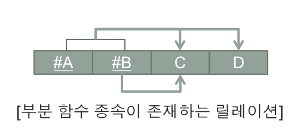

2정규형이기 위해서는 `A,B` pk쌍이 결정 되었을 때 C와 D가 결정되어야 한다. **만약, B만 결정되어도 C가 결정되는 관계라면 이는 2정규화 대상이 된다.**

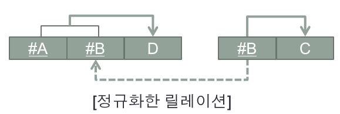

B를 pk로 가지는 새로운 마스터 테이블을 생성하고 C와 관계를 정의한다. 그 후, 원래 테이블에서 B의 pk를 fk로 가지고 `1:M`의 관계를 맺는다.

##### 예시

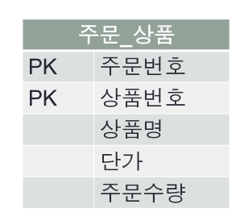

- **식별자인** `상품번호`가 결정되면 일반 속성인 `상품명, 단가`가 결정된다. 이는 2정규형을 위반한다.
- 따라서, `상품번호`를 pk로하고 필드에 `상품명, 단가` 필드가 있는 테이블을 따로 관리해야 한다.

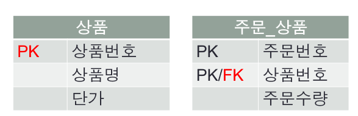

### 3정규형 (3NF)

- **식별자가 아닌** 일반 속성 간에는 종속성이 존재하지 않는다.
- 3정규형의 대상이 되는 속성을 이행 종속 속성이라고 한다.

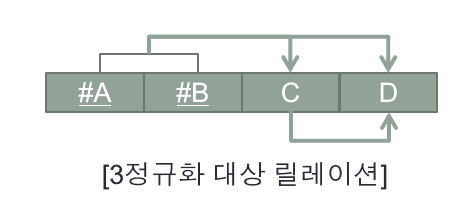

`A,B` pk 쌍이 결정되면 C, D가 결정되어야 한다. 하지만, C가 결정되었을 때 D가 결정된다면 이는 3정규화 대상이다.

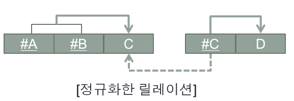

C를 pk로하는 새로운 마스터 테이블을 생성하고 D와의 관계를 정의한다. 그리고 원래 테이블에 C의 pk를 fk로 갖는 관계를 정의하고, `1:M`관계를 맺는다.

##### 예시

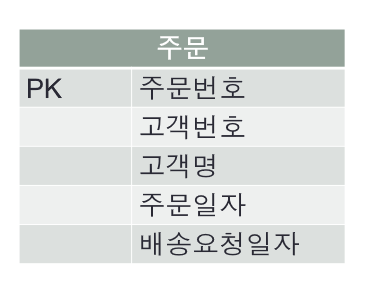

- 위 테이블에서 일반 속성인 `고객 번호`가 결정되면 `고객명`이 결정된다. 이는 3 정규형을 위반한다. 따라서, 고객 테이블을 분리해서 관리해야 한다.

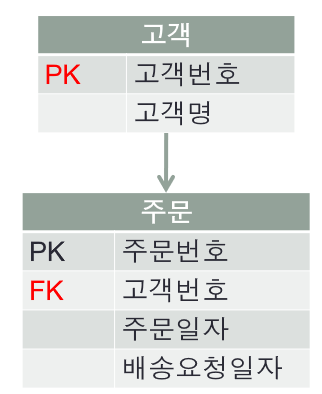

### BC정규형 (BCNF)

- 릴레이션에 존재하는 종속자는 후보 식별자가 아니어야 한다.

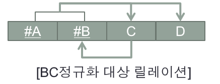

- `A,B`를 pk로 가지는 테이블에서 `A,B` pk 쌍이 결정되면 C, D가 결정된다.
- 이 때, C가 결정되면 B가 결정되는 경우 BC 정규형을 위반한다. 즉, C를 pk로 하고 B를 필드로 갖는 테이블을 따로 독립시켜 관리해야 한다.

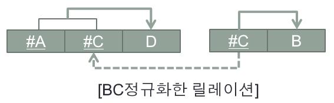

- **그리고 원래 테이블에서 C의 pk를 fk로 참조한다.**

##### 예시

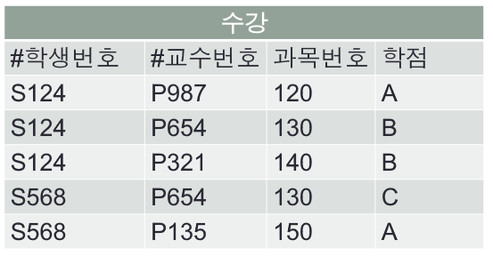

- `학생번호, 교수번호`를 pk 쌍으로 가지는 테이블이다. 겉으로 보기에는 아무 문제 없어 보인다.
- 하지만, `수강`이라는 관계는 `학생`, `과목` 사이의 비즈니스 테이블이다. 따라서, `학생번호`, `과목번호`가 결정되면 일반 속성들이 결정되고, `과목번호`가 결정되면 `교수번호`가 결정된다.
- 따라서, 과목 테이블을 따로 빼서 `과목번호`를 pk로, `교수번호`를 1:1로 매핑한다. 그리고, 수강 테이블에 과목번호를 fk로 참조해서 pk쌍을 이룬다.

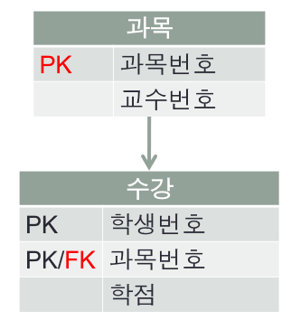

### 역정규화

- 정규화는 중복을 없애기 위해 하는 행위

- **역정규화는 효율을 위해 정규화된 결과의 일부를 수정해서 중복을 허용하는 행위**
  - 정규화되지 않은 상태에서 중복을 허용하는 것과는 다르다.
  - 대부분 JOIN 시 발생되는 엄청난 계산량을 해결하기 위해 사용

##### 예시

만약 A 테이블에 pk와, K라는 필드가 있다고 가정하고, B라는 테이블에서 pk, A의 fk를 pk 쌍으로 가진다고 가정해보자.

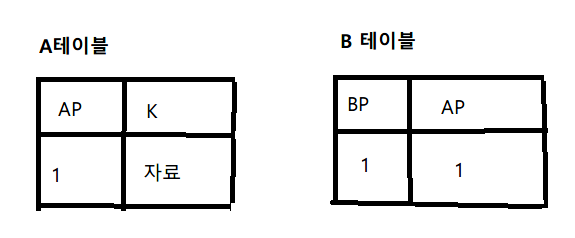

B 테이블에서 A의 pk가 fk로 존재하는 이유는 A 테이블에 있는 필드를 사용하기 위해서다. 즉, 위와 같은 관계에서는 B 테이블의 fk에 해당하는 A테이블의 K 필드를 사용하기 위해서이다.

**만약, 위와 같은 상황에서 A,B 테이블에 데이터 수가 매우 많고, B 테이블에서 필드 K를 빈번하게 사용한다면??** 

매번 A 테이블과 JOIN을 해서 엄청난 양의 계산을 수행해서 결과를 반환해야 한다. 이러한 문제를 해결하기 위해 정규화를 포기하고 중복을 허용함으로써 효율을 개선할 수 있다.

위와 같은 상황에서 기존에 `B테이블`에 `B의 pk, A의 pk`만 존재한다면 JOIN 성능을 개선하기 위해 아래와 같이 `B테이블`에 `B의 pk, A의 pk, A의 pk에 해당하는 K`가 존재하도록 해서 `2정규형에 위배`되지만 K를 가져오기 위해 JOIN 할 필요가 없어지므로 성능을 개선할 수 있다.

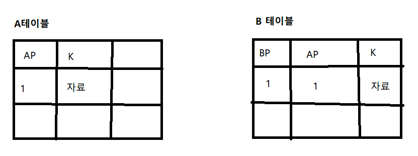