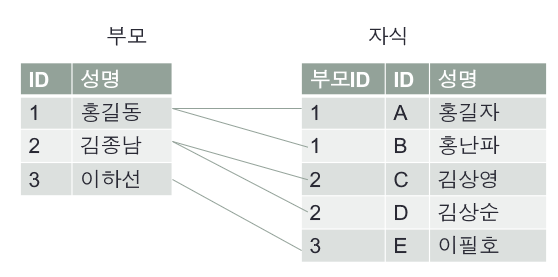
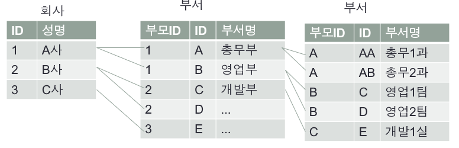
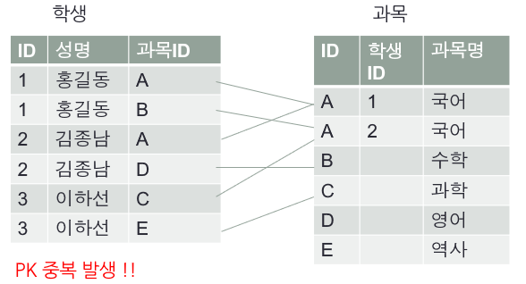
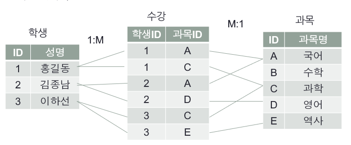
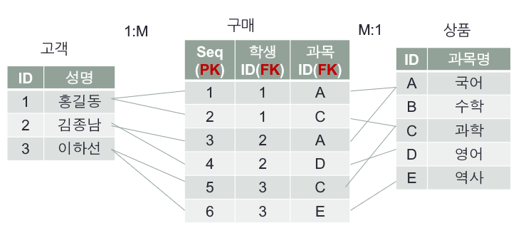
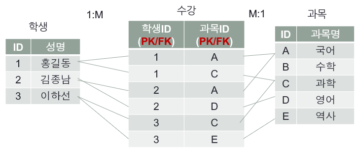
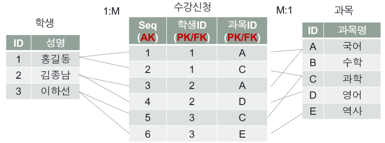

### 1 : M 관계



- 1쪽이 부모, M 쪽이 자식 관계이다.
- 자식 테이블 fk컬럼에 부모 테이블 pk가 들어간다.

- 부모 자식 관계, 컴퓨터 디렉터리 구조 등이 있다.
- **테이블은 서로 선천적으로 관계를 가지고 있다.**


### 1 : M 재귀적 관계



- 같은 테이블에 pk, fk가 모두 존재하는 경우
  - fk는 자기 자신 테이블에 존재하는 pk

- 하위 부서를 부서 테이블 필드에 추가한다면 하위 부서는 여러 개이므로 여러 개의 상위 부서의 pk가 중복된다.
- 상위 부서를 부서 테이블 필드에 추가한다면 상위 부서 pk를 fk로 관리할 수 있다.


### M : N 관계

- 관계를 가진 양쪽 당사자 모두에서 1 : M 관계가 존재할 때 나타난다.
- 이 관계는 선천적으로는 테이블과 테이블의 관계가 없다. 각 테이블은 스스로 존재하고 있다. 
- 이들 사이에 어떤 관계를 맺어 줌으로써 관계가 형성된다. (비즈니스 관계)
- `학생과 과목 관계` : 학생은 여러 개의 과목을 수강할 수 있고, 과목 입장에서는 여러 명의 학생이 과목을 선택할 수 있다.
- `고객과 상품 관계` : 고객은 여러 개의 상품을 주문할 수 있고, 상품은 여러 명의 고객이 선택할 수 있다.


##### 기존 테이블에서 M:N 관계 풀기



- M:N 관계는 두 개의 테이블 입장에서 모두 `1:M` 관계를 갖기 때문에 `pk 중복`이 발생한다.

- 이 문제를 해결하기 위해 관계 테이블이 추가로 필요하다.


##### M:N 관계 테이블



- 학생과 과목의 관계를 수강 테이블에 매핑한다.
- 즉, 수강 테이블에는 학생의 pk, 과목의 pk를 매핑해서 테이블을 관리한다.


1. **관계 테이블의 독립형 PK**



- M:N 관계에서 관계 테이블에 독립적으로 PK를 사용하는 모델
- 테이블의 PK는 유일해야 한다는 조건만 만족한다면, 학생, 과목 필드의 데이터는 중복될 수 있다.
- 즉 pk, 학생ID, 과목 ID -> `1, 1, A`가 존재한다면 `2, 1, A`는 존재할 수 있다.
- 고객과 상품 관계에서 생각해보면 A라는 고객이 B라는 상품을 두 번 구매할 수 있으므로 이러한 모델을 사용해야 한다.


2. **관계 테이블의 상속형 PK**



- 관계 테이블에서 관리하는 fk의 쌍을 pk로 관리하는 모델
- 수강 테이블의 필드 각각은 fk이다. 하지만, 학생ID, 과목ID를 묶어서 생각하면 pk이다.
- 따라서, 테이블의 pk는 유일해야 하므로 중복이 발생하면 안된다.
- 즉, 학생ID, 과목ID -> `1, A`가 존재한다면 `1, A`는 다시 존재할 수 없다. 즉 1번 학생은 A라는 과목을 중복 수강할 수 없다.


3. **관계 테이블 독립형 PK (Alternate Key 사용)**



- 관계 테이블 상속형 pk 모델을 사용하면 where 문에 모든 fk를 직접 작성해서 해당 record를 찾아야 한다.
  - `select * from 수강 where 학생Id = '1' and 과목 Id = 'c' and f3 = '2' and f4 = 'k' and f5 = 'ttt'`
- 이는 너무 비효율적이기 때문에 unique, not null 조건을 만족하는 seq 필드를 추가해서 pk를 관리하면 된다.


```
독립형 pk와 상속형 pk 모델은 비즈니스 모델에 맞게 선택하면 된다.
```

