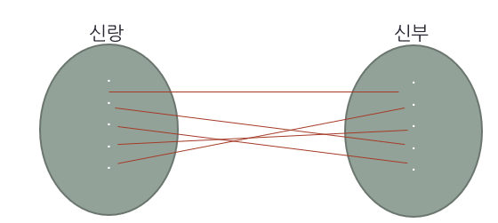
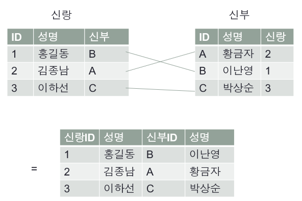
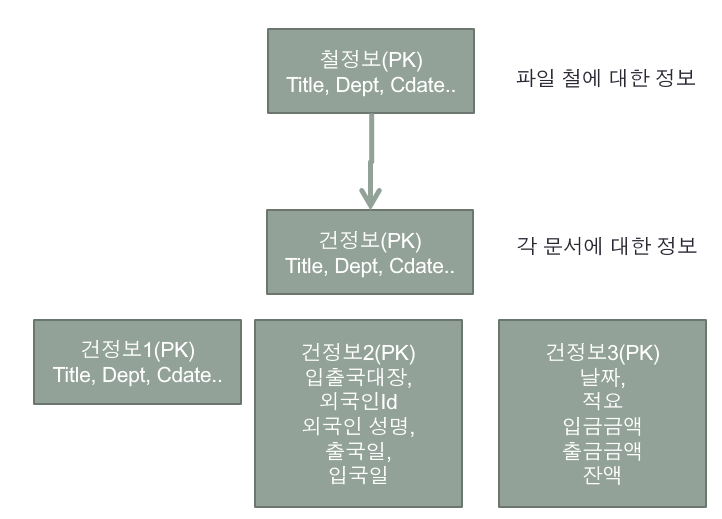
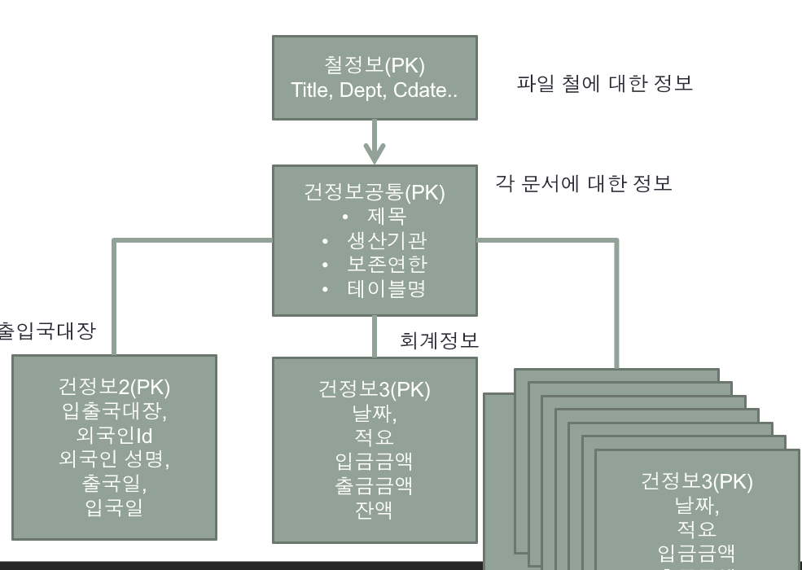

### 1 : M 관계


- 1쪽이 부모, M 쪽이 자식 관계이다.
- 자식 테이블 fk컬럼에 부모 테이블 pk가 들어간다.

- 부모 자식 관계, 컴퓨터 디렉터리 구조 등이 있다.
- **테이블은 서로 선천적으로 관계를 가지고 있다.**


### 1 : M 재귀적 관계


- 같은 테이블에 pk, fk가 모두 존재하는 경우
  - fk는 자기 자신 테이블에 존재하는 pk

- 하위 부서를 부서 테이블 필드에 추가한다면 하위 부서는 여러 개이므로 여러 개의 상위 부서의 pk가 중복된다.
- 상위 부서를 부서 테이블 필드에 추가한다면 상위 부서 pk를 fk로 관리할 수 있다.


### M : N 관계

- 관계를 가진 양쪽 당사자 모두에서 1 : M 관계가 존재할 때 나타난다.
- 이 관계는 선천적으로는 테이블과 테이블의 관계가 없다. 각 테이블은 스스로 존재하고 있다. 
- 이들 사이에 어떤 관계를 맺어 줌으로써 관계가 형성된다. (**비즈니스 관계**)
- `학생과 과목 관계` : 학생은 여러 개의 과목을 수강할 수 있고, 과목 입장에서는 여러 명의 학생이 과목을 선택할 수 있다.
- `고객과 상품 관계` : 고객은 여러 개의 상품을 주문할 수 있고, 상품은 여러 명의 고객이 선택할 수 있다.


##### 기존 테이블에서 M:N 관계 풀기


- M:N 관계는 두 개의 테이블 입장에서 모두 `1:M` 관계를 갖기 때문에 `pk 중복`이 발생한다.

- 이 문제를 해결하기 위해 관계 테이블이 추가로 필요하다.


##### M:N 관계 테이블


- 학생과 과목의 관계를 수강 테이블에 매핑한다.
- 즉, 수강 테이블에는 학생의 pk, 과목의 pk를 매핑해서 테이블을 관리한다.


1. **관계 테이블의 독립형 PK**


- M:N 관계에서 관계 테이블에 독립적으로 PK를 사용하는 모델
- 테이블의 PK는 유일해야 한다는 조건만 만족한다면, 학생, 과목 필드의 데이터는 중복될 수 있다.
- 즉 pk, 학생ID, 과목 ID -> `1, 1, A`가 존재한다면 `2, 1, A`는 존재할 수 있다.
- 고객과 상품 관계에서 생각해보면 A라는 고객이 B라는 상품을 두 번 구매할 수 있으므로 이러한 모델을 사용해야 한다.


2. **관계 테이블의 상속형 PK**


- 관계 테이블에서 관리하는 fk의 쌍을 pk로 관리하는 모델
- 수강 테이블의 필드 각각은 fk이다. 하지만, 학생ID, 과목ID를 묶어서 생각하면 pk이다.
- 따라서, 테이블의 pk는 유일해야 하므로 중복이 발생하면 안된다.
- 즉, 학생ID, 과목ID -> `1, A`가 존재한다면 `1, A`는 다시 존재할 수 없다. 즉 1번 학생은 A라는 과목을 중복 수강할 수 없다.


3. **관계 테이블 독립형 PK (Alternate Key 사용)**


- 관계 테이블 상속형 pk 모델을 사용하면 where 문에 모든 fk를 직접 작성해서 해당 record를 찾아야 한다.
  - `select * from 수강 where 학생Id = '1' and 과목 Id = 'c' and f3 = '2' and f4 = 'k' and f5 = 'ttt'`
- 이는 너무 비효율적이기 때문에 unique, not null 조건을 만족하는 seq 필드를 추가해서 pk를 관리하면 된다.


```
독립형 pk와 상속형 pk 모델은 비즈니스 모델에 맞게 선택하면 된다.
```


### 1 : 1 관계

- 1:1 관계란 어느 쪽 당사자의 입장에서 상대를 보더라도 반드시 단 하나씩 관계를 가지는 것



- 1:1 관계는 개념 상 하나로 합쳐도 전혀 문제가 없다.




- **하지만 1:1 관계를 맺고 있는 A, B는 따로 테이블을 분리해서 관리하는 것이 유리하다.**
  - 만약, 통합으로 관리한다면 A의 정보만 필요한 관계, B의 정보만 필요한 관계에서 필요 없는 데이터도 가져가는 문제를 야기할 수 있다.
  - 또한, 관계 수가 적으면 통합 관리 테이블의 필드 수가 적어서 관리하는 데 어려움이 없지만, 관계가 늘어나면 늘어날수록 관리가 어려워질 것이다.


##### 예시


문서들은 파일철로 관리되고, 파일철 안에는 다양한 형식을 가진 여러 건의 문서에 대한 정보가 있다. 



위와 같은 정보를 어떻게 관리하면 효율적으로 관리할 수 있을까?


##### 하나의 테이블로 통합 관리

모든 건 정보의 필드를 `건정보` 테이블 하나로 관리한다. 즉, 필요한 필드에만 데이터를 삽입해서 관리하는 방법이다.

하지만, 이 방법은 건 정보의 형식이 늘어나면 필드가 추가되고, 관리해야 할 필드가 증가하므로 **올바른 방법이 아니다.**


##### 공통 부분을 묶고 pk와 테이블 명으로 관리



- 건정보에 공통으로 포함되는 필드를 하나의 테이블로 빼고, 각 문서의 형식 별로 테이블을 두는 방법이다.

- `건정보공통` 테이블에 테이블 명이 존재하고, 이 테이블 명을 이용해 join 해서 데이터를 가져올 수 있다.

  - 예를들어, 건정보공통 테이블의 pk가 1인 record의 `테이블명` 컬럼의 값이 `출입국대장`이라면 이 record에서 관리하는 문서는 출입국 대장 **테이블**의 pk가 1인 데이터이다.
  - 즉, `건정보공통` 테이블의 pk와 `출입국대장` 테이블의 pk를 같게 하여 공통 데이터는 따로 관리하고, 출입국 대장에서만 필요한 데이터는 출입국 대장 테이블에서 따로 관리한다.

  

### 기준 테이블

A라는 테블에서 B라는 기준 테이블을 참조하면 해당 컬럼의 **도메인을 제한할 수 있다.**


##### 기준 테이블 미사용

고객 테이블에 Id, 이름, 성별 컬럼이 있다고 가정하면 아래와 같은 구조가 나온다.

- `고객 테이블`
  - Id(int)
  - 이름(varchar)
  - 성별(varchar)

여기서 성별이라는 컬럼에는 남, 여, 남성, 여성, male, female과 같이 다양한 값이 들어갈 수 있다. 즉, 도메인에 대한 제약이 없다.


##### 기준 테이블 사용

- **`고객 테이블`**
  - Id(int)
  - 이름(varchar)
  - 성별(tinyint, fk)
- **`성별 테이블 (기준 테이블)`**
  - Id(bit)
  - 성별(varchar)

이와 같이 `성별 테이블`에 `true, 남자`, `false, 여자` 라는 데이터를 넣어놓고 고객 테이블에서 이를 참조하면 고객 테이블의 성별의 도메인이 `남자, 여자`로 제한된다. -> fk로 성별 테이블의 pk를 사용하기 때문

이런 관계는 여러 군데에서 사용될 수 있다. `책, 카테고리` , `고객, 성별`, `상품, 분류` 등등
