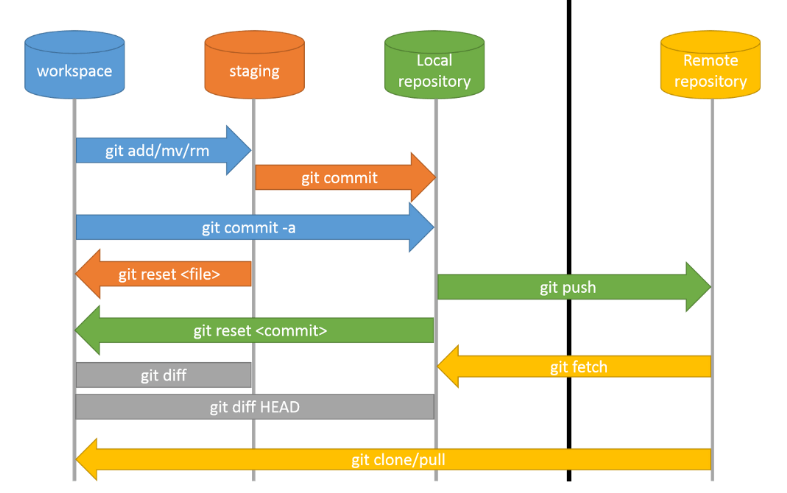

- #### work space

  - 현재 프로젝트 작업하는 공간

- #### staging 

  - commit 될 목록들이 저장되는 공간
  - `git add` 된 변경 사항이 있는 파일들이 저장되는 공간

- #### Local repository

  - `git commit` 커맨드로 staging area의 변경사항을 확정짓고 commit ID를 생성한다.
  - commit이 되면 Local Repository에 저장된다.

- #### remote repository

  - remote repository에 local repository의 변경사항(commit ID)을 업로드
    - `git push origin main/master`
  - remote repository의 변경사항을 local repository에 다운로드
    - `git pull`

### git 커맨드

#### git add

git add `파일명 or .` 은 변경 사항이 존재하는 파일을 staging area에 올리는 작업이다.

#### git commit

git commit 커맨드는 staging area에 있는 변경사항을 확정짓고 `commit ID`를 생성한다.

각 변경사항은 commit ID로 구분되고 local repository에 커밋 이력을 생성한다.

`git commit -m "커밋 메시지 타이틀"`

`git commit -m "메시지 타이틀" -m "메시지 내용"`

`git commit -am "add와 commit 동시에"` : add, commit을 동시에 진행

#### git push

git push는 local repository에 존재하는 각 변경사항(commit ID)을 원격 repository의 브랜치에 업로드한다.

- `git push origin main/master --force` : 충돌을 무시하고 강제로 push

#### git log

local repository의 commit 이력을 조회한다.

- `HEAD` : 내가 현재 속한 브랜치, commit
- `origin/master` : local repository에 존재하는 원격 repository의 commit 

- `git log --oneline` : git log를 `커밋ID 커밋메시지` 형식으로 간결하게 표현
- `git log --graph` : git log를 graph 형태로 조회
- `git log --all` : 전체 커밋 이력 조회

#### git checkout

특정 commit ID 또는 브랜치로 전환하는 커맨드

- `git checkout 커밋ID`
- `git checkout 브랜치명`

#### git fetch

원격 repository의 변경사항을 local repository로 가져오되 병합은 하지 않는 것.

즉, local repository에 원격 repository의 커밋 이력은 존재하지만 코드는 병합되지 않는다.

#### git merge

local repository의 브랜치와 원격 repository의 브랜치를 병합하는 행위

코드가 합쳐진다. -> 충돌 발생 가능

#### git pull

원격 repository의 변경사항을 local로 내려받는 행위(working directory까지 반영된다.)

- ##### git pull = git fetch + git merge

- `git pull origin 브랜치명`

#### git diff

변경사항을 확인하는 커맨드

- `git diff commit1ID commit2ID`
- `git diff 브랜치1 브랜치2`

#### git reset

git 작업을 취소하는 커맨드. commit 이후의 작업을 취소한다.

- `git reset head~1`, `git reset head^` : 가장 최근 commit을 reset한다. 해당 commit의 변경 사항은 모두 **unstaged** 상태로 변경된다.
  - staging 상태에 있는 변경 사항도 unstaged 상태로 변경할 수 있다.
- `git reset --soft head~1` : 가장 최근 commit을 staging area까지만 취소한다. 즉, 해당 commit의 변경 사항은 **staged** 상태로 변경된다.

#### git revert

원격 repository로 push 이후에 취소할 때 사용하는 커맨드. commit 내역 자체가 사라지지는 않는다. 즉, 중요 정보를 포함해서 git push를 했을 경우 커밋 이력에는 정보가 남아있으므로 **중요 정보 자체를 변경하는 것이 바람직하다.**

- `git revert 되돌릴 커밋ID`

- git revert 후 `git push`를 해서 원격 repository에 반영

#### git stash

git stash는 working directory의 변경사항을 임시 저장할 때 사용한다. 충돌 상황에서 많이 사용된다.

스택구조로 변경 사항을 저장한다.

- `git stash` : 변경사항을 stack에 저장
- `git stash pop` : 임시저장한 최신 작업 목록 꺼내기
- `git stash apply index번호` : 임시저장한 목록은 그대로 놔둔채 특정 index의 변경사항을 적용
- `git stash show -p index번호` : 임시저장한 작업 내용 조회
- `git stash list` : 임시저장한 작업 목록 조회
- `git stash clear` : 임시저장한 작업 목록 모두 삭제

원격 repo와 로컬 repo의 내용이 달라 git push에서 충돌이 발생했을 때 git stash로 작업하던 내용을 임시저장하고 git pull -> git stash pop -> merge -> push

#### git tag

버전을 명시할 때 사용한다. 마지막 커밋을 대상으로 tag를 설정한다.

- `git tag 버전`
- `git tag -a v1.0 -m "1.주요사항A 2.주요사항B"`
  - tag에 메시지 기록
- `git push origin 버전` 
  - tag release 배포
  - commit, push와 상관없이 태그를 별도로 push
- `git tag` : 태그 목록 조회