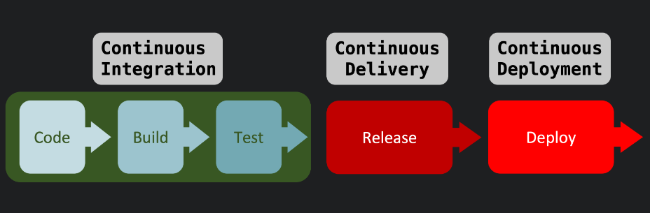

### CI/CD

CI/CD는 애플리케이션 개발 단계부터 배포 단계까지 모든 단계를 자동화해서 좀 더 효율적이고 빠르게 사용자에게 배포할 수 있도록 하는 것을 말한다.


### CI (Continuous Integration)

`CI (Continuous Integration)`은 **`지속적인 통합`**이라는 의미이다.

애플리케이션의 버그 수정이나 새로운 코드 변경이 주기적으로 빌드 및 테스트되면서 공유되는 레포지토리에 통합(merge)되는 것을 의미한다.


##### 코드 변경 사항을 주기적으로 빈번하게 merge

```markdown
1. 개발자들이 계속 github 등 관리 시스템에 통합한다.
2. 통합한 코드가 제대로 동작하는지 빌드 및 테스트를 진행한다.
3. 문제가 발생하면 다음에 해야 할 목록에 정리해두고 차후에 버그를 해결한다.
```

##### 

##### 통합 단계의 자동화

```markdown
위 과정은 매 번 build, test 해야하는 과정이 귀찮고, 사람이 할 필요가 없는 작업이다.
따라서, 개발자는 github에 코드만 올리고 나머지 작업(build, test 등)은 프로그램이 자동으로 해주는 방식

1. 위와 동일하게 개발자들은 형상관리 툴에 작업한 코드를 통합한다.
2. 빌드 및 테스트는 자동으로 진행되므로 버그가 발생하면 버그를 확인해서 해결한다.
```


##### CI 장점

- 코드 검증에 들어가는 시간이 줄어든다.
- 개발 편의성이 증가한다.
- 항상 테스트 코드를 통과한 코드만 레포지토리에 올라가기 때문에, 좋은 코드 퀄리티를 유지할 수 있다.


### CD (Continuous Delivery)

`CD(Continuous Delivery) `는 `지속적인 제공`, `Continuous Deployment`, `지속적인 배포`라는 의미가 있다.

CI에서 build 되고 test 된 후에, 배포 단계에서 release 할 준비 단계를 거치고 문제가 없는지 검증한다. 그 후, 문제가 없다면 배포를 **수동적**으로 하는 것이 `Continuous Delivery` 이다.

또한, 위와 같이 배포할 준비가 되면 **자동화**를 통해 배포를 진행하는 것을 `Continuous Deployment` 이다.


##### CD 적용 후 흐름

```
1. CI를 적용해 코드를 검증한다.
2. 배포 환경과 비슷한 곳에서 검증을 진행한다.
3. 검증된 소프트웨어를 실제 프로덕션 환경으로 배포한다.
```


##### CD 장점

- 개발자는 배포보다 개발에 더욱 신경 쓸 수 있도록 도와준다.
- 개발자가 원클릭으로 수작업 없이 빌드, 테스트, 배포까지의 과정을 자동화할 수 있다.

