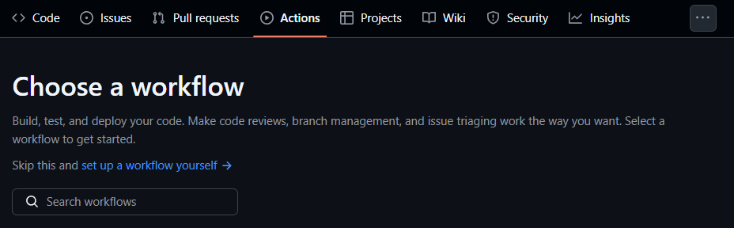
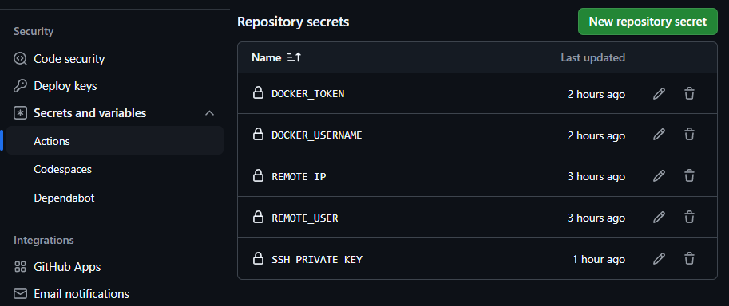

# Github Actions 배포 자동화

### 기존 배포 과정

##### git repository

```markdown
nginx
ㄴdefault.conf
server1
ㄴspringboot
ㄴDockerfile
server2
ㄴspringboot
ㄴDockerfile
docker-compose.yml
```

하나의 repository 안에서 nginx 설정 파일, `server1`, `server2` 스프링부트 애플리케이션을 모두 관리했다. 이 repository를 ec2 환경에 `git clone`하고 repository 폴더에서 `docker-compose up --build -d` 명령어로 docker-compose를 실행시켜서 배포했다.


##### 문제

- **프리티어 EC2 환경에서 서버 2개를 빌드하기에 서버 메모리가 부족했다.**
  - 로컬에서 빌드한 파일을 git repository에 올려서 사용해야 했다.
    - build 파일이 외부에 노출된다.
- **간단한 수정사항을 고치는데도 큰 비용이 발생한다. (귀찮다)**
  - 로컬에서 빌드
  - git push
  - EC2 환경 접속
    - 실행 중인 docker 모두 중지, 삭제
    - 다시 `docker-compose up` 명령어 실행

이러한 문제를 해결하고자 `git push`를 하면 변경 사항을 반영해 EC2 환경에 배포를 자동화하고자 했다.


### Github Actions

Github Actions는 간단하게 말하면 pr, push 등 어떤 작업이 발생했을 때 빌드, 배포와 같은 특정 작업을 자동으로 수행해주는 기능이다.


##### 목표

Github Actions를 통해 repository에 있는 변경 사항을 감지해서 EC2 환경에 배포하는 것.

Github Actions의 가상머신을 활용해서 빌드, 테스트 등을 작업하기 때문에 `git clone`을 할 필요가 없어짐.

이에 따라 `docker-compose.yml`, `nginx/default.conf` 파일은 미리 EC2 환경에 생성해 놓고 Github Actions 스크립트를 작성해야 함.

- `default.conf`에는 포트포워딩 설정만 있기 때문에 내용을 수정할 필요는 없다.
- `docker-compose.yml` : 이 파일을 실행하면서 server1, server2 이미지를 빌드하고 참조했다. 하지만, 이제 이 작업을 Github Actions의 가상 머신이 대신 해줄 것이기 때문에 image만 참조하는 것으로 변경


##### 요금

public repository는 무료, private repository는 시간에 따라 요금이 발생한다.


##### workflow

위에 말 했듯이 어떤 행위가 발생했을 때, 어떤 행동을 할 것인지를 작성한 것이다.

repository의 Actions 탭에서 작성 가능하다.




##### workflow 예시

```yaml
name: CD 

on:
  push:
    branches:
      - main

jobs:
  build:
    runs-on: ubuntu-latest
    strategy:
      matrix:
        service: [server1, server2]

    steps:
      # 코드 체크아웃
      - name: Checkout repository
        uses: actions/checkout@v3

      # JDK 설치
      - name: Set up JDK 17
        uses: actions/setup-java@v3
        with:
          java-version: '17'
          distribution: 'adopt'
          

      # Gradle Build
      - name: Build with Gradle
        run: |
          cd ${{matrix.service}}
          chmod +x ./gradlew
          ./gradlew clean build

      - name: Login to DockerHub
        uses: docker/login-action@v1
        with:
          username: ${{ secrets.DOCKER_USERNAME }}
          password: ${{ secrets.DOCKER_TOKEN }}

       # Docker 이미지 빌드 및 푸시
      - name: Build and Push Docker Image
        run: |
          cd ${{ matrix.service }}
          docker build -t ${{ secrets.DOCKER_USERNAME }}/${{ matrix.service }}:latest .
          docker push ${{ secrets.DOCKER_USERNAME }}/${{ matrix.service }}:latest

  deploy:
    runs-on: ubuntu-latest
    needs: build

    steps:
      - name: SSH to EC2 and deploy
        uses: appleboy/ssh-action@master
        with:
          host: ${{secrets.REMOTE_IP}}
          username: ${{secrets.REMOTE_USER}}
          key: ${{secrets.SSH_PRIVATE_KEY}}
          script: |
            cd docker-compose-test
            sudo docker-compose stop
            sudo docker-compose rm -f
            sudo docker rmi $(docker images)
            sudo docker-compose up -d
            
```


##### 설명

- `on.push.branches` : 명시한 branch에 push 이벤트가 발생했을 때 이 workflow가 작동한다는 의미

- `jobs` : workflow에서 처리하는 프로세스. 각 단계는 `step`으로 나뉜다.

  - `build` : Spring 프로젝트 빌드, docker 이미지 빌드, 실행
  - `deploy` : EC2에 접속해서 docker-compose 실행
  - `steps` : 하나의 job에서 처리될 작업들. step은 정의한 순서대로 실행된다.
    - `name` : step의 이름이다. 마음대로 작성해도 된다.
    - `uses` : 공유되어 있는 action을 사용하겠다는 의미이다.

- ```yaml
    # 코드 체크아웃
    - name: Checkout repository
      uses: actions/checkout@v3
  
    # JDK 설치
    - name: Set up JDK 17
      uses: actions/setup-java@v3
      with:
        java-version: '17'
        distribution: 'adopt'
  ```

  - `Checkout repository` : 명시한 main 브랜치의 최신 버전을 Github Actions의 가상머신에 가져오는 행위
  - `Set up JDK 17` : Github Actions의 가상머신에 JDK를 설치하는 행위

- ```yaml
    # Gradle Build
    - name: Build with Gradle
      run: |
        cd ${{matrix.service}}
        chmod +x ./gradlew
        ./gradlew clean build
  ```

  - `Build with Gradle` : Gradle로 해당 Spring 프로젝트를 빌드
  - `run` : uses와 달리 실행할 행위를 직접 명시하는 행위 (여기서는 명령어가 차례대로 실행된다.)

- ```yaml
        - name: Login to DockerHub
          uses: docker/login-action@v1
          with:
            username: ${{ secrets.DOCKER_USERNAME }}
            password: ${{ secrets.DOCKER_TOKEN }}
  
         # Docker 이미지 빌드 및 푸시
        - name: Build and Push Docker Image
          run: |
            cd ${{ matrix.service }}
            docker build -t ${{ secrets.DOCKER_USERNAME }}/${{ matrix.service }}:latest .
            docker push ${{ secrets.DOCKER_USERNAME }}/${{ matrix.service }}:latest
  ```

  - `Login to DockerHub` : docker hub에 로그인
    - `username` : username
    - `password` : docker-hub에서 발급받은 `access token`으로 로그인
      - `docker-hub -> accounts settings -> generate access token`
  - `Build and Push Docker Image` : 이미지를 빌드하고 푸시

- ```yaml
    deploy:
      runs-on: ubuntu-latest
      needs: build
  
      steps:
        - name: SSH to EC2 and deploy
          uses: appleboy/ssh-action@master
          with:
            host: ${{secrets.REMOTE_IP}}
            username: ${{secrets.REMOTE_USER}}
            key: ${{secrets.SSH_PRIVATE_KEY}}
            script: |
              cd docker-compose-test
              sudo docker-compose stop
              sudo docker-compose rm -f
              sudo docker rmi $(docker images)
              sudo docker-compose up -d
  ```

  - `runs-on` : 운영환경
  - `needs` : job은 병렬적으로 처리되기 때문에 동기적으로 처리하기 위해서 needs 조건이 필요. -> **build 작업이 선행되어야 deploy 작업이 실행된다.**
  - `SSH to EC2 and deploy` : EC2에 접속하여 docker-compose 실행
    - `host` : EC2의 public ip
    - `username` : aws ec2 linux 환경에서는 `ec2-user`
    - `key` : ssh private key -> 내부 내용 모두 포함해야 함 (시작, 끝 부분도)
    - `script` : 수행할 작업들
      - 미리 만들어놨던 폴더에 접근해서 기존에 실행되던 컨테이너 중지 및 삭제, 이미지 삭제, docker-compose 실행


##### Repository secrets

위 workflow yml 파일에서 `${{secrets.***}}` 형태로 작성된 값들은 레포지토리의 `Settings` - `Secrets and variables` - `Actions` 에서 정의하고 사용할 수 있다. workflow yml 파일은 레포지토리의 `./github/workflows` 에 공개되기 때문에 외부로 유출되면 안되는 민감한 정보는 여기에 작성하고 사용하자.




### 회고

- 혼자 개발하다 보니 pr 행위가 발생했을 때 테스트 할 CI 작업 workflow를 작성하지 않았다. 다음에 꼭 해보고 적용해보기
- Repository secrets에 SSH_PRIVATE_KEY를 작성할 때 처음과 끝 부분을 제외한 암호화 부분으로만 정의해서 ssh 접속이 거부됨. **모두 다 복사해야 한다.**
- `docker-compose.yml` 파일과 nginx의 `default.conf` 파일은 ec2 환경에 미리 만들어 놓는게 최선일까? 고민해보기
  - 이 파일들을 수정해야한다면 ec2 환경에 접근해서 수정해야하는 불편함이 있음


### 정리

Github Actions로 workflow만 작성하면 쉽게 배포를 자동화할 수 있다.
