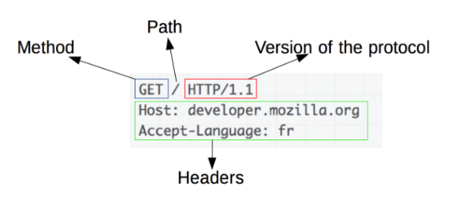
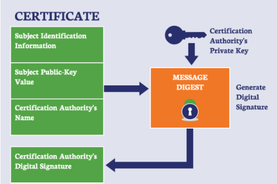

### HTTP (Hyper Text Transfer Protocol)

##### HTTP란?

서버/클라이언트 모델을 따라 데이터를 주고 받기 위한 프로토콜

즉, HTTP는 인터넷에서 하이퍼텍스트를 교환하기 위한 **통신 규약**으로, `80번 포트`를 사용하고 있다. 따라서, HTTP  서버가 80번 포트에서 요청을 기다리고, 클라이언트는 80번 포트로 요청을 보낸다.

##### HTTP 구조

HTTP는 애플리케이션 레벨의 프로토콜로 TCP/IP 위에서 작동한다. HTTP는 Stateless 프로토콜이며 Method, Path, Version, Headers, Body 등으로 구성된다.

##### 문제

HTTP는 암호화가 되지 않은 평문 데이터를 전송하는 프로토콜이기 때문에, HTTP로 중요한 정보를 주고 받으면 제3자가 정보를 조회할 수 있다. 이러한 문제를 해결하기 위해 HTTPS가 등장했다.

### HTTPS (Hyper Text Transfer Protocol Secure)

##### HTTPS란?

HTTPS는 HTTP에 데이터 암호화가 추가된 프로토콜이다. HTTPS는 443 포트를 사용하며, 네트워크 상에서 중간에 제3자가 정보를 볼 수 없도록 암호화를 지원한다.

##### 대칭키 암호화와 비대칭키 암호화

HTTPS는 대칭키 암호화 방식과 비대칭키 암호화 방식을 모두 사용하고 있다. 

- 대칭키 암호화
  - 클라이언트와 서버가 동일한 키를 사용해 암호화/복호화를 진행함
  - 키가 노출되면 매우 위험하지만 연산 속도가 빠르다.
- 비대칭키 암호화
  - 1개의 쌍으로 구성된 공개키와 개인키를 암호화/복호화 하는데 사용함
  - 키가 노출되어도 비교적 안전하지만 연산 속도가 느림
  - `공개키 암호화` : 공개키로 암호화하면 개인키로만 복호화할 수 있다. -> 나만 볼 수 있다.
  - `개인키 암호화` : 개인키로 암호화하면 공개키로 복호화 할 수 있다. -> 내가 인증한 정보임을 알려 신뢰성을 보장할 수 있다.

##### HTTPS 동작 과정

HTTPS는 **대칭키 암호화와 비대칭키 암호화를 모두 사용**해 빠른 연산 속도와 안정성을 모두 얻고 있다.

HTTPS 연결 과정(Hand-Shaking)에서는 먼저 서버와 클라이언트 간에 세션키를 교환한다. 여기서 세션키는 주고 받는 데이터를 암호화하기 위해 사용되는 대칭키이며, 데이터 간의 교환에는 빠른 연산 속도가 필요하므로 세션키는 대칭키로 만들어진다.

문제는 이 세션키를 클라이언트와 서버가 어떻게 교환할 것이냐 인데, 이 과정에서 비대칭키가 사용된다.

즉, 처음 연결을 성립해 안전하게 세션키를 공유하는 과정에서 비대칭키가 사용되는 것이고, 이후에 데이터를 교환하는 과정에서 빠른 연산 속도를 위해 대칭키가 사용되는 것이다.

##### HTTPS 통신 흐름

1. 애플리케이션 서버를 만드는 기업은 HTTPS를 적용하기 위해 공개키와 개인키를 만든다.
2. 신뢰할 수 있는 CA 기업을 선택하고, 공개키 관리 계약을 한다.
   - `CA (Certificate Authority)` : 공개키를 저장해주는 신뢰성이 검증된 민간 기업
3. 계약이 완료된 CA 기업은 `기업 이름`, `A서버 공개키`, `공개키 암호화 방법`을 담은 인증서를 만들고, 해당 인증서를 CA 기업의 **개인키**로 암호화해서 A서버에 제공
4. A서버는 암호화된 인증서를 갖게됨. 이제 A서버는 A서버의 공개키로 암호화되지 않은 HTTPS 요청이 오면, 암호화된 인증서를 클라이언트에게 전달
5. 클라이언트가 index.html을 주라고 A 서버에 요청했다고 가정하면, HTTPS 요청이 아니기 때문에 인증서를 받게 됨.
   - CA 기업의 공개키는 브라우저가 이미 알고있음. (신뢰할 수 있는 기업으로 등록되어있기 때문에 브라우저가 인증서를 탐색하여 해독 가능)
   - 즉, 클라이언트는 CA 기업의 공개키를 가지고 있음
6. 브라우저는 CA 기업의 공개키로 인증서를 해독하고 A 서버 공개키 획득
7. 클라이언트와 A 서버가 Hand-Shaking 과정에서 주고받은 난수를 조합해 `pre-master-key(대칭키)`를 생성한 뒤, A 서버의 공개키로 해당 대칭키를 암호화해서 서버로 보냄
8. A 서버는 자신의 개인키로 복호화해서 대칭키를 획득
9. 이후 클라이언트-서버 사이의 통신을 할 때 주고 받는 메세지는 이 대칭키를 이용해서 암호화, 복호화를 진행

단, **HTTPS도 무조건 안전한 것은 아니다**. (신뢰받는 CA 기업의 인증서가 아닌 자체 인증서를 발급한 경우 등)

이때는 HTTPS지만 브라우저에서 `주의 요망`, `안전하지 않은 사이트`와 같은 알림으로 주의를 준다.

