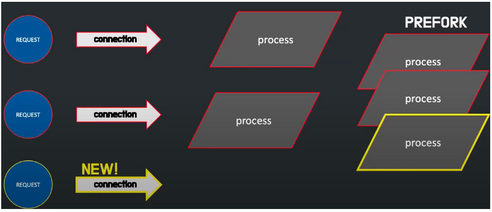
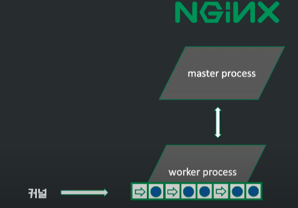
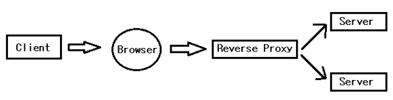

### Nginx

- apache와 같은 web server

- apache는 connection이 생길 때 마다 프로세스를 생성
  - **`prefork`** : 미리 프로세스를 만들어놓고 응답에 반응
  - **`C10K`** : connection이 늘어나면서 메모리 부족 현상 발생
  - 많은 프로세스가 context switching -> cpu 부하 증가
  - 즉, apache 구조가 수 많은 동시 connection을 처리하기에 구조가 부적합 -> **nginx 탄생**

- **초기에는 nginx를 apache 앞에 배치해서 수 많은 동시 connection을 처리**
  - client의 정적 파일 요청은 nginx, 동적 파일 요청은 apache가 수행
- **nginx는 하나의 master process를 가지고 다수의 worker process를 가진다.**
  - master process는 설정 파일을 읽고 worker process를 생성
  - worker process는 queue 방식으로 event를 **비동기**로 처리한다. -> worker process가 쉬지 않고 작업
    - worker process가 생성될 때 listen 소켓 할당
    - listen 소켓으로 event 수신
    - `event` : connection 연결, 요청 응답
  - worker process는 일반적으로 cpu core 수 만큼 존재한다.
  - queue에 할당된 event가 시간이 오래 걸리는 작업이면 따로 thread pool에 할당해서 처리

### Nginx 장단점

##### 장점

- `자원의 효율적인 사용` : worker process로 단일 thread를 사용해 자원 효율성을 보장
- `동시 요청 처리` : 여러 요청을 비동기적인 이벤트 기반으로 처리
- `강력한 설정` : Nginx의 설정 파일 구문은 간단하고 유연해서 사용자가 서버 동작을 세밀하게 제어할 수 있다.
- `커뮤니티 및 지원` : 방대한 커뮤니티와 다양한 문서, 자료, 지원 제공

##### 단점

- 기본적으로 동적 컨텐츠를 처리할 수 없다.
- 동적 컨텐츠를 처리하기 위해서는외부 자원과 연계가 불가피하다.

### Nginx 활용처

##### 리버스 프록시(Reverse Proxy)

클라이언트 요청을 대신 받아 내부 서버로 전달해주는 것. 내부  서버 정보를 client에 숨길 수 있다. (캡슐화)

##### 로드 밸런싱(Load Balancing)

하나의 서버에서 받는 요청을 여러 대의 서버가 분산 처리할 수 있도록 요청을 나누어 성능, 확장성 및 신뢰성 향상

##### 캐싱(Caching)

클라이언트가 요청한 내용을 캐싱하여 같은 요청이 오면 캐시에 저장된 내용을 전송해 전송 시간을 절약할 수 있고 불필요한 외부 전송을 막을 수 있다.