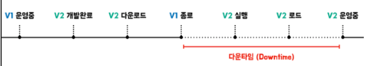
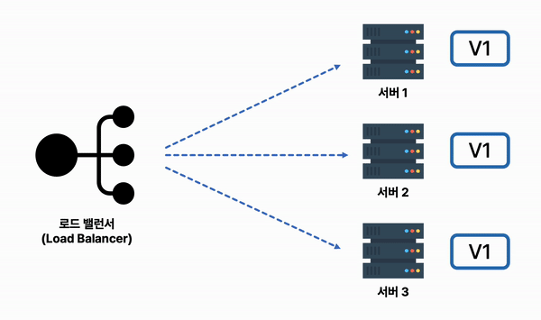
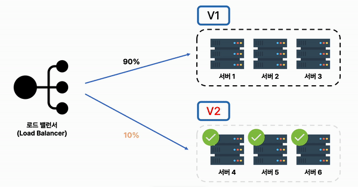
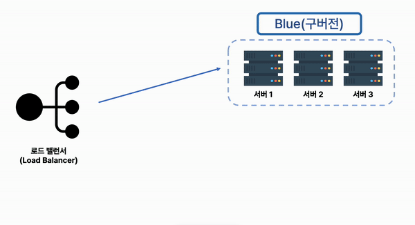

### 무중단 배포란?

말 그대로 서비스의 중단 없이 새로운 버전의 소프트웨어를 배포하는 것을 말한다.

배포 자동화와는 다른 개념이다. 배포 자동화는 말 그대로 배포를 자동화하는 것이고 무중단 배포는 신버전을 배포할 때 발생하는 `downtime`을 없애는 것이다.


##### downtime

새로운 버전을 배포하기 위해서는 다음과 같은 과정이 필요하다.

1. 기존 서비스를 종료한다.
2. 새로운 서비스를 시작한다.




```markdown
배포 자동화를 한 내 토이 프로젝트의 downtime은 약 30초로 측정됐다. 이는 사용자가 30초 동안 서비스를 이용하지 못하고 내가 사용자라도 이 서비스를 사용하지 않을 것이다. 따라서, 이 문제를 해결하고자 무중단 배포를 학습
```


### 무중단 배포 방식

무중단 배포에는 `Rolling`, `Blue/Green`, `Canary` 방식이 존재한다.


#### Rolling

Rolling 방식은 **구버전으로 실행중인 서버들을 점진적으로 신버전으로 교체**하는 방식이다.

구버전으로 실행중인 서버들을 신버전으로 배포한 후 트래픽을 향하게 하는 방식

##### 


##### 장점

- 서버별로 배포를 진행하기 때문에 문제 발생 시 롤백이 간편하다.
- 별도의 추가 자원이 필요하지 않다.

##### 단점

- 서비스 도중 하나의 서버로 향하는 트래픽을 멈추고, 다른 서버에게 향하도록 하기 때문에 다른 서버의 트래픽이 증가한다.
  - 따라서, 전체 트래픽의 양과 각 서버가 부담할 수 있는 트래픽을 잘 판단해서 진행해야 한다.
- 신버전으로 교체하는 과정에서 서비스에 신버전, 구버전이 공존하기 때문에 균일한 서비스를 제공하지 못한다. `서비스 간 충돌이 발생할 수 있다.`


#### Canary

Canary 방식은 **신버전 서버와 구버전 서버를 정해두고, 신버전 배포 시 구버전으로 향하던 트래픽을 점차적으로 신버전 서버로 향하도록 하는 방법**이다.

신버전을 운영 서비스에 배포해보고 조금씩 테스트 해보면서 점차 트래픽을 늘려가는 방법



##### 장점

- 서비스에 신버전과 구버전이 공존하기 때문에 서로 다른 버전에서 보이는 사용자의 반응을 테스트하는 A/B 테스트에 용이하다.
  - `A/B 테스트` : **두 가지 콘텐츠를 비교해 방문자/뷰어가 더 높은 관심을 보이는 버전을 확인하는 테스트**
- 신버전에 대한 트래픽을 점진적으로 늘리기 때문에 신버전 운영의 문제에 빠르게 대처할 수 있다.

##### 단점

- 롤링 방식과 마찬가지로 신버전과 구버전이 공존하기 때문에 균일한 서비스를 제공하지 못한다.


#### Blue/Green 방식

Blue/Green 방식은 점진적 배포였던 Rolling, Canary 배포와 달리 **모든 트래픽을 한번에 신버전으로 향하게 하는 무중단 배포 방식**이다.

기존 구버전 서버 운영 중에 신버전 서버를 배포하고, 배포가 완료되면 해당 신버전 서버로 모든 트래픽을 향하게 하고 구버전 서버는 종료하는 방식



##### 장점

- 트래픽을 한번에 신버전으로 변경하기 대문에 운영하는 서비스에 구버전과 신버전이 공존하지 않음
- 구버전 서버가 그대로 남아있기 때문에 롤백이 간편하다.

##### 단점

- 구버전 신버전별로 서버가 다르게 나뉘기 때문에 기존 자원의 2배가 필요하다.