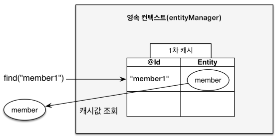
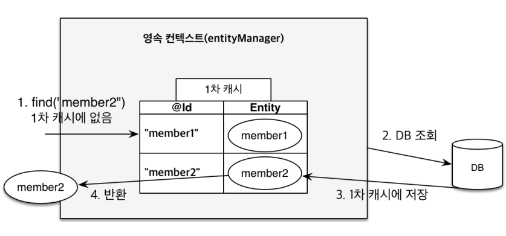
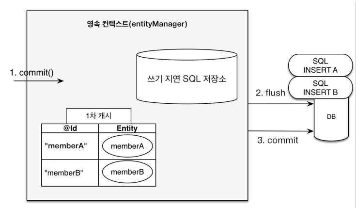
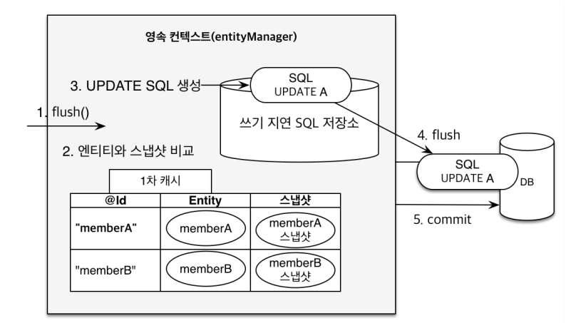

### 영속화

비영속 상태의 객체를 `EntityManager`를 사용해서 영속화 하면 즉시 데이터베이스에 쿼리를 날리는 것이 아니라 **영속 컨텍스트의 1차 캐시에 저장**된다.

```java
// 비영속 상태
Member member = new Member();
member.setId("member1");
member.setName("hello");

// 영속화, 1차 캐시에 저장
em.persist(member);
```




### Entity 조회

```java
Member findMember = em.find(Member.class, "member2");
```

EntityManager는 데이터베이스에 select 쿼리를 바로 날리는 것이 아니라 우선 1차 캐시에서 데이터를 찾는다. 만약, 해당 데이터가 1차 캐시에 존재하면 데이터 베이스에 쿼리를 날리지 않고 영속화된 인스턴스를 바로 반환하고, 1차 캐시에 존재하지 않으면 데이터베이스에 쿼리를 전송해서 응답 받은 결과를 1차 캐시에 저장한다.



### 동일성 보장

```java
Member a = em.find(Member.class, "member1");
Member b = em.find(Member.class, "member1");
System.out.println(a==b) // true
```

- 엔티티를 1차 캐시에서 관리하기 때문에 동일성을 보장한다.
  - `a` : Member 데이터를 DB에서 조회해서 1차 캐시에 저장하고 인스턴스 반환
  - `b` : 1차 캐시에서 Member 인스턴스 조회 후 반환
  - 따라서 a,b 는 동일하다.
- DB가 아닌 애플리케이션 수준에서 **REPEATABLE READ** 등급의 트랜잭션 격리 수준을 제공한다.


### 쓰기 지연

```java
EntityTransaction tx = em.getTransaction();

tx.begin(); // 트랜잭션 시작

em.persist(memberA);
em.persist(memberB);

tx.commit();
```



- `em.persist()`는 DB에 즉시 쓰기 쿼리를 날리지 않는다. 1차 캐시에 영속화 하고 쿼리를 쓰기 지연 SQL에 저장한다.
- `tx.commit()` 즉, 트랜잭션을 커밋할 때 쓰기 지연 저장소에 저장해놨던 SQL들을 DB에 전달한다.


### 변경 감지 (Dirty Checking)

```java
tx.begin();

// 영속 엔티티 조회
Member memberA = em.find(Member.class, "memberA");

// 엔티티 수정
memberA.setUsername("HI");
memberA.setAge(10);

// em.update(memberA); 필요?
tx.commit();
```



- 1차 캐시에는 엔티티가 영속화 될 때 처음 상태 `스냅샷`이 함께 저장된다.
- 트랜잭션 커밋 시점에 엔티티와 스냅샷을 비교한다.
- 만약 변경 사항이 있으면 쿼리를 생성해서 쓰기 지연 SQL 저장소에 저장하고 순서대로 DB에 전달하고 커밋한다.


### flush

영속성 컨텍스트의 변경 내용을 데이터베이스에 반영(**동기화**)하는 작업.

##### 작업

- 변경 감지
- 수정된 엔티티 쓰기 지연 SQL 저장소에 등록

- 쓰기 지연 SQL 저장소의 쿼리를 DB에 전송
- `flush != commit` 이므로 flush가 호출된다고 영속성 컨텍스트가 비워지는 것은 아니다.


##### 방법

`em.flush() ` : 직접 호출

`transaction commit` : 플러시 자동 호출

`JPQL 쿼리 실행` : 플러시 자동 호출


### 영속 상태, 준영속 상태

- `영속 상태` : 영속 컨텍스트가 관리하는 상태
- `준영속 상태` : 영속 컨텍스트가 관리하지 않는 상태
  - 영속성 컨텍스트가 제공하는 기능을 사용하지 못한다.
  - em.detach()
  - em.close()
  - em.clear()