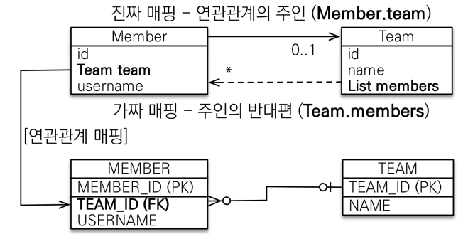
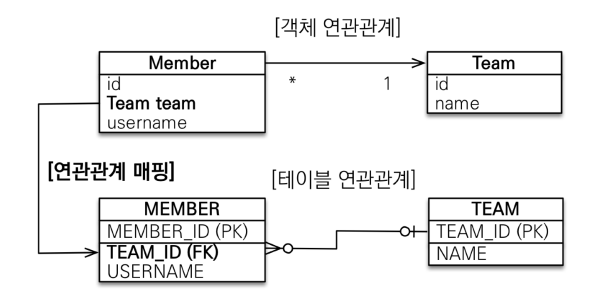
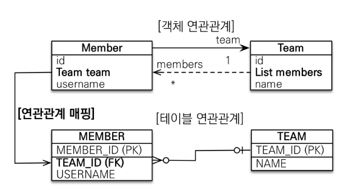
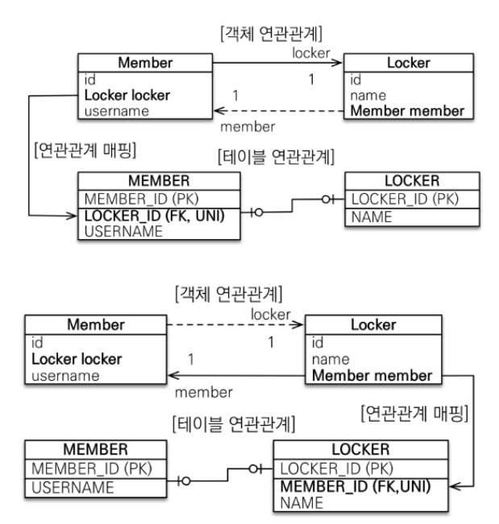
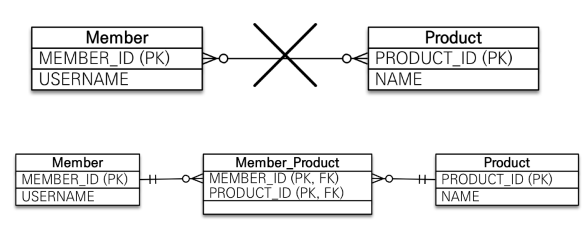
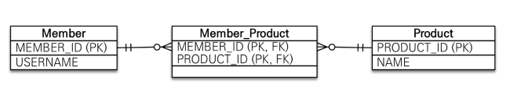
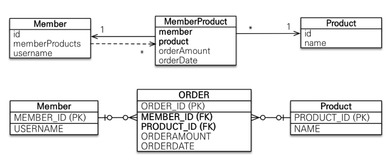

### @JoinColumn

차후에 설명할 연관관계 주인에서 fk가 해당 테이블에서 어떻게 저장될지를 정해주는 애노테이션이다.

```java
public class Member {
    
    @ManyToOne
    @JoinColumn(name = "team_id")
    private Team team;
}
```

기존에는 ManyToOne 관계로 설정될 컬럼을 지정해주는 것인지 알았다. 즉, Member의 team 필드에 매핑될 컬럼이 team 테이블의  `team_id` 이다. 라고 생각했다. 하지만 **이게 아니다.**


`@JoinColumn` 의 `name`옵션은 단순히 Team 테이블의 fk가 Member 테이블의 어떤 컬럼에 저장될지 나타내는 것이다. 즉, fk가 저장될 column 명을 지정하는 것이다.

그럼 Member의 team 필드는 어떤 테이블과 연관관계를 맺는지 어떻게 알까? `필드에 선언된 타입`에 의해 연관관계 테이블이 결정된다. 그럼 테이블의 pk는 어떻게 자동으로 fk로 결정되는 것인가??

그 이유는 `@JoinColumn`의 `referencedColumnName` 옵션을 생략하면 해당 테이블의 pk를 외래 키로 지정하기 때문이다.

- `referencedColumnName` : 외래 키가 참조하는 대상 테이블의 컬럼명


### 연관관계 주인

- DB는 외래키 하나로 테이블을 조인해서 Member의 팀과, 팀의 멤버들을 모두 조회할 수 있다.
- 객체는 참조를 이용하기 때문에 각각 참조 값이 존재해야 한다.
- 따라서, Member의 Team 참조 값을 변경하면 DB에 적용할지, Team의 memebers 값을 변경하면 DB에 적용해야할지 애매하다.
- 쉽게 생각해서 DB 입장에서 생각해보면 외래키는 항상 1:N 관계에서 N쪽에 존재한다.
- 연관 관계를 바꾸기 위해서는 외래키를 변경해야 한다. 따라서, 외래키를 가지고 있는 N쪽이 연관관계의 주인이다.
- 연관관계 주인의 데이터를 변경해줘야 DB에 적용된다. -> Team의 members에 member를 추가해도 DB에 반영되지 않는다.



```java
public class Member {
    //..
    @ManyToOne
    @JoinColumn(name="TEAM_ID")
    Team team;
}

public class Team {
    //..
    @OneToMany(mappedBy = "team") //Member의 team 필드에 의해 매핑되어 있다.
    List<Member> members = new ArrayList<>();
}
```


#### 많이 하는 실수

```java
Team team = new Team();
team.setName("teamA");
em.persist(team);

Member member = new Member();

team.getMembers().add(member); // 역방향
em.persist();
```

위와 같이 실행하면 DB Member 테이블에 `team_id = null` 이다. 즉, DB 외래키가 설정되지 않는다.

-> 위 코드에서 Team은 읽기 전용이다.


### N:1 (다대일)

##### 다대일 단방향



##### 다대일 양방향



```java
// 다대일 단방향
public class Member {
    //..
    
    @ManyToOne
    @JoinColumn(name = "team_id")
    private Team team;
}

// 다대일 양방향일 때 추가 -> 테이블은 수정 x
public Team team {
    //..
    @OneToMany(mappedBy="team")
    private List<Member> members = new ArrayList<>();
}
```

- N쪽 (Member)이 항상 연관관계의 주인이다.


### 1:1 (일대일)

주 테이블, 대상 테이블 중에 어떤 곳에서 외래키를 관리할 지 생각해야 한다.

고객 - 사물함 관계에서 1:1 관계가 성립한다고 하자.

- 고객 테이블에 사물함의 외래키가 들어가는 것
  - 만약 시간이 흘러 한명의 고객이 여러 개의 사물함을 가질 수 있다면? -> `테이블 구조를 변경해야 함`
- 사물함 테이블에 고객의 외래키가 들어가는 것
  - 만약 시간이 흘러 한명의 고객이 여러 개의 사물함을 가질 수 있다면? -> `유니크 제약만 해제하면 됨`

미래를 생각해서 연관관계의 주인을 선택할 수도 있고, 개발 입장에서 선택할 수도 있다. 팀원과 상의해서 trade off 를 잘 처리하면 된다.




### N:M (다대다)

- 관계형 DB는 다대다 관계를 테이블 2개로 표현할 수 없다.
- 연결 테이블을 추가해서 일대다, 다대일 관계로 풀어내야 한다.




##### @ManyToMany

`@ManyToMany`를 사용하면 JoinTable을 생성해서 두 클래스를 매핑해준다. 




아래와 같이 생성되는데 실무에서는 `Member_Product` 테이블에 Member, Product 클래스에 있는 정보 뿐만 아니라, 생성 시간, 수정 시간 등 다양한 데이터도 존재한다. 따라서, `@ManyToMany`를 사용해서 Member, Product 의 정보만 가지고 구상한 테이블은 사용할 수 없다.


##### @OneToMany, @ManyToOne

`@ManyToMany`를 사용했을 때 발생한 문제를 해결하기 위해 `중간 테이블을 엔티티로 승격`시키면 된다.

```java
public class MemberProduct {
    
    @Id @GenerateValue
    private Long id;
    
    @ManyToOne
    @JoinColumn(name = "member_id")
    private Member member;
    
    @ManyToOne
    @JoinColumn(name = "product_id")
    private Product product;
    
    private int orderAmount;
    private LocalDateTime OrderDate;
}
```

중간 테이블을 엔티티로 승격시키고, @ManyToMany 관계를 @OneToMany, @ManyToOne 관계로 풀어서 다양한 정보를 추가할 수 있다.

또한, @ManyToMany를 사용하면 중간 테이블의 기본키가 Member, Product 테이블에 의존하게 되는데 엔티티로 승격시키면 이 문제도 해결 가능하다.


