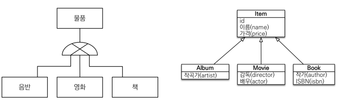
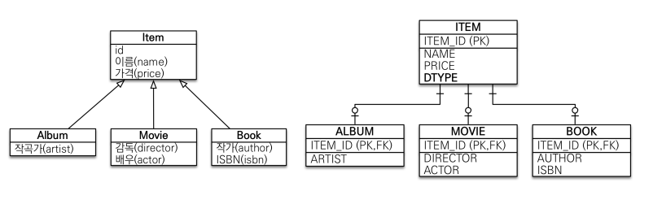
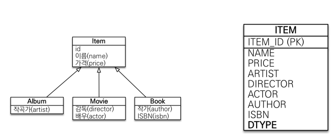
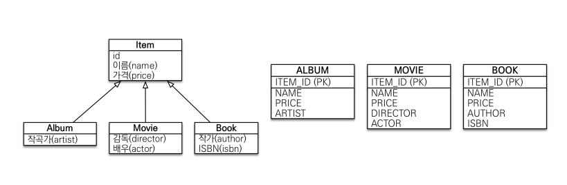

### 상속관계 매핑

- 관계형 DB는 상속 관계가 없다.
- 슈퍼타입 서브타입 관계라는 모델링 기법이 객체 상속과 유사하다.
  



- 슈퍼타입 서브타입 논리 모델을 실제 물리 모델로 구현하는 방법에는 3가지 방법이 있다.
  - 조인 전략
  - 단일 테이블 전략
  - 서브타입 테이블로 변환


#### 조인 전략



```java
@Entity
@Inheritance(strategy = InheritanceType.JOINED)
public class Item {
    //..
}

@Entity
public class Movie extends Item {
    //..
}

@Entity
public class Album extends Item {
    //..
}

@Entity
public class Book extends Item {
    //..
}
```

`@Inheritance` 애노테이션에 구현 전략을 설정해줌으로써 상속 관계 매핑 방법을 변경할 수 있다.

- 자바의 상속 모델과 비슷하다.
- 부모 클래스와, 자식 클래스 모두 테이블로 만들어 fk로 관리하는 방법이다.

- ##### 장점

  - 테이블 정규화
  - 외래 키 참조 무결성 제약조건 활용가능
  - 저장 공간 효율화

- ##### 단점

  - 조회시 조인을 많이 사용한다. 성능 저하가 발생할 수 있다.
  - 조회 쿼리가 복잡하다.
  - 데이터 저장 시 부모 테이블, 자식 테이블에 각각 insert되므로 2번 호출된다.


#### 단일 테이블 전략

- 한 테이블에서 모두 관리하는 방식
- Dtype으로 어떤 엔티티인지 구별
- 자신의 필드가 아닌 속성은 null을 허용해야 한다.



```java
@Entity
@Inheritance(strategy = InheritanceType.SINGLE_TABLE)
public class Item {
    //..
}
```

`@Inheritance(strategy = InheritanceType.SINGLE_TABLE)` 

- ##### 장점

  - 조인이 필요 없어서 일반적으로 조회 성능이 빠르다.
  - 조회 쿼리가 단순하다.

- ##### 단점

  - 자식 엔티티가 매핑한 컬럼은 모두 null 허용
  - 단일 테이블에 모든 것을 저장하므로 테이블이 커질 수 있다. 상황에 따라 조회 성능이 오히려 느려질 수 있다.


#### 구현 클래스마다 테이블 전략



```java
@Inheritance(strategy = TABLE_PER_CLASS)
public abstract class Item {
    //..
}
```

- 부모 클래스에 있는 속성을 모두 자식 테이블로 내리고 구현 클래스마다 테이블을 생성해서 관리
- 애플리케이션에서 Item 타입으로 조회하면 모든 자식 테이블을 union 해서 조회
- **실무에서 사용하지 않음**


### @MappedSuperclass

- 공통 매핑 정보가 필요할 때 사용한다.
- 예를 들어 모든 클래스에 생성 시간, 수정 시간 속성이 필요하다고 가정하면 2개의 필드를 가진 클래스를 만들고, 그 클래스를 상속 받아서 사용한다.

```java
@MappedSuperclass
public class BaseEntity {
    public LocalDateTime createdDate;
    public LocalDateTime lastModifiedDate;
}

public class Item extends BaseEntity {}
```

- 상속 관계 매핑과 관련 없다.
- DB에 BaseEntity 테이블이 생성되는 것이 아니다.
- Item 테이블에 BaseEntity에 있는 필드가 추가된다.

- 직접 생성해서 사용할 일이 없으므로 추상 클래스 권장