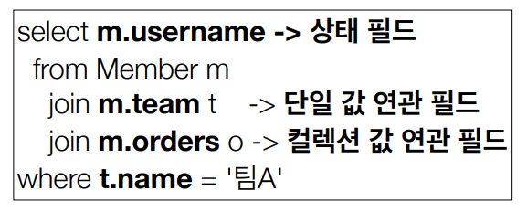
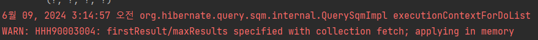
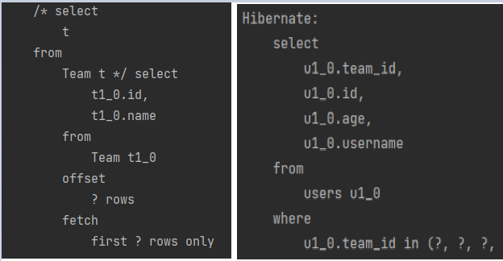

### 경로 표현식




#### 상태 필드

단순히 값을 저장하기 위한 필드


#### 연관 필드

연관 관계를 위한 필드

- `단일 값 연관 필드` : @ManyToOne, @OneToOne, 대상이 **엔티티** (ex : m.team)
- `컬렉션 값 연관 필드` : @OneToMany, @ManyToMany, 대상이 **컬렉션** (ex : m.orders)


#### 경로 표현식 특징

- `상태 필드` : 경로 탐색의 끝. 더 이상 탐색 x

- `단일 값 연관 경로` : 묵시적 내부 조인 (inner join) 발생, 탐색 o

  - ```java
    "select m.team from Member m" -> "select t from Member m inner join m.team t"
    ```

- `컬렉션 값 연관 경로` : 묵시적 내부 조인 발생, 탐색 x

  - from 절에서 명시적 조인을 통해 별칭을 얻으면 별칭을 통해서 탐색 가능

  ```java
  String query = "select m.username from Team t join t.members m";
  ```


### 페치 조인 - fetch join

- SQL 조인 종류가 아니다.
- JPQL에서 성능 최적화를 위해 제공하는 기술
- 연관된 엔티티나 컬렉션을 SQL 한 번에 함께 조회하는 기능

```
// JPQL
select m from Member m join fetch m.team
    
// SQL
SELECT M.*, T.* FROM MEMBER M
INNER JOIN TEAM T ON M.TEAM_ID = T.ID
```


#### 예시

##### 매핑 정보 Member, Team (N : 1)

```java
@Entity
public class Member {
    @ManyToOne(fetch = FetcyType.LAZY)
    @JoinColumn(name = "team_id")
    private Team team;
}

@Entity
public class Team {    
    @OneToMany(mappedBy = "team")
    List<Member> members = new ArrayList<>();
}
```

##### 단순 join

```java

String query = "select m from Merber m";
List<Member> result = em.createQuery(query, Member.class).getResultList();

for (Member member : result) {
    System.out.println(member.getName() + " " + member.getTeam().getName());
}
```

지연 로딩으로 설정했기 때문에 result에 담긴 Member 인스턴스의 Team에는 **프록시 객체**가 들어와있다. 따라서, 실제로 team 인스턴스를 사용할 때 쿼리를 날려 데이터를 가져온다.

만약, 100개의 Member가 모두 다른 team을 가지고 있다면, 쿼리가 100개가 나갈 것이다. **(N+1 문제 발생)**


##### fetch join

```java
String query = "select m from Member m join fetch m.team";
List<Member> result = em.createQuery(query, Member.class).getResultList();

for (Member member : result) {
    System.out.println(member.getName() + " " + member.getTeam().getName());
}
```

fetch join을 사용하면 result에 담길 때 team에 대한 데이터가 모두 바인딩돼서 들어온다. 즉 team 필드에 `즉시 로딩`이 이루어진다. 따라서, `member.getTeam().getName()`에서 실제 team 객체에 접근해도 추가적인 쿼리를 날리지 않는다.


- fetch join을 사용하면 조회된 데이터 크기가 커진다. -> join 하면 N 쪽의 row 수에 따라 데이터 수 변경
- **하이버네이트 6 이전** -> distinct를 사용해서 엔티티 중복을 제거하면 된다.
- **하이버네이트 6 이후** -> distinct가 자동으로 적용돼서 데이터를 조회한다.


### 페치 조인 특징과 한계

- **페치 조인 대상에는 별칭을 줄 수 없다.**
  - 하이버네이트는 가능, 가급적 사용 x
- **둘 이상의 컬렉션은 페치 조인 할 수 없다.**
- **컬렉션을 페치 조인하면 페이징 API (setFirstResult, setMaxResults)를 사용할 수 없다.**
  - 일대일, 다대일 같은 단일 값 연관 필드들은 페치 조인해도 페이징 가능
  - 하이버네이트는 경고 로그를 남기고 메모리에서 페이징(매우 위험)


### @BatchSize

데이터의 컬렉션을 즉시 로딩하기 위해 fetch join을 사용해서 N+1 문제를 해결할 수 있다. 하지만 이 경우에 페이징 API를 사용할 수 없다는 단점이 있다.

`@BatchSize`를 사용해서 N+1 문제를 해결할 수 있다.


#### 예시

팀에 속한 유저 컬렉션을 fetch join으로 조회하고 페이징 API를 사용해보겠다.

```java
String query = "select t from Team t join fetch t.users";
List<Team> result = em.createQuery(query, Team.class)
    .setFirstResult(2)
    .setMaxResults(5)
    .getResultList();
```



`firstResult/maxResult specified with colletion fetch` 에러가 발생하면서 페이징이 되지 않는다. 그 이유는 1:N 관계에서 컬렉션 페치 조인을 할 경우 데이터의 수가 N쪽에 맞춰지기 때문에 `데이터 뻥튀기`가 발생할 수 있다. -> 하이버네이트6 에서는 distinct를 기본 전략으로 사용하지만 여기서도 마찬가지로 페이징 API를 사용할 수 없다.

따라서, 1쪽에서 N쪽의 컬렉션을 조회하기 위해선 `@BatchSize`를 사용해서 해결할 수 있다.


```java
// @BatchSize 설정
public class Team {
    
    @BatchSize(size = 100)
    @OneToMany(mappedBy = "team")
    List<User> users = new ArrayList<>();
}

// 실행 코드
String query = "select t from Team t";
List<Team> result = em.createQuery(query, Team.class)
    .setFirstResult(2)
    .setMaxResults(5)
    .getResultList();
```



- 페이징이 정상적으로 처리됐다.
- `@BatchSize`를 사용하면 설정한 size의 크기의 `IN`쿼리로 연관된 엔티티를 조회한다.
- 기존에 N+1 문제가 발생했다면 `@BatchSize`를 사용함으로써 처음 실행 쿼리 1, IN 쿼리 1 번으로 `1+1` 개의 쿼리로 문제를 해결할 수 있다.


### NamedQuery

- 미리 정의해서 이름을 부여해두고 사용하는 JPQL
- 정적 쿼리
- 어노테이션, XML에 정의
- **애플리케이션 로딩 시점에 초기화 후 재사용**
  - jpql에서 sql로 변환하는 코스트가 발생한다. 하지만, NamedQuery를 사용하면 로딩 시점에 캐시에 저장해놓기 때문에 코스트가 줄어든다.
- **애플리케이션 로딩 시점에 쿼리를 검증**
  - query가 문자열이기 때문에 애플리케이션이 실행은 되지만 오류 메시지가 발생한다.

```java
// 애노테이션 설정
@Entity
@NamedQuery(
    name = "User.findByUsername",
    query = "select u from User u where u.username = :username"
)
public class User {
    //..
}

// 실행
List<User> result = em.createNamedQuery("User.findByUsername", User.class)
    					.setParameter("username", "user1")
    					.getResultList();
```


### 벌크 연산

- 재고가 10개 미만인 모든 상품의 가격을 10% 상승하려면?
- JPA 변경 감지 기능으로 실행하려면 너무 많은 SQL이 실행된다.
  - 재고가 10개 미만인 상품을 리스트로 조회
  - 조회된 상품 엔티티 가격을 10% 증가
  - 트랜잭션 커밋 시점에 변경 감지가 동작
- 변경된 데이터가 100건이라면 100번의 update sql 실행


#### 벌크 연산 예제

- 쿼리 한 번으로 여러 테이블 로우 변경
- executeUpdate()의 결과는 영향 받은 엔티티 수 반환
- update, delete 지원

```java
String query = "update Product p set p.price = p.price*1.1 where p.stockQuantity < 10";
int resultCount = em.createQuery(query).executeUpdate();
```


#### 벌크 연산 주의

- **벌크 연산은 영속성 컨텍스트를 무시하고 DB에 직접 쿼리**
  - 벌크 연산을 먼저 수행한다.
  - 벌크 연산 수행 후 영속성 컨텍스트를 초기화 한다.
    - 애플리케이션의 A 엔티티가 벌크 연산을 통해 B 엔티티로 변경되었다. -> 애플리케이션에서는 그대로 A, DB에는 B -> 충돌
    - 따라서, 벌크 연산을 수행하고 난 후 영속성 컨텍스트를 초기화하고 DB에서 다시 데이터를 조회함으로써 동기화 가능