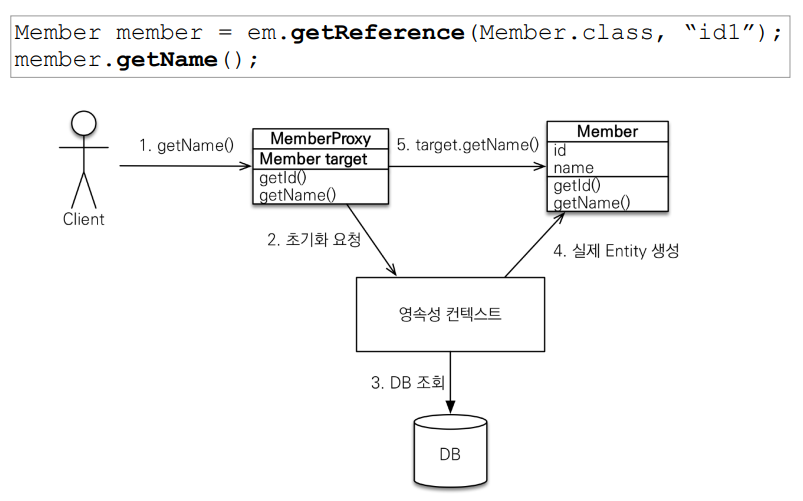
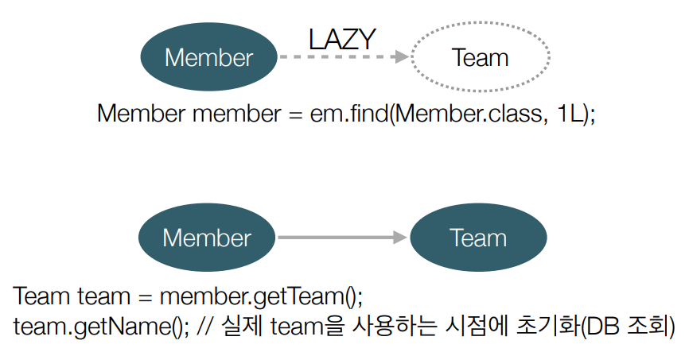

### 프록시 객체 초기화



1. 최초로 getName() 호출할 때 한 번만 초기화 (프록시 객체 생성)
2. 영속성 컨텍스트에 초기화 요청
3. DB에 쿼리 전송
4. 실제 target Entity 생성
5. 프록시 target에 실제 Entity 매핑하고 실제 Entity 메소드 호출


### 즉시 로딩 vs 지연 로딩

#### - 즉시 로딩

```java
public class Member {
    
    //..
    @ManyToOne
    @JoinColumn(name = "team_id")
    private Team team;
}
```

만약 Member와 Team이 N:1 관계로 매핑된 상태에서 Member를 조회하면 항상 Team을 가져와야 할까?

Team을 가져오기 위해선 Member 테이블과 Team 테이블을 Join해서 데이터를 가져와야 한다. 만약 Member의 이름만 조회가 필요한 상황에 Team을 가져오면? **낭비**다.

`즉, 불필요한 Join이 발생하고 필요 없는 데이터를 가져오는 상황이 있을 수 있다.`


#### - 지연 로딩

```java
public class Member {
    @ManyToOne(fetch = FetchType.LAZY)
    @JoinColumn(name = "team_id")
    private Team team;
}
```

`@ManyToOne` 애노테이션에 fetch 전략을 `FetchType.LAZY` 즉, 지연 로딩으로 설정하고 Member를 조회하면 Team은 프록시 객체로 생성되고, 실제로 사용하는 시점에 SQL이 전송되고 초기화가 진행된다.




- 가급적 지연 로딩만 사용하자. (함께 자주 사용되는 Entity는 즉시 로딩, 가끔 사용되면 지연 로딩), 실질적으로는 모두 지연 로딩

- 즉시 로딩을 적용하면 예상치 못한 SQL이 발생한다.

- **즉시 로딩**은 JPQL에서 `N+1`문제를 일으킨다. (`N+1` : 1개의 쿼리를 날렸는데 예상치 못한 N개의 쿼리가 추가로 발생하는 문제)

  - Member가 2명이고, team1, team2가 각각 매칭되어 있다.

  - ```
    List<Member> members = em.createQuery("select m from Member m", Member.class).getResultList();
    ```

  - 즉시 로딩으로 Member 리스트를 조회하면 미리 값을 모두 채워서 반환해야 하기에 Member를 초기화 하면서 Team 데이터도 채워야 하기 때문에 테이블을 Join 해서 가져온다.

  - 즉, 관계된 테이블을 매핑하기 위해 추가적인 쿼리가 발생한다.


### 영속성 전이

특정 엔티티를 영속 상태로 만들 때 연관된 엔티티도 영속 상태로 만들고 싶을 때 사용

```java
@Entity
public class Parent {
    
    @OneToMany(mappedBy = "parent", cascade = CascadeType.ALL)
    private List<Child> childList = new ArrayList<>();
    
    //getter, setter ...
}

@Entity
public class Child {
    
    @ManyToOne
    @JoinColumn(name = "parent_id")
    private Parent parent;
}
```

```java
Parent parent = new Parent();
Child child1 = new Child();
Child child2 = new Child();

em.persist(parent);
```

- child1, child2를 EntityManager로 영속화 할 필요가 없다.

- parent만 영속화 하면 그와 매핑된 클래스 child들은 함께 영속화 된다.

- 연관관계 매핑과는 아무 상관없다.
- **종류**
  - ALL
  - PERSIST
  - REMOVE
  - MERGE
  - REFRESH
  - DETACH


```java
public class Order {
    @OneToMany(mappedBy = "order", cascade = CascadeType.ALL)
    List<OrderItem> orderItems = new ArrayList<>();
}

public class OrderItem {
    @ManyToOne
    @JoinColumn(name = "order_id")
    private Order order;    
}

// 테스트
Order order = new Order();
OrderItem oi1 = new OrderItem();
OrderItem oi2 = new OrderItem();

orderItems.getOrderItems().add(oi1);
orderItems.getOrderItems().add(oi2);

em.persist();

em.clear();
em.flush();

Order findOrder = em.find(Order.class, order.getId());
System.out.println(findOrder.getOrderItems().size());
```

cascade 옵션 때문에 `System.out.println(findOrder.getOrderItems().size())`에서 cascade 옵션으로 oi1과 oi2가 영속화 될거라고 생각해서 값이 2가 나올줄 알았다. 하지만, 결과는 0 이었다. 

그 이유는 oi1, oi2가 영속화는 되지만 Order과 관계가 맺어지지 않았기 때문이다. cascade 옵션을 사용하면 이도 자동으로 될 것이라 생각했지만 **아니다**!! 따라서, 이 문제를 해결하려면 연관관계 메서드를 사용하거나, 개별적으로 관계를 맺어주고 영속화를 해야한다.

```java
oi1.setOrder(order);
oi2.setOrder(order);
```

**즉, cascade 옵션은 단순히 편의를 위해 영속화만 해주는 것이다!!!! `연관 관계 주인이랑은 아예 다른 개념`이다. 상속 관계에 일절 관여하지 않는다. 주의주의주의**


### 고아 객체

- 고아 객체 제거 : 부모 엔티티와 연관관계가 끊어진 자식 엔티티를 자동으로 삭제
- `orphanRemoval = true`

```java
public class Parent {
    @OneToMany(mappedBy = "parent", orphanRemoval = true)
    private List<Child> children = new ArrayList<>();
}
// 예제 코드
Parent parent = em.find(Parent.class, id);
parent.getChildren().remove(0);
em.flush();
```

`parent.getChildren().remove(0)` 에서 children의 0번째 객체와 parent와의 관계가 끊어졌다. 이 때, commit이나 em.flush()가 발생한다면 `orphanRemoval=true` 옵션에 의해서 delete 쿼리가 발생한다.

- 참조하는 곳이 하나일 때 사용해야 한다. 
  - **여러 곳에서 참조하는 데이터를 삭제하면 다른 테이블에서도 삭제된다. -> 심각한 문제..**
- 특정 엔티티가 개인 소유할 때 사용한다.
- `@OneToOne`, `@OneToMany`만 사용 가능하다.


### 영속성 전이 + 고아 객체

- `CascadeType.ALL + orphanRemoval = true`
- 두 옵션을 모두 활성화 하면 부모 엔티티를 통해 자식 생명 주기를 관리할 수 있다.
- cascade 옵션에서 연관관계 편의 메서드를 사용하고, orphanRemoval=true 옵션을 사용하면 부모 엔티티에서 생성, 삭제가 모두 가능


