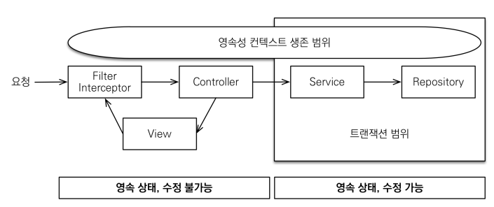
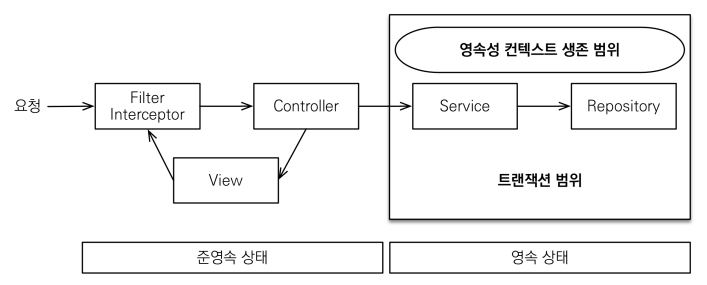

### 순환 참조

JSON 직렬화를 처리하는 라이브러리는 JSON을 만들기 위해 `A->B`, `B->A`를 참조하는 경우에는 모든 참조를 순환하게 된다. 따라서, 초기화 과정에서 순환 참조는 발생하지 않지만, `@Restcontroller` 에서 양방향 연관 관계를 가진 원본 객체의 JSON 응답을 반환한다면 순환 참조가 발생한다.

```java
@GetMapping("/api/v1/simple-orders")
public List<Order> ordersV1() {

    List<Order> all = orderRepository.findAllByString(new OrderSearch());
    for (Order order : all) {
        order.getMember().getName();
        order.getDelivery().getAddress();
    }

    return all;
}
```

- Order과 Member, Delivery는 각각 `N:1`, `1:1` 관계이고, Lazy Loading 전략이다.

- 위와 같은 상황에서 for 반복문까지는 `N+1 문제`만 발생한다. 하지만, `return all` 에서 JSON 직렬화 과정을 거치기 때문에 순환 참조 문제가 발생한다.


### fetch Join 최적화

##### SimpleOrderDto.class

```java
@Data
static class SimpleOrderDto {

    private Long orderId;
    private String name;
    private LocalDateTime orderDate;
    private OrderStatus orderStatus;
    private Address address;

    public SimpleOrderDto(Order order) {
        this.orderId = order.getId();
        this.name = order.getMember().getName();
        this.orderDate = order.getOrderDate();
        this.orderStatus = order.getStatus();
        this.address = order.getDelivery().getAddress();
    }
}
```

##### 

##### 기존 코드

```java
List<Order> orders = em.createQuery("select o from Order o", Order.class).getResultList();

List<SimpleOrderDto> result = orders.stream().map(o -> new SimpleOrderDto(o)).toList();
```

- 최초 `orders` 조회할 때 쿼리가 1번 발생한다. Order의 member, delivery 필드는 `Lazy Loading` 으로 설정되어 있기 때문에 이 시점에는 **프록시 객체**이다.
- stream()을 돌면서 order를 사용해서 SimpleOrderDto를 생성할 때, `order.getMember().getName()` 에서 쿼리 1번, `order.getDelivery().getAddress()`에서 쿼리가 1번 발생한다.
- 즉, 1개의 order에서 총 2개의 쿼리가 추가로 발생한다. **N+1 문제**

- 현재 orders의 개수는 총 2개이므로 result를 초기화 하면서 총 4개의 쿼리가 추가로 발생한다.


##### fetch join 사용

```java
List<Order> orders = em.createQuery("select o from Order o " +
                "join fetch o.member m " +
                "join fetch o.delivery d", Order.class)
                .getResultList();

List<SimpleOrderDto> result = orders.stream().map(o -> new SimpleOrderDto(o)).toList();
```

- 최초 `orders`를 조회할 때 쿼리가 1번 발생한다. 이 때, Order의 member, delivery 필드는 `fetch join`을 사용해 미리 바인딩된다.
- 따라서, result 초기화 시점에 member, delivery 필드에 접근해도 추가적인 쿼리가 발생하지 않는다. -> 최초 쿼리 1번으로 모두 초기화
- fetch join을 사용해서 N+1 문제를 해결할 수 있다.

- **주의**
  - 컬렉션 fetch join을 사용하면 페이징이 불가능하다. 1:N 에서 N쪽으로 데이터 row수가 반환되기 때문
  - 따라서, 컬렉션 fetch join을 사용해야 하는 경우, `@BatchSize`, 전역 batch-size를 설정해서 IN 쿼리로 컬렉션을 모두 조회하자.
  - 쿼리 수 `1+N` -> `1+1`로 줄일 수 있다.


##### 정리

```
- xxOne 관계는 모두 fetch join 사용해서 가져온다.
- xxMany 관계는 fetch join을 사용하거나, batch-size를 설정한다.
- 컬렉션 fetch join의 경우 1개만 가능하고, 페이징이 불가능하다.
- batch-size를 설정할 시 1+N 개의 쿼리를 1+1개로 줄일 수 있다.
- batch-size 설정은 영속성 컨텍스트에서 관리하는 엔티티에만 적용이 된다. -> DTO로 조회하면 엔티티가 아니기 때문에 적용 되지 않는다.
```


### DTO로 직접 조회

```java
List<OrderSimpleQueryDto> orders =  em.createQuery(
            "select new jpabook.jpashop.repository.order.simplequery.OrderSimpleQueryDto(o.id, m.name, o.orderDate, o.status, d.address) " +
                    "from Order o " +
                    "join o.member m " +
                    "join o.delivery d", OrderSimpleQueryDto.class)
            .getResultList();
}
```

- **dto로 조회한 데이터는 엔티티가 아니다.** 따라서, `@BatchSize`나 전역 batch-size 설정에 영향을 받지 않는다.
- 쿼리를 날리고 엔티티에서 dto로 변환하는 것이 아니라 쿼리를 날려서 바로 dto에 주입 받는 방법이다.
- dto로 직접 조회를 할 때는 `fetch join`을 사용하지 **못한다**. fetch join은 엔티티를 조회할 때만 사용이 가능하다.
  - 사용하면 `SemanticException` 발생
- dto로 직접 조회를 하면 fetch join을 사용하지 않아도 값이 모두 바인딩되어 반환된다.

- **장점**
  - fetch join에 비해 select 절에 **내가 필요한 필드만 가져올 수 있다**. fetch join은 연관된 엔티티의 모든 필드를 가져온다.
  - 따라서, 성능상 이점이 있을 수 있다. -> 테스트 해봐야 한다. 성능 차이가 작을 확률이 높다.
- **단점**
  - 화면에 맞춘 조회 쿼리이다. 즉, 그 화면 이외의 곳에서는 재사용이 어렵다.
  - 또한, API 스펙에 맞춘 코드가 리포지토리에 들어가는 단점이 있다.
  - dto로 직접 조회하는 리포지토리를 따로 관리하는 것이 유지 보수에 좋다.
  - 엔티티를 조회하는 리포지토리는 엔티티만 반환하도록 하는 것이 유리하다.

##### 정리

```
- DTO로 직접 조회하는 방법은 후순위로 고려하자.
- DTO로 직접 조회하는 경우에는 fetch join을 사용할 수 없다. -> DTO 조회에서는 DB에서 join으로 데이터를 가져와서 바인딩한다고 생각하자.
- @BatchSize, 전역 batch-size 설정도 엔티티가 아니기 때문에 적용되지 않는다.
- 최적화하기 위해선 직접 IN 쿼리를 작성해서 메모리에서 최적화하는 방식 또는 연관 테이블을 모두 join해서 메모리에서 필터링을 거는 방식을 채택
```


### 쿼리 방식 선택 권장 순서

1. 우선 엔티티를 DTO로 변환하는 방법을 선택한다.
2. 필요하면 fetch join으로 성능을 최적화 한다. -> 대부분 성능 이슈 해결
3. 그래도 안되면 DTO로 직접 조회하는 방법을 선택한다.
4. 최후의 방법은 JPA가 제공하는 Native SQL이나 스프링 JDBC Template을 사용해서 SQL을 직접 사용한다.


### OSIV (Open Session In View)

영속성 컨텍스트의 생존 범위를 결정한다.


#### OSIV ON



- `spring.jpa.open-in-view`: true (기본값)

OSIV 전략은 트랜잭션 시작처럼 최초 데이터베이스 커넥션 시작 시점부터 API 응답이 끝날 때 까지 영속성 컨텍스트와 데이터베이스 커넥션을 유지한다.

지연 로딩은 영속성 컨텍스트가 살아있어야 가능하고, 영속성 컨텍스트는 기본적으로 데이터베이스 커넥션을 유지한다. 그렇기에 Controller, View Template에서 지연 로딩이 가능했다.

**하지만, 이 전략은 데이터베이스 커넥션을 너무 오래 사용하기 때문에, 실시간 트래픽이 중요한 애플리케이션에서는 커넥션이 모자랄 수 있다.**

예를 들어, 컨트롤러에서 외부 API를 호출하면 외부 API 대기 시간 만큼 커넥션 리소스를 반환하지 못하고, 유지해야 한다.


#### OSIV OFF



- `spring.jpa.open-in-view`: false

OSIV를 끄면 트랜잭션을 종료할 때 영속성 컨텍스트를 닫고, 데이터베이스 커넥션도 반환한다. 따라서, 커넥션 리소스를 빠르게 반납해서 리소스를 낭비하지 않는다.

OSIV를 끄면 영속성 컨텍스트 생존 범위가 줄어들기 때문에, 모든 지연로딩 작업을 트랜잭션 안에서 처리해야 한다. 즉, View Template, Controller에서는 지연로딩이 동작하지 않는다.


##### 커멘드와 쿼리 분리

- OrderService
  - `OrderService`: 핵심 비즈니스 로직
  - `OrderQueryService` : 화면이나 API에 맞춘 서비스 (주로 읽기 전용 트랜잭션 사용)

즉, 엔티티에서 DTO로 변환하는 로직과 같은 지연로딩을 사용해서 화면에 맞춘 API 응답을 작성할 때는 비즈니스 로직과 관심사를 분리하는 것이 유지보수 관점에서 충분히 의미가 있다.