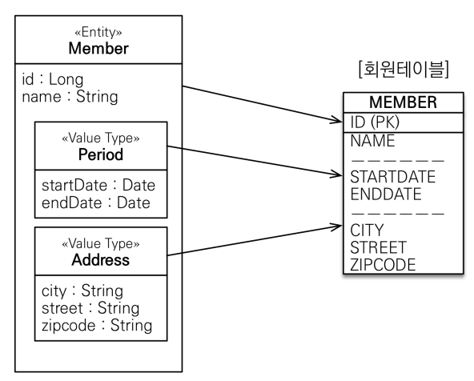

### JPA 데이터 타입 분류

- ##### 엔티티 타입

  - @Entity로 정의하는 객체
  - 데이터가 변해도 식별자로 지속해서 추적 가능

- ##### 값 타입

  - int, Integer, String 처럼 단순히 값으로 사용하는 자바 기본 타입이나 객체
  - 식별자가 없고 값만 있으므로 변경시 추적이 불가능


#### 값 타입 분류

- 기본값 타입
- 임베디드 타입
- 컬렉션 값 타입


#### 기본값 타입

- 생명주기를 엔티티에 의존
- 값 타입은 공유하면 안된다. -> 공유 참조 하면 안된다.


### 임베디드 타입

- 새로운 값 타입을 정의할 수 있다.
- 주로 기본 값 타입을 모아서 만들어서 복합 값 타입이라고 한다.

```java
@Embbedable
public class Period {
    
    private LocalDateTime startTime;
    private LocalDateTime endTime;
}

@Embbedable
public class Address {
    
    private String zipcode;
	private String city;
    private String street;
}

public class Member {
    
    //..
    
    @Embedded
    private Period period;
    
    @Embedded
    private Address address;
}
```

- 테이블은 변하지 않는다.
- 필드 중에 묶어서 관리할 수 있는 필드를 묶어서 관리할 수 있다.
- 임베디드 타입 자체가 null 이면 안에 속한 컬럼들은 모두 null 이다.




### 값 타입 주의 사항

- 불변 객체로 만들어야 한다.
- 공유 참조가 발생하면 예상치 못한 사이드 이펙트가 발생할 수 있다.
- 여러 가지 방법이 있다. 대표적으로 생성자에서 초기화 하고, setter를 모두 없애는 방식이 있다.


```
식별자가 필요하고, 지속해서 값을 추적, 변경해야 한다면 그것은 값 타입이 아닌 엔티티
```

