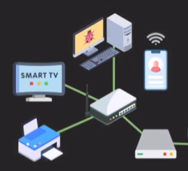
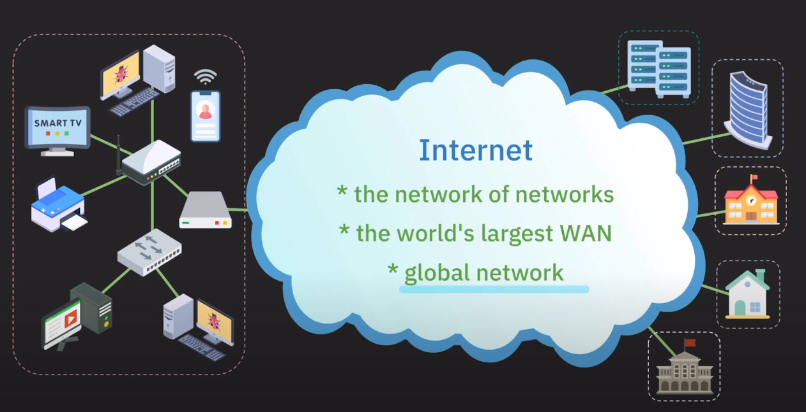
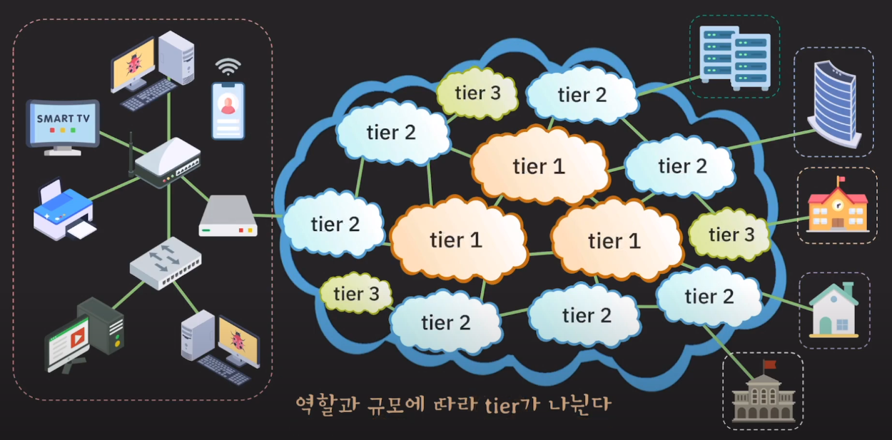

#### 공유기 (Home Router)

- 여러 기기들을 인터넷에 연결될 수 있도록 하는 장치
- 하나의 IP 주소로도 동시에 인터넷을 사용하는 것이 가능

- **공유기에 연결된 기기들은 같은 네트워크 소속**

#### 스위치 (Switch)

- 보통 공유기 LAN 포트가 부족할 때 사용
- 같은 네트워크 내의 기기들이 서로 통신할 수 있도록 하는 장치

#### LAN (Local Area Network)

좁은 범위의 네트 워크 영역 (회사, 집, 건물 등)

- `유선 통신` : Ethernet
- `무선 통신` : wireless LAN (Wi-fi)

#### WAN (Wide Area Network)

여러 LAN이나 다른 종류의 네트워크들을 하나로 묶어서 멀리 떨어진 기기들도 통신이 가능하도록 만든 네트워크

훨씬 더 넓은 범위를 커버하는 네트워크

#### Internet

인터넷은 세계에 존재하는 수 많은 LAN, WAN 의 네트워크라고 볼 수 있다.

#### ISP (Internet Service Provider)

일반 사용자나 회사, 기관 등이 인터넷을 사용할 수 있도록 인터넷 연결 서비스를 제공하는 존재

**실제 인터넷은 수 많은 ISP가 제공하는 네트워크들의 집합이고 ISP는 역할과 규모에 따라 tier가 나뉜다.**

tier가 낮은 ISP가 자신보다 tier가 높은 ISP로 트래픽을 전송하기 위해서는 비용이 든다.

- ##### Tier 1

  - 국제 범위의 네트워크 보유
  - 인터넷 모든 네트워크에 접근이 가능하다.
  - 인터넷의 중추 역할 `backbone`
  - 트래픽 전송 비용이 없다.

- ##### Tier 2

  - 국가/지방 범위 네트워크를 보유
  - 일반 사용자, 기업 대상 서비스
  - **인터넷의 모든 영역에 연결되기 위해 tier 1 ISP에 비용을 내고 트래픽 전송**

- ##### Tier 3

  - 작은 지역 범위 서비스를 제공
  - 일반 사용자나 기업 대상 서비스
  - **상위 ISPs에게 비용을 내고 인터넷 트래픽을 구매해서 이를 통해 서비스**

