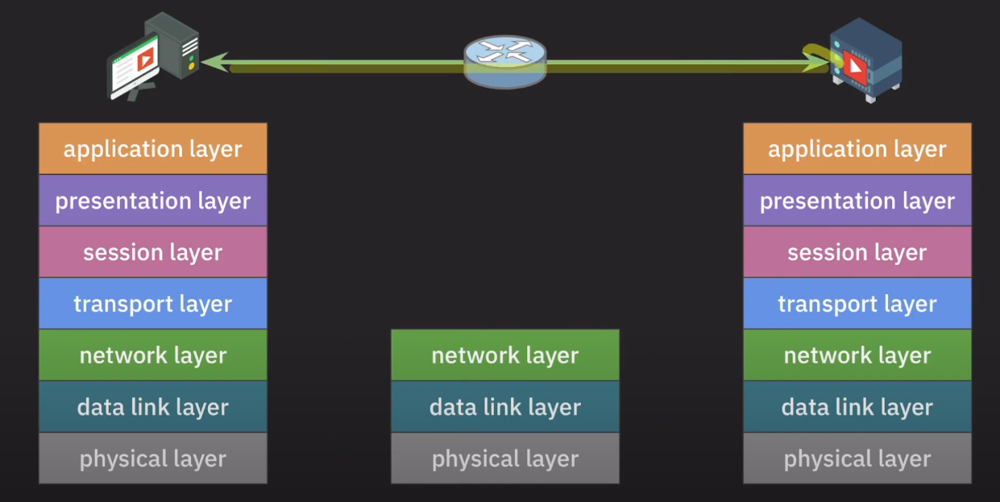

# OSI 7 Layer

네트워크는 컴퓨터나 기타 기기들이 리소스를 공유하거나 데이터를 주고 받기 위해 유선 혹은 무선으로 연결된 통신 체계이다.

**네트워크의 기능**으로는

- 애플리케이션 목적에 맞는 통신 방법 제공
- 신뢰할 수 있는 데이터 전송 방법 제공
- 네트워크 간의 최적의 통신 경로 결정
- 목적지로 데이터 전송
- 노드 사이의 데이터 전송
  - `노드` : 네트워크에 연결된 모든 기기

이런 모든 기능을 하나의 프로토콜로 정의할 수 없다. 즉, 프로토콜을 계층별로 모듈화 해야한다.

계층별로 나눔으로써 통신이 일어나는 과정을 단계별로 알 수 있고, 특정한 곳에 이상이 생기면 그 단계만 수정할 수 있기 때문이다.

### OSI 7 layer

##### 물리 계층 (Physical)

`디지털 신호 -> 아날로그 신호`로 변경해서 bits 단위 데이터를 전송하는 역할

##### 데이터 링크 계층 (Data Link)

직접 연결된 노드간의 통신 담당 `노드 -> 노드`

물리 계층으로 송수신 되는 정보를 관리하여 안전하게 전달되도록 도와주는 역할

MAC 주소를 통해 통신(`ARP`). 프레임에 MAC 주소를 부여하고 에러 검출, 재전송, 흐름제어를 한다.

##### 네트워크 계층 (Network)

호스트간 통신을 담당(IP) `호스트 -> 호스트`

데이터를 목적지까지 안전하고 빠르게 전달하는 기능

라우터를 통해 이동할 경로를 선택하여 IP 주소를 지정하고, 해당 경로에 따라 패킷을 전달해준다.

라우팅, 흐름 제어, 오류 제어, 세그먼테이션 등을 수행한다.

##### 전송 계층 (Transport)

애플리케이션 간의 통신을 담당 `애플리케이션 -> 애플리케이션` `(포트 -> 포트)`

TCP, UDP 프로토콜을 통해 통신을 활성화한다. 포트를 열어두고 프로그램들이 리소스를 전송할 수 있도록 제공

`TCP` : 신뢰성 보장, 연결 지향적 (**3 way hand-shake, 4 way hand-shake**)

`UDP` : 비신뢰성, 비연결성, 실시간

##### 세션 계층 (Session)

애플리케이션 간의 통신에서 세션을 관리 (RPC)

##### 표현 계층 (Presentation)

애플리케이션 간의 통신에서 메시지 포맷 관리

`인코딩 - 디코딩`, `암호화 - 복호화`, `압축 - 압출 풀기`

##### 응용 계층 (Application)

애플리케이션 목적에 맞는 통신 방법 제공

`HTTP`, `DNS`, `SMTP`, `FTP`

메일 기능을 사용할 때는 SMTP, 파일 다운로드가 필요할 떄는 FTP 등 목적에 맞는 통신 프로토콜을 제공한다.

### 통신 흐름

클라이언트가 Youtube 서버에 동영상을 요청한 경우를 예로 통신 흐름을 알아보자.

1. 출발 노드에서 각 layer 마다 필요한 정보를 데이터의 헤더에 붙인다. (`캡슐화` **encapsulation**)
2. 각 계층의 헤더가 붙은 리소스를 물리 계층에서 아날로그 신호로 변경해서 다음 노드로 전달한다.
3. 목적지 노드 (Youtube 서버)가 아닌 `중간 노드`에서는 네트워크 계층까지 (`역캡슐화` **decapsulation**) 해서 다음 노드의 정보를 얻고 다시 캡슐화해서 데이터를 다음 노드로 전달한다. (이 과정 반복)
4. Youtube 서버 노드에 도착하면 모든 계층을 `역캡슐화`해서 목적지 애플리케이션에 데이터를 전달한다.

`캡슐화` : 응용 -> 물리 계층 순으로 각 계층의 정보를 데이터 헤더에 담아서 하위 계층으로 전달

`역캡슐화` : 물리 -> 응용 계층 순으로 데이터의 헤더를를 제거하며 상위 계층으로 전달

