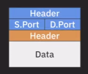

### TCP/IP Stack

`TCP/IP Layer`는 TCP 프로토콜과 IP 프로토콜을  `OSI Layer`에 맞추어 더욱 추상화(간략화) 시킨 모델이다.

- `Application` : OSI 7Layer 모델의 `application`, `presentation`, `session` 계층을 포함
- `Transport` : OSI 7Layer 모델의 `transport` 계층 `(port to port)`
- `Internet` : OSI 7Layer 모델의 `network` 계층 `(host to host)`
- `Link` : OSI 7Layer 모델의 `Datalink`, `physical` 계층 `(node to node)`

#### 상황

A 클라이언트가 B 서버에 데이터를 전송하는 과정

#### Application Layer

- application layer에서 송/수신 되는 데이터는 `data` 또는 `message` 라 부른다. `(Header + Data)`

- application layer에서 필요한 프로토콜의 정보를 Header에 담는다.
- `payload` : 프로토콜의 통해 송/수신 되는 실제 데이터 (이 계층에서 추가된 Header를 제외한 데이터)
  - 수신 측에서 역캡슐화하며 payload를 전달

#### Transport Layer

- 전송 방식에 따라 송/수신 되는 데이터 명칭이 다름
  - `TCP` : **segment**
  - `UDP` : **datagram**

- 전송 방식에 상관 없이 송신 포트, 수신 포트에 대한 정보가 담겨 있다.

#### Internet Layer

- Header에 데이터의 전송 방식이 TCP 인지 UDP 인지에 대한 정보가 담겨있다.

  - **왜 Transport Layer의 Header에 담겨있지 않고 Internet Layer의 Header에 담겨있을까?**
  - 수신측에서 데이터를 수신하는 과정에서 Internet Layer에서 Transport Layer로 데이터를 전달한다. (Internet -> Transport)
  - **Transport Layer는 TCP, UDP 전송 방식에 따라 데이터를 읽는 포맷이 다르므로 Internet Layer에서 전송 방식에 대한 정보를 넘겨주기 위함.**

  - `TCP : 6`,  `UDP : 17`

- `Multiplexing`, `DeMultiplexing`

- `Header + Data` : `IP datagram`, `IP packet`

#### Link Layer

- Link Layer의 캡슐화 과정에서는 Ip packet에  `Header`와 `Trailer` 추가한다.
- Link Layer는 node에서 다음 node로 데이터를 전달한다.
  - 이 과정에서 목적지 노드가 아닌 중간 노드에서는 internet layer (host -> host)까지 역캡슐화 해서 host에 대한 정보를 얻는다.
  - **그 후 다시 Header를 붙여 IP packet을 만들고, Link Layer에서 Header, Trailer를 추가하여 다음 노드로 라우팅한다.**

- `Header + Ip packet + Trailer` : `Frame`

#### Internet -> Transport -> Application (역캡슐화)

Ip packet에 담겨있는 정보는 `전송 Protocol, 송신 IP, 수신 IP`이고 따로 저장해둔다.

전송 프로토콜 (TCP, UDP)에 따라 데이터 전송 과정에 차이가 발생한다.

##### UDP

UDP datagram에서 수신 port를 확인하고 해당 socket으로 `payload`를 전달한다.

##### TCP

1. `TCP segment의 syn 값이 1이면 listening socket으로` (해당 소켓의 connection이 없는 경우)
   - segment의 수신 port를 확인하고 해당 socket의 listening socket으로 payload를 전달
2. `이미 연결된 connection 이라면 송/수신 IP, Port를 활용해서 connection을 확인하고 해당 socket으로 payload 전달`

##### DeMultiplexing

Internet Layer로 부터 받은 TCP segment, UDP datagram의 payload를 적절한 socket으로 전달하는 행위

##### Multiplexing

여러 socket에서 데이터를 수집하여 TCP segment, UDP datagram을 생성하여 Internet Layer로 전달하는 행위