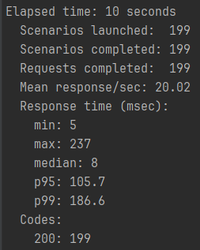
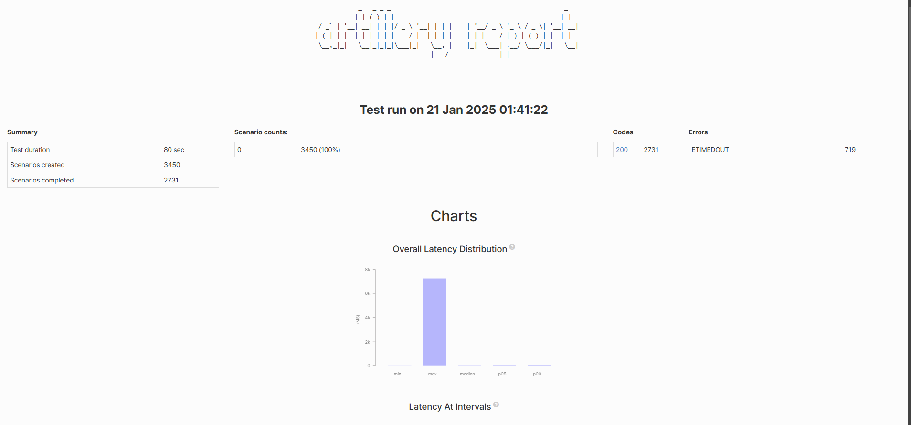
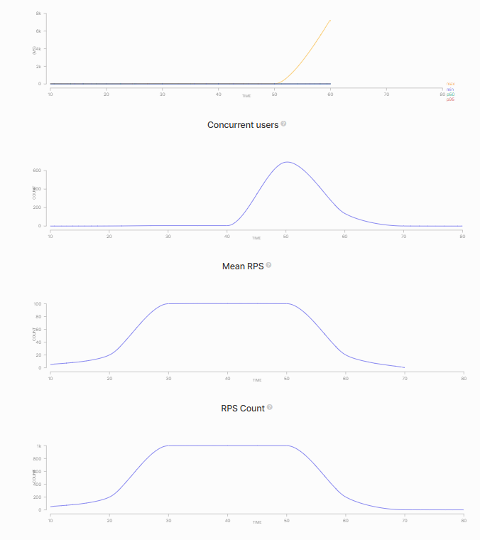

# Artillery

#### 장점

- node만 설치되어 있다면 artillery 테스트 툴 설치가 간편하다.

- yaml 파일만 작성하면 간단하게 테스트 시나리오를 작성할 수 있다.

#### 단점

- 테스트가 진행되는 과정을 확인하기 어렵다. 단순 텍스트로 표현

- nGrinder는 그래프로 실시간으로 확인할 수 있다.


### Artillery Docs

https://www.artillery.io/docs


### Artillery 설치

`node 버전` : v22.13.0

```sh
npm install -g artillery@latest
```


### YAML 파일 작성

#### config 작성 (부하, 파일 설정 등)

```yaml
config:
  target: 'http://localhost:8080'
  phases:
    - duration: 30
      arrivalRate: 10
```

`config.target` : 테스트를 진행할 Host IP

`config.phases` : 30초 동안 지속되는 로드 단계로, 매초 10개의 새로운 가상 사용자가 요청을 보낸다.


#### rampTo (점진적 부하 증가, 감소)

```yaml
config:
  target: 'http://localhost:8080'
  phases:
    - duration: 30
      arrivalRate: 10
      rampTo: 500
    - duration: 60
      arrivalRate: 500
```

**30초 동안 초당 10개의 요청으로 시작해서 점진적 증가하며 마지막엔 500개의 요청을 보내고, 그 후 60초 동안 초당 500개의 요청을 보낸다.**

`arrivalRate > rampTo` : 요청이 점차 감소

`arrivalRate < rampTo` : 요청이 점차 증가


#### scenarios 작성

```yaml
scenarios:
  - name: "login and use some functions"
    flow:
      - post:
          url: "/login"
      - get:
          url: "/some-function-one"
      - get:
          url: "/some-function-two"
  - name: "just login"
    flow:
      - post:
          url: "/login"
```

- 각 flow 마다 스크립트를 작성할 수 있다. HTTP 메서드와 url, query 파라미터 등을 작성하여 구체적인 요청 시나리오를 작성한다.


#### 요청 수

```yaml
config:
  target: 'http://localhost:8080'
  phases:
    - duration: 30
      arrivalRate: 10
scenarios:
  - name: "login and use some functions"
    flow:
      - post:
          url: "/login"
      - get:
          url: "/some-function-one"
      - get:
          url: "/some-function-two"
  - name: "just login"
    flow:
      - post:
          url: "/login"
```

위와 같은 상황에서는 총 300개의 요청이 각 시나리오에 분배되어 발생하지 않고, 각 시나리오당 300개씩 발생하여 총 600개의 요청이 발생한다.

즉, `총 요청 개수 = 요청 개수 * 시나리오 개수`이다.


#### 파라미터 전달

##### json 형식

```yaml
config:
  target: 'http://localhost:8080'
  phases:
    - duration: 30
      arrivalRate: 3
      name: Warm up
  payload:
    path: "id-password.csv"
    fields:
      - "id"
      - "password"
scenarios:
  - name: "just login"
    flow:
      - post:
          url: "/login-with-id-password"
          json:
            id: "{{ id }}"
            password: "{{ password }}"
```

- `config.payload`
  - `path` : 참조할 데이터 파일이 존재하는 경로 (현재는 yaml 파일 경로와 함께 있어 파일명만 지정)
  - `fields` : `A, B` 형태로 저장된 csv 파일의 필드명을 지정
- `scenarios` 탭에서 **`{{ field명 }}`** 형태로 사용된다. -> 중괄호 내 공백도 작성해야 한다.


##### query 파라미터 형식

```yaml
config:
  target: 'http://localhost:8080'
  phases:
    - duration: 60
      arrivalRate: 30
  payload:
    path: "numbers.csv"
    fields:
      - "number"
scenarios:
  - name: "get hash"
    flow:
      - get:
#          url: "/no-cache-hash-string?input={{ number }}"
          url: "/cached-hash-string?input={{ number }}"
```


### 부하 테스트 실행

테스트 커맨드는 테스트 yaml 파일이 있는 경로의 터미널에서 입력한다.


##### 테스트 실행

```sh
artillery run --output report.json test-config.yaml
```

- test-config.yaml 파일에 작성된 스크립트를 실행하여 부하테스트를 진행한다.
- 부하 테스트 결과를 report.json 파일로 저장한다.



- 테스트를 실행하는 중에 터미널에 위와 같은 정보가 표시된다.
  - `p95` : **95% 사용자가 응답받는 시간**
  - `p99` : **99% 사용자가 응답받는 시간**

##### report.json -> report.html

```sh
artillery report report.json --output report.html
```

- 부하 테스트를 진행하여 얻은 결과 json 파일을 html 파일로 변환하여 브라우저에서 그래프와 수치를 확인할 수 있다.






- 위와 같은 결과를 참고하여 병목 지점을 특정하고, 로그를 파악하여 지연 시간을 개선할 수 있다.

- HashMap, Redis 등 도구, 알고리즘을 적용하고 테스트하며 성능을 개선할 수 있다.


### 정리

Artillery는 간단한 테스트나 부하가 적은 상황에 쓰기 알맞은 테스트용 도구이다. 

- 간단한 설치, 쉬운 사용법

부하 테스트를 진행함으로써 애플리케이션의 병목 지점을 확인하고, 병목 원인을 개선함으로써 성능을 개선하여 사용자 경험을 증진시킬 수 있다.

즉, 클라이언트의 요청에 대한 응답시간을 줄이는 것을 목표로 다양한 도구, 알고리즘, 라이브러리 등 목적에 맞는 방법을 채택하여 지연 시간을 줄이자. -> 병목 원인을 찾기 위해서는 CS 지식이 큰 도움이 될 것 같다.

- 네트워크, 데이터베이스, 자료구조 등