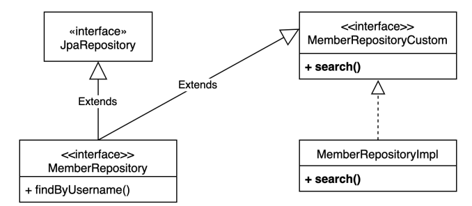

### 사용자 정의 리포지토리


##### 사용법

1. 사용자 정의 인터페이스 **작성**
2. 사용자 정의 인터페이스 **구현**
3. 스프링 데이터 리포지토리에 사용자 정의 인터페이스 상속


##### 사용자 정의 리포지토리 구성



- MemberRepository에서 해결할 수 없는 기능을 수행할 인터페이스 작성 -> `MemberRepositoryCustom`
- `MemberRepository`는 `MemberRepositoryCustom`을 상속 받는다. 즉, spring-data-jpa가 내부적으로 구현체를 생성할 때 사용된다.
- `MemberRepositoryCustom`의 구현체인 `MemberRepositoryImpl`을 작성한다.
  - 사용자 정의 리포지토리의 구현체의 클래스 명은 규칙이 있다. -> `spring-data-jpa 인터페이스 명 + Impl`


##### MemberRepository

```java
public interface MemberRepository extends JpaRepository<Member, Long>, MemberRepositoryCustom {
    List<Member> findByUsername(String username);
}
```


##### MemberRepositoryCustom

```java
public interface MemberRepositoryCustom {
    List<MemberTeamDto> search(MemberSearchCond condition);
}
```


##### MemberRepositoryImpl

```java
@RequiredArgsConstructor
public class MemberRepositoryImpl {
    
    private final JPAQueryFactory queryFactory;
    
    @Override
    public List<MemberTeamDto> search(MemberSearchCond condition) {
        return queryFactory
            	.select(new QMemberTeamDto(
                		member.id.as("memberId"),
                    	member.username,
                    	member.age,
                    	team.id.as("teamId"),
                    	team.name.as("teamName")
                ))
            	.from(member)
            	.leftJoin(member.team, team)
            	.where(
            		usernameEq(condition.getUsername()),
            		teamNameEq(condition.getTeamName()),
            		ageGoe(condition.getAgeGoe()),
            		ageLoe(condition.getAgeLoe())
        		)
            	.fetch();
    }
    
    private BooleanExpression usernameEq(String username) {
        return StringUtils.hasText(username) ? member.username.eq(username) : null;
    }
    
    private BooleanExpression teamNameEq(String teamName) {
        return StringUtils.hasText(teamName) ? team.username.eq(teamName) : null;
    }
    
    private BooleanExpression ageGoe(Integer ageGoe) {
        return ageGoe == null ? null : member.age.goe(ageGoe);
    }
    
    private BooleanExpression ageLoe(Integer ageLoe) {
        return ageLoe == null ? null : member.age.loe(ageLoe);
    }
}
```


##### 사용

```java
@Autowired
MemberRepository memberRepository;

@Test
void test() {
    
    MemberSearchCond condition = new MemberSearchCond();
    condition.setAgeGoe(35);
    condition.setAgeLoe(40);
    condition.setTeamName("teamB");
    
    List<MemberTeamDto> result = memberRepository.search(condition);
}
```

- 사용자 정의 리포지토리 구현체에서 정의한 메서드를 spring-data-jpa 리포지토리로 사용한다.


### 스프링 데이터 페이징

- 스프링 데이터의 Page, Pageable 활용
- `fetchResult()`, `fetchCount()` 가 Deprecated 되었기 때문에 `content`, `count` 쿼리 별도 조회

```java
public Page<MemberTeamDto> searchPage(MemberSearchCond condition, Pageable pageable) {
    
    // content 조회
    List<MemberTeamDto> content = queryFactory
        	.select(new QMemberTeamDto(
            		member.id,
            		member.username,
            		member.age,
            		team.id,
            		team.name))
        	.from(member)
        	.leftJoin(member.team, team)
        	.where(
        		usernameEq(condition.getUsername()),
    			teamNameEq(condition.getTeamName()),
    			ageGoe(condition.getAgeGoe()),
    			ageLoe(condition.getAgeLoe()))
        	.offset(pageable.getOffset())
        	.limit(pageable.getPageSize())
        	.fetch();
    
    // count 쿼리 따로 작성
    JPAQuery<Long> countQuery = queryFactory
        	.select(member.count())
        	.from(member)
        	.leftJoin(member.team, team)
            .where(
        		usernameEq(condition.getUsername()),
    			teamNameEq(condition.getTeamName()),
    			ageGoe(condition.getAgeGoe()),
    			ageLoe(condition.getAgeLoe()));
    
    // 1. 기본 Page 구현체 생성해서 반환
    return new PageImpl<>(content, pageable, countQuery.fetchOne());
    
    // 2. 페이지 최적화해서 반환
    return PageableExecutionUtils.getPage(content, pageable, () -> countQuery.fetchOne());
}
```

- `PageableExecutionUtils.getPage(content, pageable, countQuery::fetchOne)`
  - **스프링 데이터 라이브러리가 제공**
  - count 쿼리가 생략 가능한 경우 생략해서 처리
    - 페이지 시작이면서 content 사이즈가 페이지 사이즈보다 작을 때
    - 마지막 페이지 일 때 (offset + 컨텐츠 사이즈를 더해서 전체 사이즈를 구함, **마지막 페이지면서 컨텐츠 사이즈가 페이지 사이즈보다 작을 때**)


### OrderSpecifier

```java
JPAQuery<Member> query = queryFactory
    	.selectFrom(member);

for (Sort.Order o : pageable.getSort()) {
    PathBuilder pathBuilder = new PathBuilder(member.getType(), member.getMetaData());
    query.orderBy(new OrderSpecifier(o.isAscending() ? Order.ASC : Order.DESC, pathBuilder.get(o.getProperty())));
}

List<Member> content = query.fetch();
```

- Pageable에 있는 Sort를 활용해서 정렬하는 방법이다.
- 루트 엔티티에 있는 필드로 정렬할 때 이 방법을 사용할 수 있다.
- 메서드 파라미터로 조건문을 넘기고 OrderSpecifier 배열을 얻어 orderBy에 넘겨주면 여러 개의 정렬 조건을 적용할 수 있다.


루트 엔티티 범위가 넘어가는 정렬 조건은 DTO, 파라미터를 받아서 직접 처리하는 방법을 사용한다.

##### 예시

```java
private OrderSpecifier[] createOrderSpecifier(MemberSearchCond condition) {
    List<OrderSpecifier> orders = new ArrayList<>();
    
    if (condition.getUsername() != null) {
        orders.add(new OrderSpecifier(Order.ASC, member.username));
    }
    
    if (condition.getTeamName() != null) {
        orders.add(new OrderSpecifier(Order.ASC, team.name));
    }
    
    return orders.stream().toArray(OrderSpecifier[]::new);
}

// 사용
List<MemberTeamDto> content = queryFactory
        .select(new QMemberTeamDto(
                    member.id.as("memberId"),
                    member.username,
                    member.age,
                    team.id.as("teamId"),
                    team.name.as("teamName")
            ))
        .from(member)
        .leftJoin(member.team, team)
        .where(
                usernameEq(condition.getUsername()),
                teamNameEq(condition.getTeamName()),
                ageLoe(condition.getAgeLoe()),
                ageGoe(condition.getAgeGoe())
        )
        .orderBy(createOrderSpecifier(condition))
        .offset(pageable.getOffset())
        .limit(pageable.getPageSize())
    	.fetch();
```

