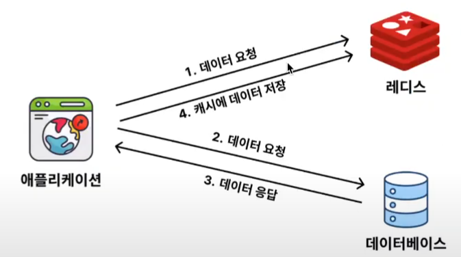
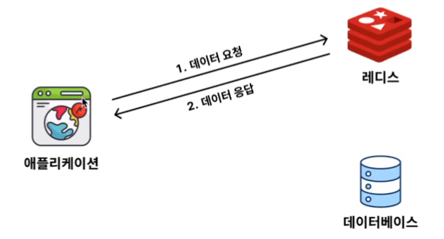
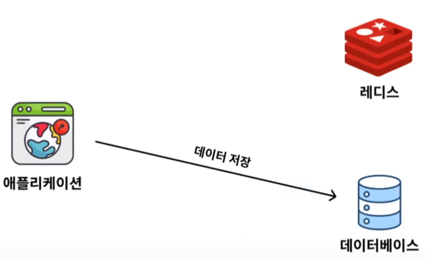

## 캐싱 전략


### Cache Aside

캐시에서 데이터를 확인하고, 없다면 DB에서 데이터를 조회해오는 방식 (**조회 전략**)


##### 1. 캐시에 데이터가 없을 경우 (Cache Miss)

##### 


##### 2. 캐시에 데이터가 있을 경우 (Cache Hit)

##### 

### Write Around

쓰기 작업(저장, 수정, 삭제) 할 때 캐시에 반영하지 않고 DB에만 반영하는 방식




### Cache Aside / Write Around 전략의 한계

1. **데이터의 일관성을 보장할 수 없다.**
   - 캐시된 데이터와 DB 데이터가 일치하지 않을 수 있다.
   - Write Around 전략 사용 시 DB 데이터만 업데이트하기 때문에 기존 캐시 데이터와 값이 다르다.


쓰기 작업을 할 때 캐시 데이터도 동시에 업데이트 시켜서 해결할 수는 있다. -> 성능 저하

**따라서, 성능 vs 데이터 일관성 trade off가 발생**


**캐시를 적용시키기에 적절한 데이터**

```
- 자주 조회되는 데이터
- 잘 변하지 않는 데이터
- 실시간으로 정확하게 일치하지 않아도 되는 데이터
```

장기간 데이터가 일치하지 않는 것은 문제가 될 수 있다. 적절한 주기로 데이터를 동기화 해줘야 한다. -> TTL

즉, 일정 시간 후 데이터를 캐시에서 삭제하고 다시 조회할 때 DB에서 조회해서 데이터 동기화


2. **DB에 비해 저장 공간이 비교적 작다.**
   - DB는 Disk에 저장하기 때문에 저장 공간이 크지만, 캐시는 메모리(RAM) 에 저장하기 때문에 DB에 비해 저장 공간이 작다.

-> TTL 기능을 사용해 자주 조회되는 데이터만 캐시에 남게된다. 자주 사용되지 않는 데이터는 만료시간 후에 삭제되기 때문이다.


```
Cache Aside / Write Around 전략은 TTL을 활용해 한계를 어느정도 보완할 수 있다.
```