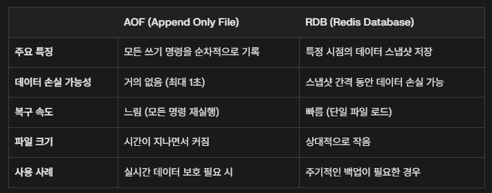

# Redis

### Redis 란?

키(key)와 값(value)를 가진 NoSQL에 속하는 데이터베이스. 주로 비정형 데이터를 다루며 비관계형 데이터베이스

key, value 구조이기 때문에 쿼리를 사용할 필요가 없다.

##### 자료구조

- **Strings** : binary-safe한 기본적인 key-value 구조
- **Lists** : String element의 모음, 삽입된 순서를 유지하며 기본적인 자료 구조는 Linked List 사용
- **Sets** : 유일한 값들의 모임인 자료구조, 순서 유지 x
- **Sorted sets** : Sets 자료구조에 score라는 값을 추가로 두오 해당 값을 기준으로 순서 유지
- **Hashes** : 내부에 key-value 구조를 하나 더 가지는 Redis 자료 구조
- **Bit arrays(bitMaps)** : bit array를 다룰 수 있는 자료구조
- **HyperLogLogs** : 집합의 원소의 개수를 추정하는 방법, Set 개선된 방법
- **Streams** : Redis 5.0에서 Log나 IoT 신호와 같이 지속적으로 빠르게 발생하는 데이터를 처리하기 위해 도입된 자료구조

### 레디스 데이터는 휘발성인가 ?

Redis는 인메모리 데이터베이스이기 때문에 휘발성인 MM에 데이터를 저장한다. 따라서, 서버가 다운된다면 데이터 유실이 발생할 수 있다.

**레디스는 데이터의 영속성을 보장하기 위해 디스크에도 데이터를 저장한다.** 서버가 다운되어도 디스크에 저장된 데이터를 다시 메모리에 가져올 수 있다.

##### Redis가 메모리의 데이터를 디스크에 저장하는 방법

- **RDB (Redis Data Base)** : RDB 지속성은 지정된 간격으로 데이터 세트의 특정 시점 스냅샷을 수행한다.
- **AOF (Append Only File)**
  - **명령 기록** : Redis는 클라이언트로부터 수신한 모든 쓰기 연산을 AOF 파일에 기록한다. 이 파일에는 명령어가 텍스트 형식으로 저장되며, 서버가 재시작될 때 이 명령어들을 다시 실행하여 데이터를 복원한다.
  - **Append-Only** : 기존 데이터를 덮어쓰지 않고, 새로운 명령을 파일 끝에 추가하는 방식으로 동작한다. 따라서, 데이터 손실 가능성이 매우 낮다.
- **지속성 없음** : 지속성을 완전히 비활성화할 수 있다. 캐싱할 때 가금 사용된다.
- **RDB + AOF** : 동일한 인스턴스에서 RDB와 AOF를 같이 사용할 수 있다.

##### RDB 장점

- RDB는 Redis 데이터의 매우 작은 단일 파일 특정 시점 표현이다. RDB 파일은 백업에 적합하다.
  - 1시간마다 데이터 백업
- DR(재해 복구)에 매우 유용하다.
- Redis의 상위 프로세스가 디스크 I/O를 수행하지 않기 대문에 성능이 최대화된다.
- 디스크에서 RDB는 다시 시작 및 장애 조치 후 부분 재동기화를 지원한다.
- RDB 파일은 매우 작고 효율적으로 압축되어 있어 디스크 공간을 절약할 수 있다.

##### RDB 단점

- 스냅샷 간격 동안 변경된 데이터는 기록되지 않기 때문에 장애 발생 시 일부 데이터 손실이 발생할 수 있다.

- Redis가 오랜 시간 도안 비정상적으로 작동을 멈춘 경우 최근 데이터의 백업이 불가능하다. 일반적으로 5분마다 **RDB 스냅샷**을 생성하긴 하지만 Redis가 어떤 이유로든 비정상적으로 작동을 멈춘다면, 그에 대한 방안을 마련해야 한다. 

- RDB는 상위 프로세스를 사용하지 않는 만큼 하위 프로세스를 굴린다. 따라서, 하위 프로세스는 디스크에 데이터를 유지하기 위해 잦은 **디스크 I/O**가 발생. **fork(디스크 I/O)**는 데이터 세트가 큰 경우 시간이 많이 소요될 수 있으며, 데이터 세트가 매우 크고 CPU 성능이 좋지 않은 경우 클라이언트 서비스가 다운될 수 있다.

##### AOF 장점

- **fsync 설정** : AOF는 얼마나 자주 디스크에 데이터를 동기화할지 선택할 수 있다.
  - **fsync=always** : 모든 쓰기 연산 후 즉시 디스크에 기록, 가장 안전하지만 느리다.
  - **fsync=everysec** :  1초마다 기록하여 성능과 안정성의 균형을 맞춘다.
  - **fsync=no** : 동기화를 하지 않아 성능은 좋지만 데이터 손실 위험이 크다.
- AOF는 다른 fsync 정책을 가질 수 있기 때문에 RDB보다 내구성이 높다. fsync는 백그라운드 스레드를 사용해 수행되며 기본 스레드는 fsync가 진행 중이지 않을 때 쓰기 작업을 계속 진행한다.
- AOF 파일은 텍스트 형식이므로 사람이 읽고 수정할 수 있다.
  - 'FLUSHALL' 명령어를 실행했다면, AOF 파일에서 해당 명령을 제거하고 Redis를 다시 시작하여 데이터 복구 가능
- Redis는 AOF가 너무 커지면 백그라운드에서 자동으로 다시 작성할 수 있다.

**AOF 단점**

- 모든 쓰기 연산을 기록하기 때문에 시간이 지남에 따라 AOF 파일 크기가 매우 커질 수 있다. 이를 해결하기 위해 Redis는 주기적으로 AOF 파일을 rewrite하여 크기를 줄인다.
  - 일반적으로 동일한 데이터 세트에 대한 동등한 RDB 파일보다 용량이 크다.
- 서버 재시작 시 AOF 파일에 저장된 모든 명령어를 순차적으로 실행해야 하므로, RDB 방식보다 복구 시간이 오래 걸릴 수 있다.

### AOF vs RDB

### 정리

데이터 백업용으로는 RDB, 실시간 데이터 보호를 위한 용도로는 AOF 를 사용하자. 즉, RDB + AOF 방식 활용