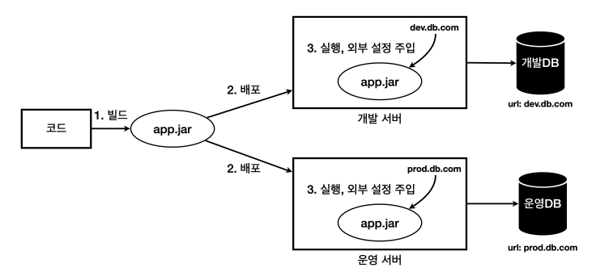
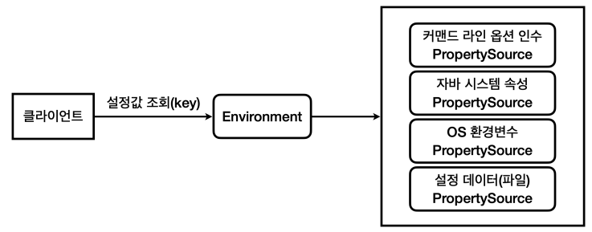

### 환경에 따라 변하는 설정값을 실행 시점에 주입




### 스프링 외부 설정 통합



##### PropertySource

- 스프링은 `PropertySource`라는 추상 클래스를 제공하고, 각각 외부 설정을 조회하는 `xxxPropertySource`를 만들어 두었다.
  - `CommandLinePropertySource`
  - `SystemEnvironmentPropertySource`

##### Environment

- 스프링은 `Environment`를 통해 다양한 방식의 외부 설정 접근 방법을 추상화해서 제공한다.
- `Environment`는 내부에서 여러 과정을 거쳐 `PropertySource`들에 접근한다.
- `application.yml`, `application.properties`도 `PropertySource`에 추가된다. 즉, `Environment`로 접근할 수 있다.


### 외부 설정 사용

```properties
my.datasource.url=local.db.com
my.datasource.username=local_user
my.datasource.password=local_pw
my.datasource.etc.max-connection=1
my.datasource.etc.timeout=3500ms
my.datasource.etc.options=CACHE,ADMIN
```


##### Environment

```java
@Slf4j
@Configuration
public class MyDataSourceConfig {

    private final Environment env;

    public MyDataSourceConfig(Environment env) {
        this.env = env;
    }

    @Bean
    public MyDataSource myDataSource() {
        String url = env.getProperty("my.datasource.url");
        String username = env.getProperty("my.datasource.username");
        String password = env.getProperty("my.datasource.password");
        int maxConnection = env.getProperty("my.datasource.etc.max-connection", Integer.class);
        Duration timeout = env.getProperty("my.datasource.etc.timeout", Duration.class);
        List<String> options = env.getProperty("my.datasource.etc.options", List.class);

        return new MyDataSource(url, username, password, maxConnection, timeout, options);
    }
}
```

- `Environment`의 `getProperty()` 메서드를 사용해 `application.properties`에 작성된 값에 접근 가능


##### @Value

```java
@Slf4j
@Configuration
public class MyDataSourceValueConfig {

    @Value("${my.datasource.url}")
    private String url;
    @Value("${my.datasource.username}")
    private String username;
    @Value("${my.datasource.password}")
    private String password;
    @Value("${my.datasource.etc.max-connection}")
    private int maxConnection;
    @Value("${my.datasource.etc.timeout}")
    private Duration timeout;
    @Value("${my.datasource.etc.options}")
    private List<String> options;

    @Bean
    public MyDataSource myDataSource1() {
        return new MyDataSource(url, username, password, maxConnection, timeout, options);
    }

    @Bean
    public MyDataSource myDataSource2(
            @Value("${my.datasource.url}") String url,
            @Value("${my.datasource.username}") String username,
            @Value("${my.datasource.password}") String password,
            @Value("${my.datasource.etc.max-connection}") int maxConnection,
            @Value("${my.datasource.etc.timeout}") Duration timeout,
            @Value("${my.datasource.etc.options}") List<String> options
    ) {
        return new MyDataSource(url, username, password, maxConnection, timeout, options);
    }
}
```

- `org.springframework.beans.factory.annotation.Value`
- `@Value`를 사용해서 `application.properties`에 작성된 값에 접근 가능


### @Profile

```java
package org.springframework.context.annotation;

@Conditional(ProfileCondition.class)
public @interface Profile {
    String[] value();
}
```

- `@Profile`은 특정 조건에 따라 해당 **빈**을 등록할지 말지 선택한다.
- `@Conditional` 기능을 활용해서 제공하는 기능


##### PayClient

```java
@Slf4j
public interface PayClinet {
    void pay(int money);
}
```


##### LocalPayClient

```java
@Slf4j
public class LocalPayClient implements PayClient{
    @Override
    public void pay(int money) {
        log.info("로컬 결제 money={}", money);
    }
}
```


##### ProdPayClient

```java
@Slf4j
public class ProdPayClient implements PayClient{

    @Override
    public void pay(int money) {
        log.info("운영 결제 money={}", money);
    }
}
```

- `PayClient` 인터페이스를 구현한 `LocalPayClient`, `ProdPayClient`가 있다.
- 개발 환경에 따라 `PayClient` 구현체를 다르게 사용하고 싶을 경우 `@Profile`을 사용해서 개발 환경에 따라 빈을 등록해준다.


##### PayConfig

```java
@Configuration
@Slf4j
public class PayConfig {

    @Bean
    @Profile("default")
    public LocalPayClient localPayClient() {
        log.info("LocalPayClient 빈 등록");
        return new LocalPayClient();
    }

    @Bean
    @Profile("prod")
    public ProdPayClient prodPayClient() {
        log.info("ProdPayClient 빈 등록");
        return new ProdPayClient();
    }
}
```

- `spring.profiles.active` 프로필 값을 확인하고 값이 없다면 default 이므로 `LocalPayClient`가 빈으로 등록
- 프로필 값이 prod라면 `ProdPayClient`가 빈으로 등록된다.


```
@Profile을 사용하면 각 환경 별로 외부 설정 값을 분리하는 것을 넘어, 등록되는 스프링 빈도 분리할 수 있다.
```