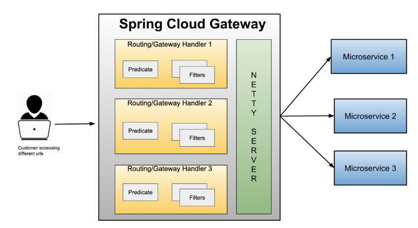
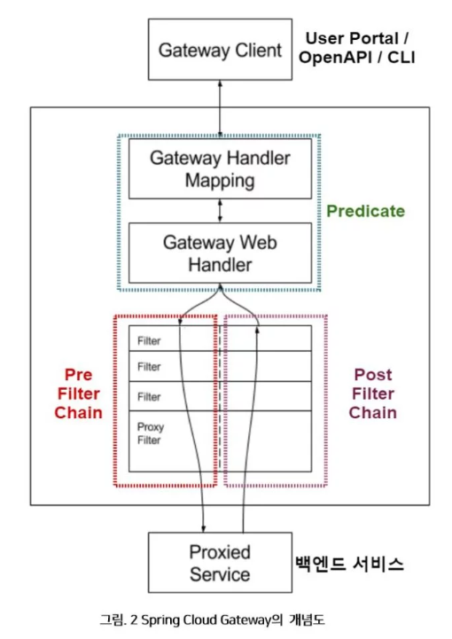

### API Gateway

API Gateway를 구축함으로써 여러 microservice 요청에 대해 필터, 로깅, 모니터링, 라우팅 등 다양한 작업을 할 수 있다.

클라이언트의 진입점을 한 곳(API Gateway)로 통일할 수 있고, 요청에 대한 다양한 작업이 가능하다.


##### 주요 기능

- 인증/인가
- 라우팅
- 백엔드 API 서버 로드 밸런싱
- 공통 로직 처리
- 로깅 및 모니터링


### Spring Cloud Gateway

Spring Cloud Gateway는 Spring Cloud 팀에서 만든 API Gateway 서비스이다.

API Gateway의 성능 측면때문에 Netty 기반으로 서버가 작동한다.

Routes, Predicates, Filters 로 쉽게 라우팅, 조건, 필터 등을 적용할 수 있다.



##### 왜 tomcat 기반이 아니라 netty 기반일까 ?

API Gateway는 모든 요청이 통과하는 통로이므로 성능적 측면이 매우 중요하다.

Spring MVC는 1 Thread / 1 Request 방식이므로 성능적 이슈가 발생할 수 있다.

Netty는 비동기 WAS이고 1 Thread / Many Requests , 1개의 Thread로 모든요청을 처리하기 때문에 기존 방식보다 더 많은 요청을 처리할 수 있다.

- ##### 높은 성능

  - `비동기 I/O와 이벤트 기반 처리`: 많은 요청을 효율적으로 처리 (고성능)
  - `다중 연결 처리` : API Gateway는 수많은 클라이언트와 서비스 간의 통신을 중계, Netty는 대규모 연결을 동시에 처리할 수 있다. 즉, 많은 트래픽을 처리하는 API Gateway에 적합

- ##### 낮은 지연 시간 (Low Latency)

  - `빠른 I/O 처리` : Netty는 요청을 처리하는 시간이 짧다. -> 고속 응답 -> **실시간** 요구 높은 시스템에 효과적

- ##### 확장성

  - `커스터마이징 가능한 파이프라인`
    - Netty는 파이프라인 구조를 사용해 요청을 처리
    - API Gateway의 라우팅, 인증, 로깅, 모니터링 등 다양한 기능을 구현 및 최적화 할 수 있다.
  - `프로토콜 지원`
    - HTTP, WebSocket, gRPC, TCP/UDP 등 다양한 프로토콜 지원

##### 

##### Spring Cloud Gateway 기본 동작 구조



1. Client가 API Gateway 서버로 요청을 보낸다.
2. `Gateway Handler Mapping`으로 요청 경로와 일치 여부를 판단한다.
3. `Gateway Web Handler`에서 요청과 관련된 filter chain을 통해 요청이 전송된다.
4. `Filter` 를 통해 요청 및 응답에 필요한 전처리, 후처리를 할 수 있다.
   - Fliter는 `Pre Filter`, `Post Filter`로 나뉘어진다. 


##### Filter

- GlobalFilter, CustomFilter로 세부 적용 가능

- `AbstractGatewayFilterFactory` 클래스를 상속받아 `apply` 메서드를 오버라이딩해서 필터를 적용할 수 있다.

```java
package com.example.apigatewayservice.filter;

import lombok.extern.slf4j.Slf4j;
import org.springframework.cloud.gateway.filter.GatewayFilter;
import org.springframework.cloud.gateway.filter.factory.AbstractGatewayFilterFactory;
import org.springframework.http.server.reactive.ServerHttpRequest;
import org.springframework.http.server.reactive.ServerHttpResponse;
import org.springframework.stereotype.Component;
import reactor.core.publisher.Mono;

@Component
@Slf4j
public class CustomFilter extends AbstractGatewayFilterFactory<CustomFilter.Config> {

    public CustomFilter() {
        super(Config.class);
    }

    @Override
    public GatewayFilter apply(Config config) {

        // Custom Pre Filter
        return (exchange, chain) -> {
            ServerHttpRequest request = exchange.getRequest();
            ServerHttpResponse response = exchange.getResponse();

            log.info("Custom PRE filter: request id -> {}", request.getId());

            // Custom Post Filter
            return chain.filter(exchange).then(Mono.fromRunnable(() -> {
                log.info("Custom POST filter: response code -> {}", response.getStatusCode());
            }));
        };
    }

    public static class Config {
        // configuration 정보

    }
}
```

위와 같이 `CustomFilter` 클래스를 작성하고 `application.yml`에 명시함으로써 특정 요청에 대해 Filter를 적용할 수 있다.

```yaml
spring:
  application:
    name: apigateway-service
  cloud:
    gateway:
      default-filters:
        - name: GlobalFilter
          args:
            baseMessage: Spring Cloud Gateway Global Filter
            preLogger: true
            postLogger: true
      routes:
        - id: user-service
          uri: lb://USER-SERVICE
          predicates:
            - Path=/user-service/**
            - Method=GET
          filters:
            - RemoveRequestHeader=Cookie
            - RewritePath=/user-service/(?<segment>.*), /$\{segment} # 앞, 뒤 -> 앞 형태 uri를 뒤 형태의 uri로 변경
            - CustomFilter
            - AuthorizationHeaderFilter
```

- `spring.cloud.gateway.routes` : id, uri, preidcates, filters로 요청에 대한 다양한 처리를 할 수 있다.
  - 위에서부터 탐색하며 predicates 조건이 부합하는 첫 과정만 실행된다.

- `spring.cloud.gateway.default-filters` : API Gateway를 거치는 모든 요청에 적용할 필터 -> `GlobalFilter`
- `spring.cloud.gateway.routes` : 특정 요청에 대해 routing
  - `id` : spring application name
  - `uri` : 라우팅 될 uri
    - `lb://USER-SERVICE` : Eureka Server에 등록된 USER-SERVICE라는 application으로 라우팅
      - **기본적으로** Eureka Server의 USER-SERVICE의 ip가 `127.0.0.1:12345` 라면 서비스의 ip 뒤에 Path 경로가 그대로 붙는다.
      - 즉, `http://apigateway-service:8000/user-service/**` 는 `http://127.0.0.1:12345/user-service/**`로 라우팅된다.
      - `RewritePath=/user-service/(?<segment>.*), /$\{segment}` : 콤마 앞의 경로를 뒤 경로로 수정해서 라우팅하는 설정이다.
  - `predicates` : 라우팅 조건
    - `Path` : 요청 경로
    - `Method` : 요청 Http Method
  - `filters` : 해당 요청에 적용될 필터
    - 우리가 작성한 `AuthorizationHeaderFilter`를 명시함으로써 /user-service/ 경로를 가진 모든 GET 요청에는 해당 필터가 적용된다.

