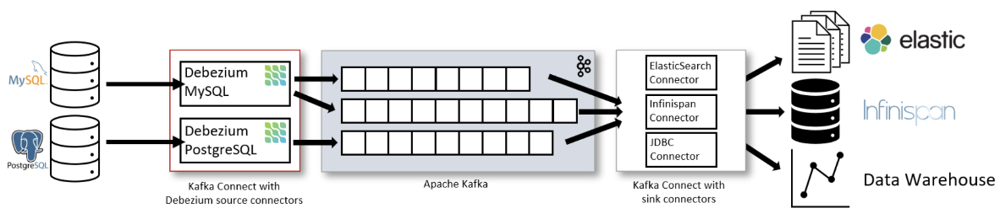
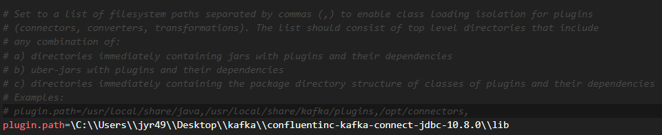
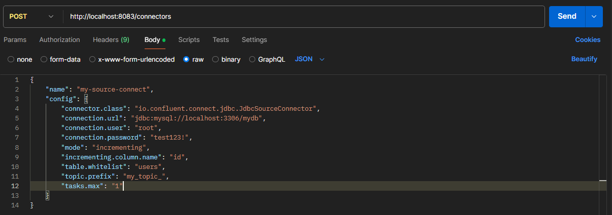
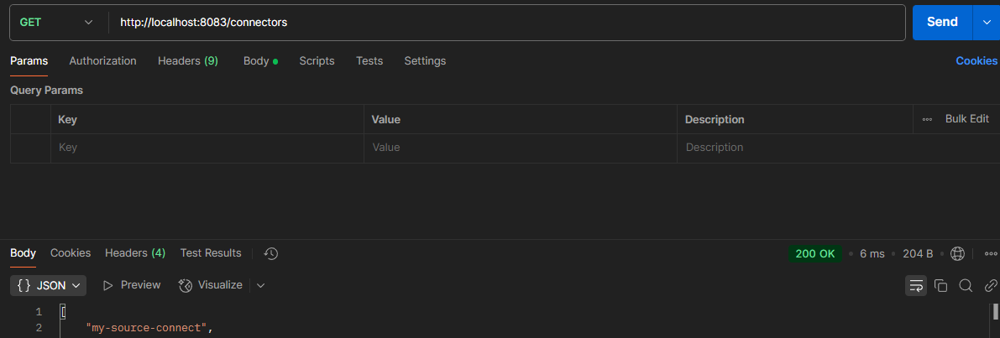
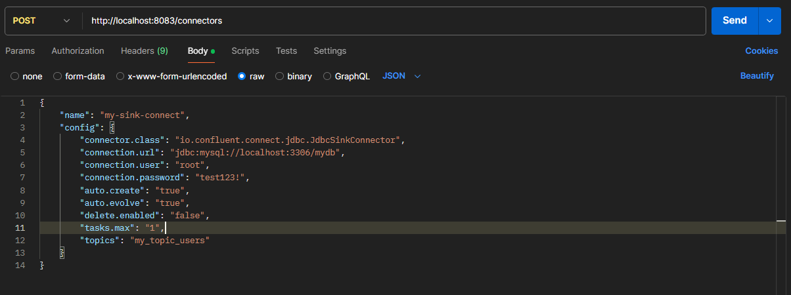
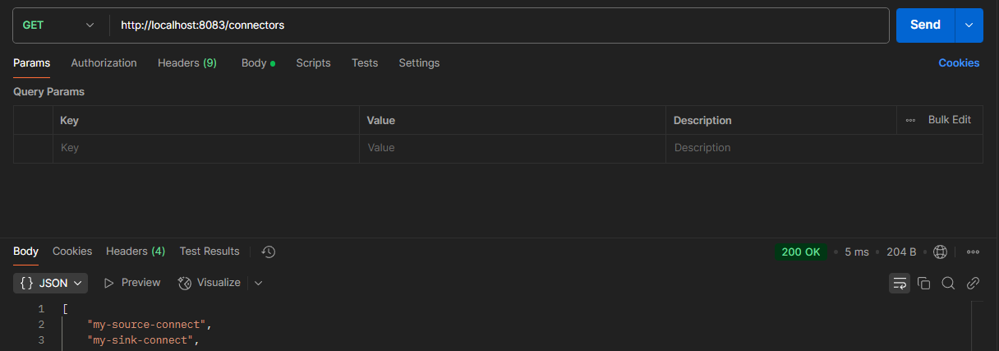
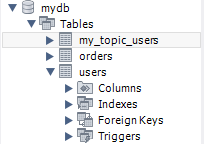
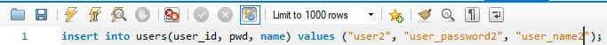
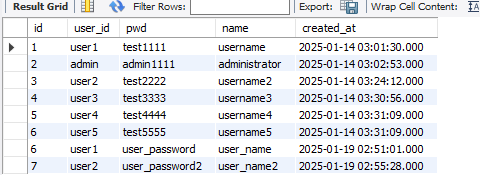

### Kafka Connect

Kafka는 Producer와 Consumer를 통해 데이터 파이프라인을 만들 수 있다. 예를 들어 A서버의 DB에 저장한 데이터를 Kafka Producer/Consumer를 통해 B서버의 DB로도 보낼 수 있다. 이러한 파이프라인이 여러개면 매번 반복적으로 파이프라인을 구성해줘야 한다. Kafka Connect는 이러한 반복적인 파이프라인 구성을 쉽고 간편하게 만들 수 있게 만들어진 Apache Kafka 프로젝트 중 하나이다.

위 사진은 Kafka Connect를 이용해 왼쪽 DB의 데이터를 Connect, Source Connector를 사용해 Kafka Broker로 보내고 Connect와 Sink Connector를 사용해 Kafka에 담긴 데이터를 DB에 저장한다.

- `Connect` : Connector를 동작하게 하는 프로세서(서버)
- `Connector` : Data Source(DB)의 데이터를 처리하는 소스가 들어있는 jar 파일
- `Source Connector` : data source에 담긴 데이터를 topic에 담는 역할을 하는 connector (producer)
- `Sink Connector` : topic에 담긴 데이터를 특정 data source로 보내는 역할을 하는 connector (consumer)

Connect는 단일 모드(Standalone), 분산 모드(Distributed)로 이루어져있다.

- 단일모드(Standalone) : 하나의 Connect만 사용하는 모드
- 분산모드(Distributed) : 여러 개의 Connect를 한개의 클러스터로 묶어서 사용하는 모드 -> 특정 Connect에 장애가 발생해도 나머지 Connect가 대신 처리함

### Kafka Connect 사용

Kafka Connect를 사용하기 위해선 기본적으로 Zookeeper, Kafka 서버가 작동되고 있어야 한다.

1. ##### Kafka Connect 설치

`curl -O http://packages.confluent.io/archive/7.3.1/confluent-community-7.3.1.tar.gz` 명령어로 Kafka Connect를 설치한다.

이후, 압축을 풀면 Kafka Connect 실행에 필요한 폴더, 파일이 생성된다.

2. ##### JDBC Connector 설치

https://www.confluent.io/hub/confluentinc/kafka-connect-jdbc 에서 `Self-Hosted` 버전을 다운로드해서 사용했다.

connector jdbc 버전은 10.8.0 버전

이후에 `{kafka-connector 디렉토리}/etc/kafka/` 에 있는 **connect-distributed.properties**에 설치한 **jdbc-connector의 lib 폴더** 경로를 입력해준다.

3. ##### MySQL Connector 설치

SpringBoot 애플리케이션에서 사용하고 있는 MySQL Connector를 복사해서 사용했다. 따로 설치해도 됨

이후 `{kafka-connector 디렉토리}/share/java/kafka`에 복사한다.

4. ##### Kafka-Connect 실행

{kafka-connector 디렉토리} 에서 `.\bin\windows\connect-distributed.bat .\etc\kafka\connect-distributed.properties` 명령어를 실행하면 기본적으로 8083 포트로 실행된다.

#### Source Connector 생성 및 확인

#### source connector 생성

host_ip의 8083 포트로 요청해서 Source Connector를 생성할 수 있다.

- `name` : source connector 이름
- `config.connector.class` : 커넥터 종류
- `config.connection.url` : DB 정보 입력
- `config.connection.user` : DB 유저 정보
- `config.connection.password` : DB 비밀번호
- `config.mode` : **테이블에 데이터가 추가되었을 때 데이터를 polling 하는 방식** (bulk, incrementing, timestamp, timestamp+incrementing)
- `config.incrementing.column.name` : incrementing mode일 때 자동 증가 column명
- `config.table.whitelist` : 데이터 변경을 감지할 table 명
- `config.topic.prefix` : kafka 토픽에 저장될 이름 형식 지정 -> {config.topic.prefix} + {config.table.whitelist} 로 저장된다. `my_topic_users`

#### 생성된 source connector 확인

`{host ip}:8083/connector` 로 GET 요청을 보내서 확인할 수 있다.

#### Sink Connector 생성 및 확인

#### sink connector 생성

- `config.auto.create` : 데이터를 넣을 테이블이 누락되었을 경우 자동 테이블 생성 여부
- `config.auto.evolve` : 특정 데이터 열이 누락된 경우 대상 테이블에 ALTER 구문을 날려 자동으로 테이블 구조를 바꾸는지 여부
  - 데이터 타입 변경, 컬럼 제거, 기본 키 제약 조건 추가등은 시도되지 않는다.
- `config.delete.enabled` : 삭제 모드 여부

#### sink connector 생성 확인

connector 들이 정상적으로 생성되면 연결한 DB에 해당 토픽 명으로 테이블이 생성된다.

users 테이블에 새로운 데이터를 삽입하면 source connector는 users 테이블의 변경을 감지하고 kafka broker의 my_topic_users 토픽으로 데이터를 전달한다. 

sink connector는 my_topic_users의 데이터를 전달 받고 변경 사항을 jdbc로 연결한 DB에 해당 내용을 반영한다.

##### 데이터 삽입

##### my_topic_users 테이블에 변경사항 저장 확인

##### Command 창에서 명령어로 my_topic_users에 전달되는 데이터 확인

전달되는 데이터 포맷을 안다면 애플리케이션에서 데이터를 가공하여 해당 포맷에 맞춰 topic으로 전달하면 sink connector는 해당 데이터를 읽어 DB에 데이터를 저장하는 파이프라인을 구성할 수도 있다.