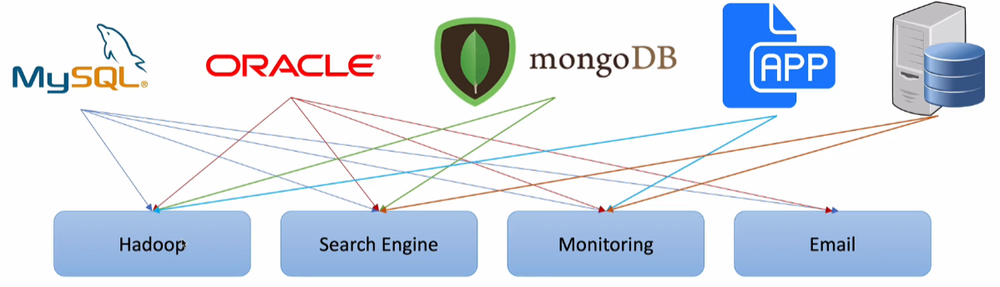
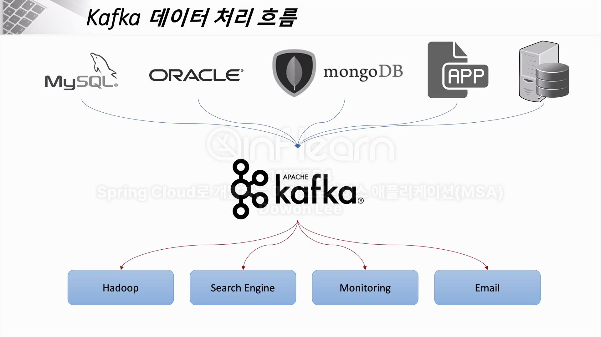
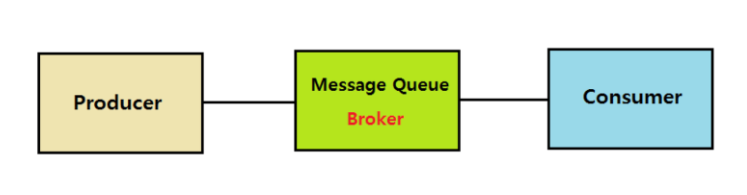
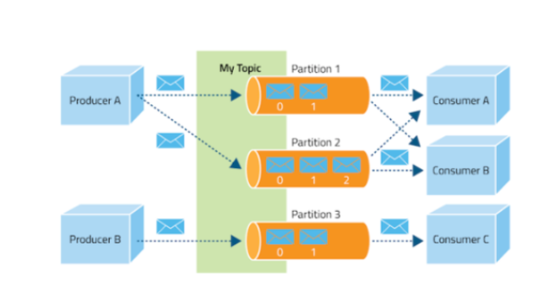
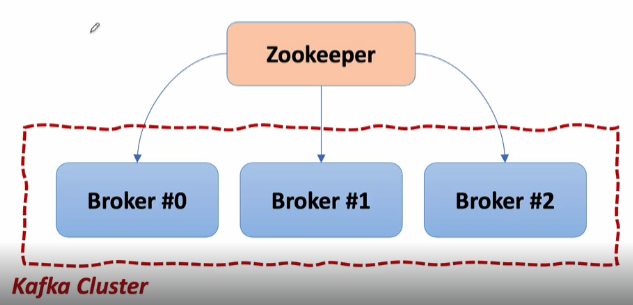
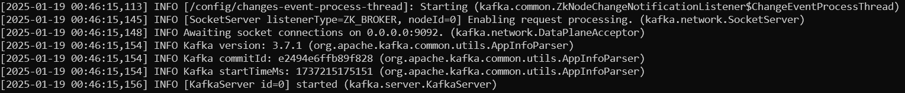
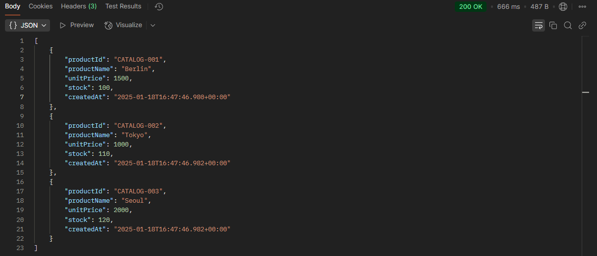
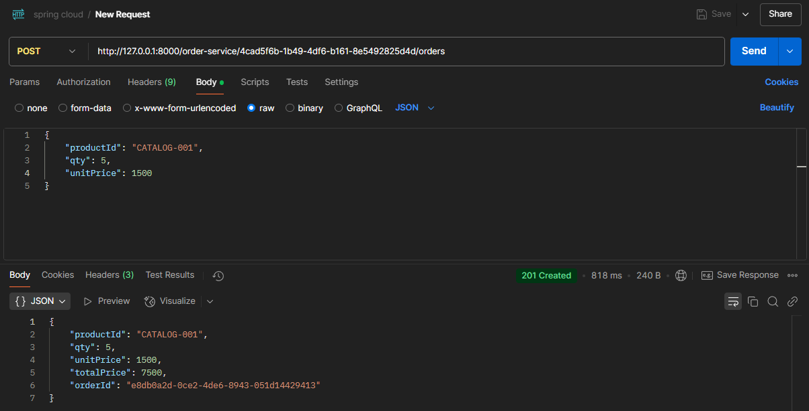
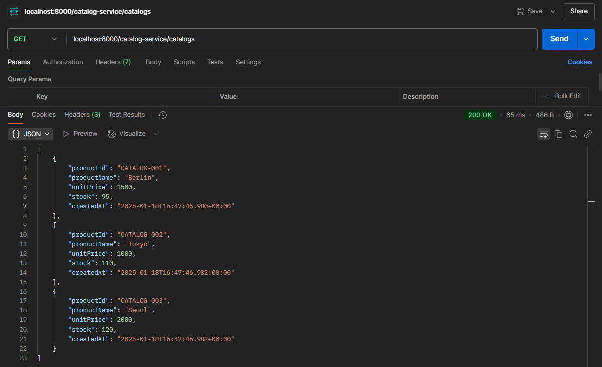
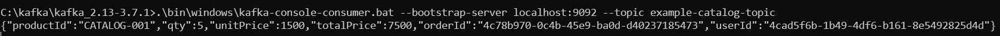

### 카프카(Kafka)

카프카(Kafka)는 파이프라인, 스트리밍 분석, 데이터 통합 및 미션 크리티컬 애플리케이션을 위해 설계된 `고성능 분산 이벤트 스트리밍 플랫폼`이다.

`Pub-Sub` 모델의 메시지 큐 형태로 동작하며 분산환경에 특화되어 있다.


### 카프카 사용 전 문제점



- 각 애플리케이션의 End-to-End 연결 방식의 아키텍처
- 데이터 연동의 복잡성 증가 (HW, 운영체제, 장애 등)
  - 통합된 전송 영역이 없어 데이터 흐름을 파악하기 어렵고, 시스템 관리가 어려움
  - 특정 부분에서 장애 발생 시 조치 시간 증가 (연결 되어있는 애플리케이션 모두 확인)
  - HW 교체, SW 업그레이드 시 관리포인트가 늘어나고, 작업시간 증가 (각 애플리케이션 side-effect 확인)
- 서로 다른 데이터 파이프라인 구조
- 확장이 어려운 구조 `파이프라인마다 다른 데이터 포맷, 처리 방식`


### 카프카(Kafka)의 목적

- 모든 시스템으로 데이터를 실시간으로 전송하여 처리할 수 있는 시스템
- 데이터가 많아지더라도 확장이 용이한 시스템


### 카프카 적용 후



- 모든 이벤트/데이터 흐름을 중앙에서 관리할 수 있게 됨
- 새로운 서비스/시스템이 추가되어도 카프카가 제공하는 표준 포맷으로 연결하면 되므로 확장성과 신뢰성 증가
- 개발자는 각 서비스간의 연결이 아닌, 서비스들의 비즈니스 로직에 집중 가능


### 카프카의 동작 방식 및 특징

카프카는 Pub-Sub 모델의 메세지 큐 형태로 동작한다.


#### 메세지 큐 (Message Queue, MQ)

메세지 큐는 메세지 지향 미들웨어 (MOM : Message Oriented Middleware)를 구현한 시스템으로 프로그램(프로세스)간의 데이터를 교환할 때 사용하는 기술



- `Producer` : 정보를 제공하는 자
- `Consumer` : 정보를 제공받아서 사용하는 자
- `Queue` : Producer의 데이터를 임시 저장하고 Consumer에게 제공하는 곳


기존 애플리케이션끼리 Endpoint간 직접 통신하는 것이 아닌 애플리케이션 중간에 MQ를 두고 MQ를 통해 중개되는 방식으로 통신


#### MQ의 장점

1. 비동기 : Queue라는 임시 저장소가 있기 때문에 나중에 처리 가능
2. 낮은 결합도 : 애플리케이션과 분리
3. 확장성 : producer, consumer 서비스를 원하는대로 확장할 수 있다.
4. 탄력성 : consumer 서비스가 다운되더라도 애플리케이션이 중단되는 것은 아니며 메세지는 지속하여 MQ에 남아 있다.
5. 보장성 : MQ에 들어가면 결국 모든 메세지가 consumer 서비스에 전달된다는 보장을 제공


### 메세지 브로커 / 이벤트 브로커

#### 

#### 메세지 브로커 (Message Broker)

publisher가 생산한 메세지를 메세지 큐에 저장하고, 저장된 데이터를 consumer가 가져갈 수 있도록 중간 다리 역할을 해주는 브로커

보통 서로 다른 시스템, 소프트웨어 사이에서 데이터를 비동기 형태로 처리하기 위해 사용한다. `대규모 엔터프라이즈 환경의 미들웨어로서 기능`

이러한 구조를 보통 pub/sub 구조라고 하며 대표적으로는 Redis, RabbitMQ 소프트웨어가 있고, GCP의 pubsub, AWS의 SQS 같은 서비스가 있다.

이와 같은 메세지 브로커들은 consumer가 큐에서 데이터를 가져가게 되면 즉시 혹은 짧은 시간 내에 큐에서 데이터가 삭제되는 특징이 있다.


#### 이벤트 브로커 (Event Broker)

이벤트 브로커도 기본적으로 메세지 브로커의 큐 기능들을 가지고있어 메세지 브로커의 역할도 할 수 있다. 하지만, 이벤트 브로커는 publisher가 생산한 이벤트를 처리 후에 바로 삭제하지 않고 저장한다. 

이벤트 시점이 저장되어 있어서 consumer가 특정 시점부터 이벤트를 다시 소비할 수 있는 장점이 있다. `장애 발생 시점부터 다시 이벤트 실행 가능`

또한, 대용량 처리에 있어서 메세지 브로커보다는 많은 양의 데이터를 처리할 수 있는 능력이 있다.

이벤트 브로커에는 Kafka, AWS kinesis 같은 서비스가 있다.


#### 카프카의 동작 방식 및 특징



##### 구성 요소

- `Event` : kafka에서 producer, consumer가 데이터를 주고 받는 단위
- `Producer` : kafka에 이벤트를 게시하는 클라이언트 애플리케이션 (topic에 저장)
- `Consumer` : kafka의 topic을 구독하고 이로부터 이벤트를 받아 처리하는 클라이언트 애플리케이션
- `Topic` : 이벤트가 모이는 곳. producer는 topic에 이벤트를 게시. consumer는 topic을 구독하여 이벤트를 가져와 처리
- `Partition` : Topic은 여러 Broker에 분산되어 저장되며, 이렇게 분산된 topic을 partition이라 한다.'
- `Zookeeper` : 분산 메세지 큐 정보를 관리

##### 동작 원리

1. publisher는 전달하고자 하는 메세지를 topic을 통해 카테고리화 한다.
2. subscriber는 원하는 topic을 구독함으로써 메세지를 읽어온다.
3. publisher, subscriber는 topic 정보만 알 뿐 서로에 대해 알지 못한다.
4. kafka는 broker들이 하나의 클러스터로 구성되어 동작하도록 설계
5. 클러스터 내 broker에 대한 분산 처리는 Zookeeper가 담당




#### 카프카(Kafka) 사용

1. ##### 카프카 설치

Docker나 공식 사이트에 접속해서 kafka를 설치할 수 있다.

2. ##### Zookeeper 서버 시작

kafka 서버 (broker)를 실행하기 전 broker를 관리하는 서버를 실행시켜줘야 한다.

- **command** :  `.\bin\windows\zookeeper-server-start.bat .\config\zookeeper.properties`
  - 기본적으로 2181 포트로 zookeeper 서버가 실행된다.

3. ##### kafka 서버 시작

- **command** : `.\bin\windows\kafka-server-start.bat .\config\server.properties`
  - 기본적으로 9092 포트로 kafka broker가 생성된다.




#### 카프카 명령어

모든 명령어는 kafka 폴더에서 bin 폴더가 존재하는 위치에서 시작하고, window 기준이다.

1. ##### 토픽 확인

`.\bin\windows\kafka-topics.bat --bootstrap-server localhost:9092 --list`

2. ##### 토픽 생성

`.\bin\windows\kafka-topics.bat --create --topic {topic_name} --bootstrap-server localhost:9092 --partitions 1`

3. ##### 토픽 정보 확인

`.\bin\kafka-topics.bat --describe --topic test_topic --bootstrap-server localhost:9092`

4. ##### 메세지 생산

`.\bin\windows\kafka-console-producer.bat --broker-list localhost:9092 --topic {topic_name}`

해당 명령어를 입력하면 {topic_name}을 구독하고 있는 모든 노드에 메세지가 전송된다.

5. ##### 메세지 소비

`.\bin\windows\kafka-console-consumer.bat --bootstrap-server localhost:9092 --topic {topic_name} --from-beginning`

해당 명령어를 입력하면 {topic_name}을 구독한다는 의미이다. 구독 이후 해당 topic에 전달되는 모든 메세지를 전달받을 수 있으며 `--from-beginning` 옵션을 통해 topic의 처음부터 모든 메세지를 전송받겠다는 의미이다.


#### Spring 애플리케이션에서 단순 사용

`user-service`, `order-service`, `catalog-service` 3개의 마이크로서비스로 운영중인 서비스가 있다고 가정하고, `order-service`, `catalog-service`에서 kafka를 활용하여 간단하게 데이터를 전달하는 예제를 해보고자 한다.

해당 예제는 로컬에서 진행하며 Zookeeper, Kafka 서버가 각 2181, 9092 서버에서 작동하고 있는 상태이다.

- `Producer` : order-service
- `Consumer` : catalog-service

##### 

#### order-service

SpringBoot에서 Kafka의 기능을 사용하기 위해서는 spring-kafka 의존성이 필요하다. `build.gradle`, `pom.xml` 형식에 맞춰 추가하자.

```
<dependency>
    <groupId>org.springframework.kafka</groupId>
    <artifactId>spring-kafka</artifactId>
</dependency>
```


##### KafkaProducerConfig

```java
import org.apache.kafka.clients.producer.ProducerConfig;
import org.apache.kafka.common.serialization.StringSerializer;
import org.springframework.context.annotation.Bean;
import org.springframework.context.annotation.Configuration;
import org.springframework.kafka.annotation.EnableKafka;
import org.springframework.kafka.core.DefaultKafkaProducerFactory;
import org.springframework.kafka.core.KafkaTemplate;
import org.springframework.kafka.core.ProducerFactory;

import java.util.HashMap;
import java.util.Map;

@Configuration
@EnableKafka
public class KafkaProducerConfig {

    @Bean
    public ProducerFactory<String, String> producerFactory() {

        Map<String, Object> properties = new HashMap<>();
        properties.put(ProducerConfig.BOOTSTRAP_SERVERS_CONFIG, "{localhost_ip}:9092");
        properties.put(ProducerConfig.KEY_SERIALIZER_CLASS_CONFIG, StringSerializer.class);
        properties.put(ProducerConfig.VALUE_SERIALIZER_CLASS_CONFIG, StringSerializer.class);

        return new DefaultKafkaProducerFactory<>(properties);
    }

    @Bean
    public KafkaTemplate<String, String> kafkaTemplate() {
        return new KafkaTemplate<>(producerFactory());
    }
}
```


##### KafkaProducer

```java
import com.example.orderservice.dto.OrderDto;
import com.fasterxml.jackson.core.JsonProcessingException;
import com.fasterxml.jackson.databind.ObjectMapper;
import lombok.RequiredArgsConstructor;
import lombok.extern.slf4j.Slf4j;
import org.springframework.kafka.core.KafkaTemplate;
import org.springframework.stereotype.Service;

@Service
@Slf4j
@RequiredArgsConstructor
public class KafkaProducer {

    private final KafkaTemplate<String, String> kafkaTemplate;

    public OrderDto send(String topic, OrderDto orderDto) {
        ObjectMapper mapper = new ObjectMapper();
        String jsonInString = "";
        try {
            jsonInString = mapper.writeValueAsString(orderDto);
        } catch (JsonProcessingException e) {
            e.printStackTrace();
        }

        kafkaTemplate.send(topic, jsonInString);
        log.info("Kafka Producer sent data from the Order microservice: {}", orderDto);

        return orderDto;
    }
}
```


##### OrderDto

```java
import lombok.Data;

import java.io.Serializable;

@Data
public class OrderDto implements Serializable {
    private String productId;
    private Integer qty;
    private Integer unitPrice;
    private Integer totalPrice;

    private String orderId;
    private String userId;
}
```


##### OrderController (주문 생성 경로)

```java
@PostMapping("/{userId}/orders")
public ResponseEntity<ResponseOrder> createOrder(@PathVariable String userId,
                                                 @RequestBody RequestOrder orderDetails) {
    ModelMapper mapper = new ModelMapper();
    mapper.getConfiguration().setMatchingStrategy(MatchingStrategies.STRICT);

    OrderDto orderDto = mapper.map(orderDetails, OrderDto.class);
    orderDto.setUserId(userId);

    /* jpa */
    OrderDto createdOrder = orderService.createOrder(orderDto);
    ResponseOrder responseOrder = mapper.map(createdOrder, ResponseOrder.class);
    
    /* send this order to the kafka */
    kafkaProducer.send("example-catalog-topic", orderDto);
    
    ResponseOrder responseOrder = mapper.map(orderDto, ResponseOrder.class);

    return ResponseEntity.status(HttpStatus.CREATED).body(responseOrder);
}
```

- 주문이 생성되는 이벤트가 발생하면  client로부터 RequestOrder 객체를 받아 service 단에서 OrderDto 형태로 반환받는다.
- kafkaProducer의 send 메서드를 사용해서 토픽에 메세지를 전달한다.
- `kafkaProducer.send("example-catalog-topic", orderDto);`
- 반환 받은 OrderDto를 kafka의 `example-catalog-topic`이라는 토픽에 전달한다. -> 해당 토픽을 구독하고 있는 모든 서비스가 OrderDto를 확인할 수 있다.


#### catalog-service

order-service와 마찬가지로 spring-kafka 의존성을 추가한다.


##### KafkaConsumerConfig

```java
import org.apache.kafka.clients.consumer.ConsumerConfig;
import org.apache.kafka.common.serialization.StringDeserializer;
import org.springframework.context.annotation.Bean;
import org.springframework.context.annotation.Configuration;
import org.springframework.kafka.annotation.EnableKafka;
import org.springframework.kafka.config.ConcurrentKafkaListenerContainerFactory;
import org.springframework.kafka.core.ConsumerFactory;
import org.springframework.kafka.core.DefaultKafkaConsumerFactory;

import java.util.HashMap;

@EnableKafka
@Configuration
public class KafkaConsumerConfig {

    @Bean
    public ConsumerFactory<String, String> consumerFactory() {

        HashMap<String, Object> properties = new HashMap<>();
        // kafka container host
        properties.put(ConsumerConfig.BOOTSTRAP_SERVERS_CONFIG, "{localhost_ip}:9092");
        properties.put(ConsumerConfig.GROUP_ID_CONFIG, "consumerGroupId");
        properties.put(ConsumerConfig.KEY_DESERIALIZER_CLASS_CONFIG, StringDeserializer.class);
        properties.put(ConsumerConfig.VALUE_DESERIALIZER_CLASS_CONFIG, StringDeserializer.class);
        return new DefaultKafkaConsumerFactory<>(properties);
    }

    @Bean
    public ConcurrentKafkaListenerContainerFactory<String, String> kafkaListenerContainerFactory() {

        ConcurrentKafkaListenerContainerFactory<String, String> kafkaListenerContainerFactory =
                new ConcurrentKafkaListenerContainerFactory<>();
        kafkaListenerContainerFactory.setConsumerFactory(consumerFactory());
        return kafkaListenerContainerFactory;
    }
}
```


##### KafkaConsumer

```java
import com.example.catalogservice.entity.CatalogEntity;
import com.example.catalogservice.repository.CatalogRepository;
import com.fasterxml.jackson.core.JsonProcessingException;
import com.fasterxml.jackson.core.type.TypeReference;
import com.fasterxml.jackson.databind.ObjectMapper;
import lombok.RequiredArgsConstructor;
import lombok.extern.slf4j.Slf4j;
import org.apache.kafka.common.errors.ResourceNotFoundException;
import org.springframework.kafka.annotation.KafkaListener;
import org.springframework.stereotype.Service;

import java.util.HashMap;
import java.util.Map;

@Service
@Slf4j
@RequiredArgsConstructor
public class KafkaConsumer {
    
    private final CatalogRepository repository;
    
    @KafkaListener(topics = "example-catalog-topic")
    public void updateQty(String kafkaMessage) {
        log.info("Kafka Message = {}", kafkaMessage);

        Map<Object, Object> map = new HashMap<>();
        ObjectMapper mapper = new ObjectMapper();
        
        try {
            // json 형식의 데이터를 Map key-value 형식으로 변환
            map = mapper.readValue(kafkaMessage, new TypeReference<Map<Object, Object>>() {});

        } catch (JsonProcessingException e) {
            e.printStackTrace();
        }

        String productId = (String) map.get("productId");
        CatalogEntity entity = repository.findByProductId(productId).orElseThrow(() -> new ResourceNotFoundException(
                "product_id is not found"
        ));

        entity.setStock(entity.getStock() - (Integer) map.get("qty"));
        repository.save(entity);
    }
}
```

SpringBoot는 `@KafkaListener` 애노테이션을 사용해 토픽을 구독하고 특정 로직을 처리하는 과정을 간편화한다.

- 카프카의 `example-catalog-topic` 토픽을 구독하며, 해당 토픽에 변경이 생기면 @KafkaListener 애노테이션이 붙은 메서드를 실행한다.
- 여기서는 JPA를 활용해서 해당 물건의 재고를 주문 수량만큼 차감하는 로직이 실행됐다.
  - `entity.setStock(entity.getStock() - (Integer) map.get("qty"));`


#### 로직 실행 전 물건 재고




#### 주문 생성




#### 재고 감소 확인



kafka에서 producer `order-service` 가 데이터를 전달하고, consumer `catalog-service` 가 해당 데이터를 전달 받아 재고를 정상적으로 감소하는 로직을 실행하고 검증했다.

#### command 창에서 kafka 토픽 확인

커맨드 창에서도 위에서 알아본 명령어를 사용해 `example-catalog-topic` 토픽에 어떤 데이터가 전달되었는지 확인할 수 있다.



