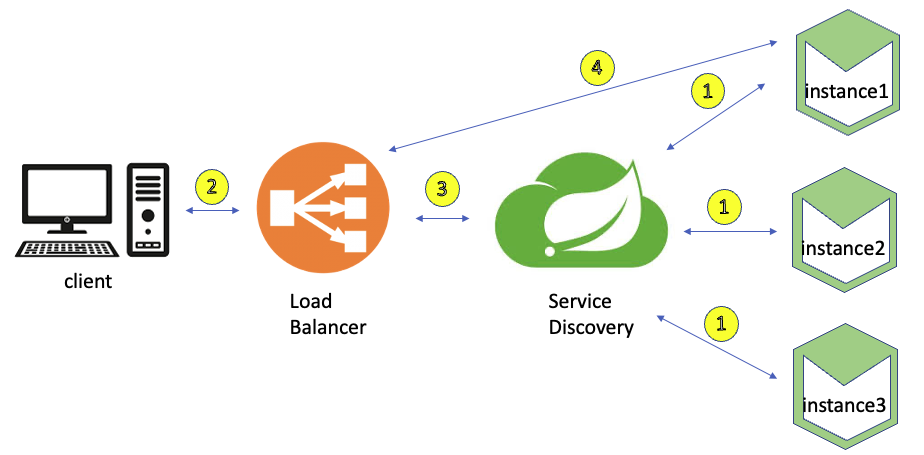

# Service Discovery

- 외부에서 다른 서비스들이 마이크로서비스를 검색하기 위해 사용하는 개념
- `key - value` 형식, `서비스 - 위치`



1. Service Discovery에 **서비스 등록**
2. Client 요청
3. Load Balancer가 Service Discovery에서 Client 요청을 처리할 수 있는 서비스 **검색**
4. 실제 처리할 수 있는 서비스 로직 실행


### Spring Cloud Eureka

Spring Cloud Eureka는 Service Discovery, Service Registry를 지원하기 위한 라이브러리이며 서버, 클라이언트로 나뉜다.


#### Eureka Server

- ##### DiscoveryserviceApplication

```java
@SpringBootApplication
@EnableEurekaServer
public class DiscoveryserviceApplication {

    public static void main(String[] args) {
        SpringApplication.run(DiscoveryserviceApplication.class, args);
    }

}
```

`@EnableEurekaServer` 애노테이션을 main 함수에 작성함으로써 Eureka Server를 명시적으로 설정할 수 있다.

- ##### application.yml

```yaml
server:
  port: 8761

spring:
  application:
    name: discoveryservice

eureka:
  client:
    register-with-eureka: false # 자기 자신을 서비스로 등록하지 않겠다는 설정
    fetch-registry: false # eureka 서버로부터 인스턴스들의 정보를 주기적으로 가져올 것인지 설정
```


#### Eureka Client

- ##### UserServiceApplication

```java
@SpringBootApplication
@EnableDiscoveryClient
public class UserServiceApplication {

    public static void main(String[] args) {
        SpringApplication.run(UserServiceApplication.class, args);
    }

}
```

`@EnableDiscoveryClient` 애노테이션으로 Eureka Client를 명시적으로 설정

- ##### application.yml

```yaml
server:
  port: 0

spring:
  application:
    name: user-service

eureka:
  instance:
    prefer-ip-address: true
    instance-id: ${spring.cloud.client.ip-address}:${spring.application.instance_id:${random.value}}
  client:
    register-with-eureka: true
    fetch-registry: true # eureka 서버로부터 인스턴스들의 정보를 주기적으로 가져올 것인지 설정
    service-url:
      defaultZone: http://127.0.0.1:8761/eureka
```

- `server.port	` : 0 으로 설정함으로써 랜덤 포트 설정
- `eureka.client`
  - `service-url.defaultZone` : 작성한 url로 해당 애플리케이션을 서비스로 등록


### 정리

- Service Discovery는 마이크로서비스들의 IP, Port 정보를 저장하고 관리하는 서비스이다.
- Spring Cloud Eureka를 사용해서 쉽게 활용할 수 있다.
- `@EnableEurekaServer`, `@EnableDiscoveryClient` 애노테이션으로 서버, 클라이언트를 명시하고 application.yml에 설정 정보를 입력해서 `서버-클라이언트` 관계를 구축할 수 있다.