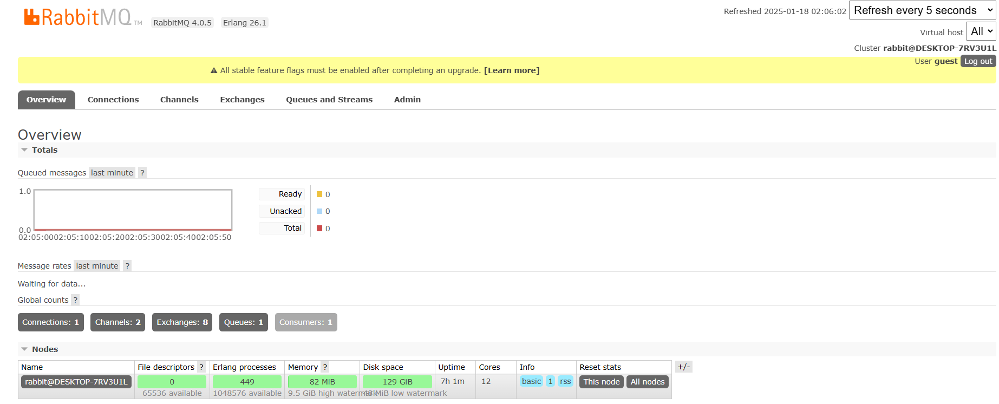

### Spring Cloud Bus

Spring Cloud Bus는 동적으로 config 변경을 적용하기 위한 `MQ(Message Queue) Handler`이다. 상태 및 구성에 대한 변경사항을 연결된 노드들(마이크로서비스)에게 전달하는 역할이며 각 노드들은 경량 메시지 브로커와 연결되어 있는 상태여야 한다.


config-server의 변경사항을 적용하기 위해서는 각 마이크로서비스에서 `/actuator/refresh`, `서버 재시작`이 필요했다. 하지만, Spring Cloud Bus를 사용하면 연결된 어떤 서비스에서라도 호출을 하게되면 다른 서비스에게까지 전달된다. 즉, 어떠한 서비스든 POST 방식으로 `/actuator/busrefresh`를 호출하면 변경 사항을 Spring Cloud Bus에서 감지하고 연결되어 있는 각 서비스들에게 변경된 사항을 업데이트 한다. `연결된 모든 노드에 refresh`


기본적으로 Spring Cloud Bus는 config-server와 각 마이크로서비스 사이에서 작동하는 `메세지 지향 미들웨어` 이기 때문에 `AMQP` 프로토콜을 사용한다.


1. config-server가 config 변경 감지
2. 갱신 이벤트를 Spring Cloud Bus를 통해 전달 `/actuator/busrefresh`
3. 메시지 브로커`RabbitMQ`는 연결된 노드(`Microservices`)에 Refresh Message 전송
4. Refresh Message를 전송받은 각 노드는 `/actuator/refresh` 엔드포인트를 호출하여 config-server에 갱신된 config 정보를 업데이트


### RabbitMQ

RabbitMQ를 사용하기 위해선 Erlang 언어를 미리 설치해야 한다.

1. ##### RabbitMQ 서버 설치

Host PC에 Docker 또는 실행 파일을 다운로드 받아 서버를 실행시킨다. 기본적으로 client가 browser로 접속하기 위해선 15672 포트를 사용한다. 만약, Docker로 서버를 설치하게 된다면 포트포워딩을 알맞게 해줘야 한다.

`localhost:15672`로 접속하면 id, password를 입력해야 하는데 기본 값은 guest, guest이다.




2. ##### Config Server

Spring Cloud Bus의 기능을 사용하기 위해서는 `spring-cloud-starter-bus-amqp`, `spring-boot-starter-actuator` 의존성이 필요하다.

- `application.yml`

```yaml
server:
  port: 8888

spring:
  application:
    name: config-server
  rabbitmq:
    host: 127.0.0.1
    port: 5672
    username: guest
    password: guest
  cloud:
    config:
      server:
        git:
          default-label: master
          uri: https://github.com/yryryr96/spring-cloud-config-test
management:
  endpoints:
    web:
      exposure:
        include: health, busrefresh
```


3. ##### Config Client

Spring Cloud Bus의 기능을 사용하기 위해서는 `spring-cloud-starter-bus-amqp`, `spring-boot-starter-actuator` 의존성이 필요하다.

```yaml
# 추가
  rabbitmq:
    host: 127.0.0.1
    port: 5672
    username: guest
    password: guest
 
# busrefresh 추가
 management:
  endpoints:
    web:
      exposure:
        include: refresh, health, beans, busrefresh
```


Config Server, Config Client에 위와 같은 설정을 하면 Spring Cloud Bus의 기능을 사용할 준비가 된 것이다.

이제 `github repository`에 저장되어 있는 설정 파일이 변경된다면 Spring Cloud Bus에 연결되어 있는 어떤 서비스에서든 `/actuator/refresh`를 호출하면 변경 사항을 업데이트 할 수 있다.


현재는 설정 파일이 변경되면 직접 `/actuator/refresh`를 호출해서 갱신해주고 있지만, github repository에서 설정 정보가 변경되면 webhook 설정을 통해 자동으로 config-server로 `[POST] http://{config-server.ip}:8888/actuator/refresh`를 수행하는 방법도 가능할 것 같다.
