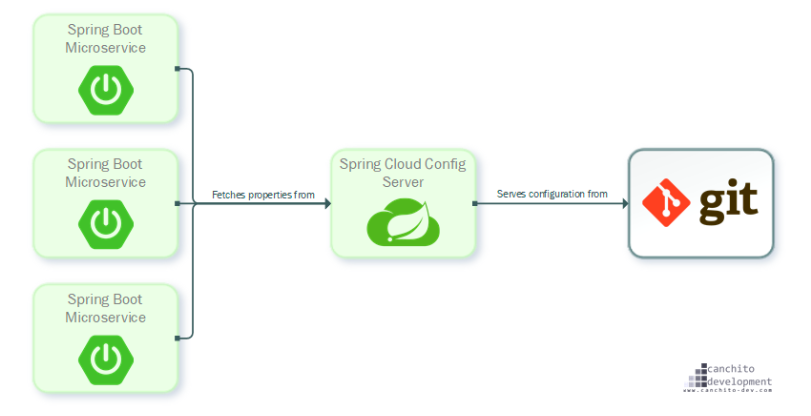
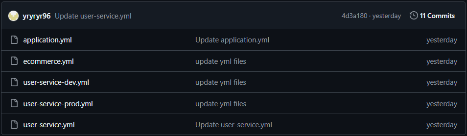

### Spring Cloud Config

Spring Cloud Config는 MSA 환경에서 외부화된 설정 정보를 서버 및 클라이언트에게 제공하는 시스템이다.

Config Server는 외부에서 모든 환경에 대한 정보들을 관리해주는 중앙 서버이다. 

기본적으로 설정 정보 저장을 위해 git을 사용하도록 되어있어서 손쉽게 외부 도구들로 접근 가능하고, 버전 관리도 가능하다.




#### Spring Cloud Config의 장단점

- ##### 장점

  - 여러 서버 설정 파일을 중앙 서버에서 관리할 수 있다.
  - 설정 파일의 변경사항을 서버를 재배포 하지 않고 반영할 수 있다.

- ##### 단점

  - Git 서버 또는 설정 서버에 의해 장애가 전파될 수 있다.
  - 우선 순위에 의해 설정 정보가 덮어씌워질 수 있다.


#### Spring Cloud Config 설정 파일 우선 순위

설정 파일은 다음 위치에 존재할 수 있고 다음의 순서대로 읽어진다. 나중에 읽어지는 것이 우선순위가 높다.

- 프로젝트의 application.yml
- 설정 저장소의 application.yml
- 프로젝트의 application-{profile}.yml
- 설정 저장소의 {application name}/{application name}-{profile}.yml


만약 읽어지는 순서대로 읽다라 동일한 값을 지니는 설정 정보가 있다면 값이 덮어 씌워진다.

예를 들어 'test' 라는 이름의 애플리케이션에 dev 프로파일인 환경 변수가 로컬의 application.yml, application-dev.yml에 있고, 설정 저장소의 application.yml, test/test-dev.yml에도 있다면 다음의 순서대로 읽어진다.

- 프로젝트의 application.yml
- 설정 저장소의 application.yml
- 프로젝트의 application-dev.yml
- 설정 저장소의 test/test-dev.yml


#### Spring Cloud Config Server 구축

1. **설정 파일 저장소 구축**

나의 경우에는 github repository에 설정 파일들을 저장하고 Spring Cloud Config Server에서 github repository를 참조하도록 설정했다.




2. **config-server 구축**

- Spring Cloud Config Server를 구성하기 위해선 `spring-cloud-config-server` 의존성이 필요하다. `build.gradle`, `pom.xml`에 형식에 맞춰 의존성을 추가한다.
- **application.yml**

```yaml
server:
  port: 8888

spring:
  application:
    name: config-server

  cloud:
    config:
      server:
        git:
          default-label: master
#          uri: file://C:\Users\jyr49\Desktop\git-local-repo
          uri: https://github.com/yryryr96/spring-cloud-config-test

```

config server는 기본적으로 8888 포트를 사용하기 때문에 `server.port` 값을 8888로 맞춰줬다.

`spring.cloud.config.server.git.uri` : github repository 주소

`spring.cloud.config.server.git.default-label` : repository의 branch 명


- ##### main class

```java
@SpringBootApplication
@EnableConfigServer
public class ConfigServiceApplication {

    public static void main(String[] args) {
        SpringApplication.run(ConfigServiceApplication.class, args);
    }
}
```

`@EnableConfigServer` 애노테이션을 명시함으로써 Config Server로 등록한다.


3. ##### config-server 실행 및 확인

Spring Cloud Config Server가 갖는 endpoint는 다음과 같다.

- /{application}/{profile}[/{label}]
- /{application}-{profile}.yml
- /{label}/{application}-{profile}.yml
- /{application}-{profile}.properties
- /{label}/{application}-{profile}.properties

기본적으로 profile을 설정하지 않았다면 profile의 기본 설정값은 `default`이다. `localhost:8888/user-service/default`로 접속하면 github에 저장되어 있는 `user-service.yml` 파일을 읽어올 수 있다.


#### Spring Cloud Config Client

config-server에서 관리하고 있는 설정파일을 MSA의 여러 분산 서비스에서 이용하고 싶다면 다음과 같은 설정으로 간편하게 이용할 수 있다.


1. ##### 의존성 추가

config-server의 리소스를 사용해야하기 때문에 `spring-cloud-config-server` 의존성이 필요하다.

2. ##### bootstrap.yml

서버를 가동하기 위해서는 application.yml 등과 같은 설정 파일이 필요하다. 하지만, 우리 서버는 config-server에서 설정 정보를 불러와야 한다. 그러므로 서버 구동에 필요한 application.yml 과 같은 설정 정보를 로딩하기 전에 `bootstrap.yml`에서 config-server 연결에 대한 정보를 작성한다.

```yaml
spring:
  cloud:
    config:
      uri: http://127.0.0.1:8888
      name: user-service
#  profiles:
#    active: dev
```

- `spring.cloud.config`
  - uri : config-server ip
  - name : 불러올 yml 파일명
- `spring.profiles.active` : 서버 작동시 적용할 profile

현재 설정으로는 config-server에 있는 user-service.yml을 불러오고 설정된다. 하지만, profile을 dev로 설정한다면 user-service-dev.yml이 불러와 설정될 것이다.


#### 문제

Spring Cloud Config Server를 사용하면 여러 서비스에서 config-server에 접근해서 설정 정보를 불러올 수 있다. 하지만, config-server에 있는 설정 정보가 변경된다면 마이크로서비스들은 설정 정보를 실시간으로 반영하지 못한다. 변경 사항을 반영하기 위해서는 `서버 재시작`, `/actuator/refresh`를 통해 변경 사항을 반영할 수 있다. 마이크로서비스의 개수가 작으면 문제 없겠지만 100개, 1000개의 서비스가 config-server를 사용하고 있다고 한다면 매우 번거로운 작업이다.

이 문제는 spring cloud bus, rabbitmq를 사용해서 해결해볼 것이다.

