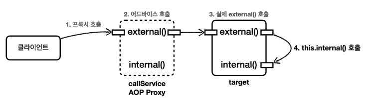

## spring-aop


#### 횡단 관심사 (cross-cutting concerns)

- 비즈니스 로직 = 핵심 기능 + 부가 기능


핵심 기능이 따로 있고, 로그 추적 기능을 추가하면 모든 핵심 로직에 부가 기능을 하는 코드를 작성해야 한다. 이렇게 되면, 수정 사항이 생겼을 때 모든 코드를 수정해야한다.


- 부가 기능을 적용할 때 아주 많은 반복이 필요하다.
- 부가 기능이 여러 곳에 퍼져서 중복 코드를 만들어낸다.
- 부가 기능을 변경할 때 중복 때문에 많은 수정이 필요하다.
- 부가 기능의 적용 대상을 변경할 때 많은 수정이 필요하다.


#### AOP 적용 방식

- `컴파일 시점` : 실제 대상 코드에 애스팩트를 통한 부가 기능 호출 코드가 포함된다. AspectJ를 직접 사용해야 한다.
- `클래스 로딩 시점` : 실제 대상 코드에 애스팩트를 통한 부가 기능 호출 코드가 포함된다. AspectJ를 직접 사용해야 한다.
- `런타임 시점` : 실제 대상 코드는 그대로 유지된다. 대신 **프록시**를 통해 부가 기능이 적용된다.


#### AOP 적용 위치

컴파일 시점, 클래스 로딩 시점에 적용되는 AOP는 바이트코드를 실제로 조작하기 때문에 모든 지점에 적용할 수 있다.

하지만, 스프링 AOP는 프록시 방식을 사용하기 때문에 `메서드 실행 지점`에만 적용할 수 있다.

- 프록시는 메서드 오버라이딩 개념으로 동작한다. 따라서, 생성자, static 메서드, 필드 값 접근에는 프록시 개념이 적용될 수 없다.
- 프록시 방식을 사용하는 스프링 AOP는 스프링 컨테이너가 관리할 수 있는 스프링 빈에만 적용할 수 있다.


#### AOP 용어 정리

- **조인 포인트(Join Point)**
  - 어드바이스가 적용될 수 있는 위치, 메소드 실행, 생성자 호출, 필드 값 접근, static 메서드 접근 같은 프로그램 실행 중 지점
  - 조인 포인트는 추상적인 개념 -> AOP를 적용할 수 있는 모든 지점
  - 스프링 AOP는 프록시 방식을 사용하므로 조인 포인트는 항상 메소드 실행 시점이다.

- **포인트컷(Pointcut)**
  - 조인 포인트 중 어드바이스가 적용될 위치를 선별하는 기능
- **타겟(Target)**
  - 어드바이스를 받는 객체, 포인트컷으로 결정
- **어드바이스(Advice)**
  - 부가 기능
  - 특정 조인 포인트에서 Aspect에 의해 취해지는 조치
  - Around, Before, After 과 같은 다양한 종류의 어드바이스가 있다.
- **애스펙트(Aspect)**
  - 어드바이스 + 포인트컷을 모듈화 한 것
- **어드바이저(Advisor)**
  - 하나의 어드바이스와 하나의 포인트컷으로 구성
  - 스프링 AOP에서만 사용되는 특별한 용어
- **위빙(Weaving)**
  - 포인트컷으로 결정한 타겟의 조인 포인트에 어드바이스를 적용하는 것
  - 위빙을 통해 핵심 기능 코드에 영향을 주지 않고 부가 기능을 추가할 수 있다.
  - AOP 적용을 위해 애스펙트를 객체에 연결한 상태
- **AOP 프록시**
  - AOP 기능을 구현하기 위해 만든 프록시 객체, 스프링에서 AOP 프록시는 JDK 동적 프록시 또는 CGLIB 프록시이다.


#### AOP 사용

```java
// Pointcut 모음
public class Pointcuts {
    
    @Pointcut("execution(* hello.aop.order..*(..))")
    public void allOrder(){}

    @Pointcut("execution(* *..*Service.*(..))")
    public void allService(){}

    @Pointcut("allOrder() && allService()")
    public void orderAndService(){}
    
}

// Aspect
@Slf4j
public class AspectV5Order {

    @Aspect
    @Order(2)
    public static class LogAspect {
        @Around("hello.aop.order.aop.Pointcuts.allOrder()")
        public Object doLog(ProceedingJoinPoint joinPoint) throws Throwable {
            log.info("[log] {}", joinPoint.getSignature());
            return joinPoint.proceed();
        }
    }

    @Aspect
    @Order(1)
    public static class TxAspect {
        @Around("hello.aop.order.aop.Pointcuts.orderAndService()")
        public Object doTransaction(ProceedingJoinPoint joinPoint) throws Throwable {

            try {
                log.info("[트랜잭션 시작] {}", joinPoint.getSignature());
                Object result = joinPoint.proceed();
                log.info("[트랜잭션 커밋] {}", joinPoint.getSignature());
                return result;
            } catch (Exception e) {
                log.info("[트랜잭션 롤백] {}", joinPoint.getSignature());
                throw e;
            } finally {
                log.info("[리소스 릴리즈] {}", joinPoint.getSignature());
            }
        }
    }
}
```

- Pointcut을 모아놓은 클래스를 생성해서 관리할 수 있다. -> Aspect 에서 경로를 모두 작성해서 사용
- `@Aspect`와 포인트 컷을 활용해서 Advice를 적용할 수 있다.
  - Advice 적용 순서를 정하기 위해 `@Order`를 사용.
  - `@Order`는 클래스 단위로 적용되기 때문에 `@Aspect`를 클래스로 나눠준다.


### Advice 종류

- `@Around` : 메서드 호출 전후에 수행, 가장 강력한 어드바이스, 조인 포인트 실행 여부 선택, 반환 값 변환, 예외 변환 등이 가능
- `@Before` : 조인 포인트 실행 이전에 실행
- `@AfterReturning` : 조인 포인트가 정상 완료 후 실행
- `@AfterThrowing` : 메서드가 예외를 던지는 경우 실행
- `@After` : 조인 포인트가 정상 또는 예외에 관계 없이 실행 (finally)


`@Around`는 항상 타겟을 호출해줘야 한다. 나머지 Advice는 그럴 필요가 없다. 또한, @Before은 타겟이 호출되기 전, @After은 타겟이 호출된 후와 같이 명확한 의도를 드러낸다.


### 포인트컷 지시자


##### 포인트컷 지시자 종류

- `execution` : 메소드 실행 조인 포인트를 매칭
  - `execution(접근제어자? 반환타입 선언타입?메서드이름(파라미터) 예외?)`
- `within` : 특정 타입 내 조인 포인트를 매칭
- `args` : 인자가 주어진 타입의 인스턴스인 조인 포인트
- `this` : 스프링 빈 객체(스프링 AOP 프록시)를 대상으로 하는 조인 포인트
- `target` : Target 객체를 대상으로 하는 조인 포인트
- `@target` : 실행 객체의 클래스에 주어진 타입의 애노테이션이 있는 조인 포인트 (해당 타입, 부모 메서드까지 모두 적용)
- `@within` : 주어진 애노테이션이 있는 타입 내 조인 포인트 (해당 타입에 있는 메서드만 적용)


- `@annotation` : 메서드가 주어진 애노테이션을 가지고 있는 조인 포인트를 매칭
- `@args` : 전달된 인수의 런타임 타입이 주어진 타입의 애노테이션을 갖는 조인 포인트
- `bean` : 스프링 전용 포인트컷 지시자, 빈의 이름으로 포인트컷 지정


#### target, this

- `this` : 스프링 빈으로 등록되어 있는 프록시 객체를 대상으로 포인트컷 매칭
- `target` : `스프링 AOP 프록시가 가리키는 실제 대상`을 대상으로 포인트컷 매칭


**기본적으로 this, target은 모두 부모 타입을 허용한다. -> 자식 타입을 찾아서 적용 가능하다.**

MemberService 인터페이스와 이를 구현한 MemberServiceImpl 구현체가 있다고 하자.

`this(hello.aop.member.MemberService)`, `target(hello.aop.member.MemberService)`와 같이 사용할 수 있다.


##### JDK 동적 프록시로 프록시 생성

JDK 동적 프록시로 만들어진 프록시 객체는 **인터페이스를 기반으로 구현된 새로운 클래스**이다.

- `this(hello.aop.member.MemberService)`, `target(hello.aop.member.MemberService)`
  - MemberService 인터페이스를 구현한 빈, target 클래스에 Aspect를 적용하겠다.
- `this(hello.aop.member.MemberServiceImpl)` - 프록시를 보고 판단
  - MemberServiceImpl을 구현한 스프링 빈 프록시가 없으므로 **AOP 적용 대상이 아니다.**
- `target(hello.aop.member.MemberServiceImpl)` - target을 보고 판단
  - target이 MemberServiceImpl인 스프링 빈 프록시가 있으므로 AOP 적용 대상이다.


##### CGLIB 프록시 생성

CGLIB 프록시로 만들어진 프록시 객체는 target 객체를 상속받아 만들어진다. 즉, 프록시 객체가 target의 자식 객체이다.

- `this(hello.aop.member.MemberService)`, `target(hello.aop.member.MemberService)`
  - MemberService 인터페이스를 구현한 빈, target 클래스에 Aspect를 적용하겠다.
- `this(hello.aop.member.MemberServiceImpl)` - 프록시를 보고 판단
  - 스프링 빈에 등록된 CGLIB 프록시는 MemberServiceImpl 자식 객체이므로 AOP 대상이다.
- `target(hello.aop.member.MemberServiceImpl)` - target을 보고 판단
  - target 객체가 MemberServiceImpl 이므로 AOP 대상이다.


```
프록시 생성 방식에 따라 다른 결과가 도출될 수 있다.
```


### 스프링 AOP 주의 사항

##### 대상 객체 내부 메서드 호출 문제

```java
@Slf4j
@Component
public class CallService {

    public void external() {
        log.info("call external");
        internal();
    }
    
    public void internal() {
        log.info("call internal");
    }
}
```

`CallService`의 모든 메서드에 로그 AOP가 적용되는 상황에서 CallService의 `external()` 메서드를 호출하면 external() 내부에서 실행되는 `internal()` 메서드에는 AOP가 적용되지 않는다.



1. CallService 프록시 호출
2. 어드바이저 참고해서 포인트컷 확인하고 어드바이스(**로그 부가 기능**) 호출
3. 실제 타겟 클래스의 external() 메소드 호출
4. 실제 타겟 클래스의 internal() 메소드 호출

어드바이스, 즉 부가 기능은 프록시 객체에서 적용된다. 하지만, 위 코드의 경우 실제 타겟 클래스 위치에서 internal() 메소드가 호출되므로 어드바이스가 적용되지 않는다.

**=> 대표적으로 `@Transactional` 애노테이션을 사용한 트랜잭션 적용에서도 메소드 내부 호출 문제로 트랜잭션이 적용되지 않을 수 있다.**

#### 대안

- **자기 자신 주입** : 자기 자신을 필드로 가져서 프록시 객체를 주입

```java
@Slf4j
@Component
public class CallService {
    private CallService service;
    
    @Autowired
    public void setCallService(CallService service) {
        this.service = service;
    }
    
    public void external() {
        log.info("call external");
        service.internal();
    }
    
    public void internal() {
        log.info("call internal");
    }
}
```

자동 주입하게 되면 CallService의 프록시 객체가 주입된다.


- ##### 지연 조회

```java
@Slf4j
@Component
@RequiredArgsConstructor
public class CallService {
    private final ObjectProvider<CallService> provider;
    
    public void external() {
        log.info("call external");
        CallService service = provider.getObject();
        service.internal();
    }
    
    public void internal() {
        log.info("call internal");
    }
}
```

ObjectProvider의 `getObject()` 메소드를 사용하면 스프링 빈에 등록된 객체(프록시)를 조회할 수 있다.


- **구조 변경**

```java
@Slf4j
@Component
@RequiredArgsConstructor
public class CallService {
    private final InternalService service;
    
    public void external() {
        log.info("call external");
        service.internal();
    }
}
```

```java
@Slf4j
@Component
public class InternalService {
    public void internal() {
        log.info("call internal");
    }
}
```

위와 같이 구조 자체를 변경하면 `CallService`의 `InternalService` 필드에는 프록시 객체가 주입된다. 따라서, 프록시 객체의 메소드를 실행하는 것이기에 어드바이스가 적용된다.


### 프록시 기술과 한계 - 타입 캐스팅

- JDK 동적 프록시 기술로 생성한 프록시 객체는 인터페이스 기반 프록시이다. -> 부모 인터페이스가 있으면 인터페이스로 프록시 생성

- CGLIB 프록시 기술로 생성한 프록시 객체는 클래스 기반 프록시이다. -> 클래스를 상속받아 프록시 생성

```
JDK 동적 프록시 기술로 생성한 프록시는 다운 캐스팅이 불가능하다. (인터페이스) -> 구현체에 DI 불가능

CGLIB 동적 프록시 기술로 생성한 프록시는 업 캐스팅이 가능하다. (구현체를 상속한 클래스) -> 부모 타입, 구현체에 DI 가능
```


**사실 DI는 인터페이스 기반으로 하는 것이 맞다. 하지만, AOP 프록시가 적용된 구체 클래스를 직접 의존관계 주입 받아야 하는 경우가 있을 수 있다.**
