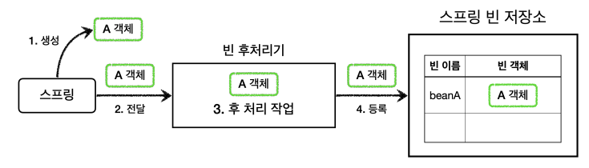
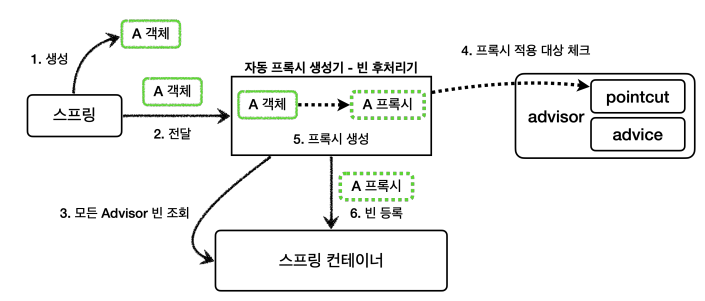
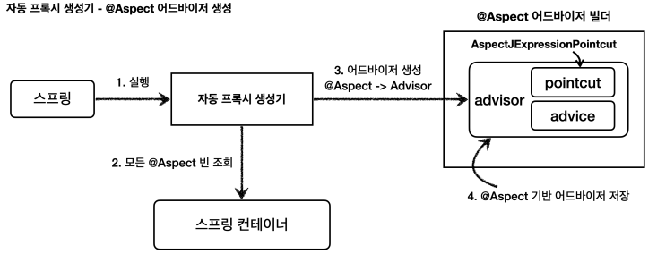

### BeanPostProcessor

스프링이 빈 저장소에 등록할 목적으로 생상한 객체를 `빈 저장소에 등록하기 전에` 조작하고 싶다면 빈 후처리기를 사용하면 된다.




1. `생성` : 스프링 빈 대상이 되는 객체를 생성한다. (@Bean, @ComponentScan)
2. `전달` : 생성된 객체를 빈 저장소에 등록하기 전에 빈 후처리기에 전달
3. `작업` : 빈 후처리기는 전달된 객체를 조작, 변경할 수 있다.
4. `등록` : 빈 후처리기에서 반환된 객체를 빈 저장소에 등록


```java
public interface BeanPostProcessor {
    Object postProcessBeforeInitialization(Object bean, String beanName) throws BeansException {
        return bean;
    }
    
    Object postProcessAfterInitialization(Object bean, String beanName) throws BeansException {
        return bean;
    }
}
```

- `postProcessBeforeInitialization` : 객체 생성 이후 `@PostConstruct` 같은 초기화 발생 이전에 호출된다.
- `postProcessAfterInitialization` : 객체 생성 이후 `@PostConstruct` 초기화 발생 이후에 호출된다.


##### 자동 프록시 생성기




`AnnotationAwareAspectJAutoProxyCreator`에서 스프링 빈에 존재하는 모든 Advisor를 조회하고 pointcut을 이용해서 프록시를 생성한다.

- 해당 클래스 또는 해당 클래스의 메서드가 하나라도 pointcut 조건에 매칭된다면 프록시를 생성한다. -> 하나도 만족하지 못하면 프록시 x


##### Pointcut 사용

1. 프록시 적용 여부 판단
   - 자동 프록시 생성기는 advisor의 pointcut을 사용해서 해당 빈이 프록시를 생성할 필요가 있는지 체크
2. Advice 적용 여부 판단
   - 프록시가 호출되었을 때 pointcut을 확인해서 Advice(부가 기능)을 적용할지 말지 판단한다.
   - 프록시는 Advisor를 가지고 있고, Advisor에서 pointcut을 확인하고, advice를 적용한다.


### @Aspect

```java
@Aspect
public class LogTraceAspect {
    //...
    
    @Around("execution(* hello.proxy.app..*(..))") // pointcut aspectj 표현식
    public Object execute(ProceedingJoinPoint joinPoint) throws Throwable {
		
        // advice 로직 작성
        // joinPoint로 target 호출
    }
}
```

- `@Apsect` : 애노테이션 기반 프록시를 적용할 때 필요하다.
- `@Around("execution(* hello.proxy.app..*(..))")`
  - @Around의 value에 포인트컷 표현식을 넣는다. 표현식은 AspectJ 표현식
  - @Around의 메서드는 Advice가 된다.
- `ProceedingJoinPoint joinPoint` : Advice의 `MethodInvocation invocation`과 비슷하다. 내부에 실제 호출 대상, 전달 인자, 어떤 객체와 메서드가 호출되었는지 정보가 포함되어 있다.
- `joinPoint.proceed()` : 실제 호출 대상(target) 호출


### @Aspect 프록시

자동 프록시 생성기 `AnnotationAwareAspectJAutoProxyCreator`에서 스프링 빈에 등록된 모든 Advisor를 조회하고 프록시를 적용한다고 했다. 여기에 추가로 `@Aspect`를 찾아서 `Advisor`로 만들어준다. 즉, `@Aspect`를 찾아서 `Advisor`로 변환해서 저장한다.




1. `실행` : 자동 프록시 생성기 호출
2. `@Aspect 빈 조회` : 스프링 컨테이너에서 `@Aspect` 애노테이션이 붙은 스프링 빈을 모두 조회
3. `어드바이저 생성` : @Aspect 어드바이저 빌더를 통해서 어드바이저 생성
4. `어드바이저 저장` : 생성한 어드바이저를 @Aspect 어드바이저 빌더 내부에 저장