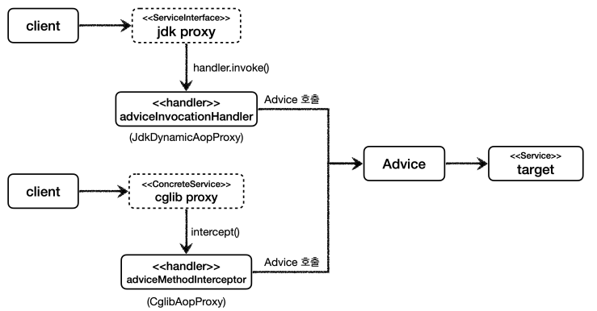
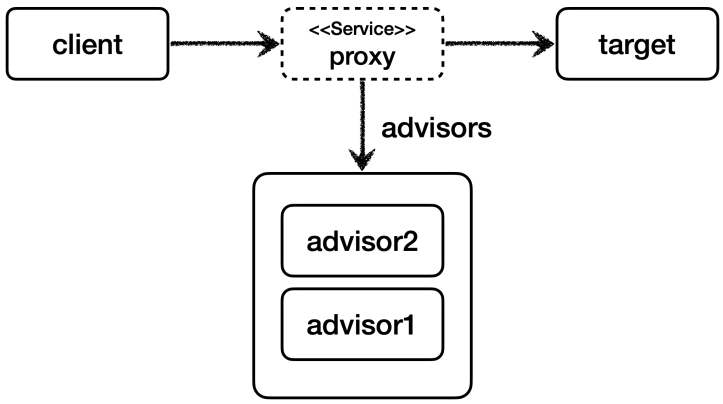

#### 프록시 주요 기능

- 접근 제어
  - 권한에 따른 접근 차단
  - 캐싱
  - 지연로딩
- 부가 기능 추가
  - 원래 서버가 제공하는 기능에 더해서 부가 기능을 수행한다.


#### 데코레이터 패턴 vs 프록시 패턴

두 패턴 모두 프록시를 사용한다. 단, 의도가 다르다.

- `데코레이터 패턴` : 새로운 기능 추가 목적
- `프록시 패턴` : 접근 제어가 목적


#### 인터페이스 기반 프록시 vs 클래스 기반 프록시

- 인터페이스 없이 클래스 기반으로 프록시를 생성할 수 있다.
- 클래스 기반 프록시는 해당 클래스에만 적용할 수 있다. 인터페이스 기반 프록시는 인터페이스만 같으면 모든 곳에 적용할 수 있다.
- 클래스 기반 프록시 제약
  - 부모 클래스 생성자를 호출해야 한다.
  - 클래스 final 키워드가 붙으면 상속이 불가능하다.
  - 메서드에 final 키워드가 붙으면 오버라이딩이 불가능하다.

```java
// 클래스 기반 프록시
public class ConcreteProxy extends OriginConcrete {
    
    private final OriginConcrete target;
    
    public ConcreteProxy(OriginConcrete target) {
        super(null);
        this.target = target;
    }
}

// 인터페이스 기반 프록시
public class InterfaceProxy implements OriginInterface {
    
    private final OriginInterface target;
    
    public InterfaceProxy(OriginInterface target) {
        this.target = target;
    }
}
```


#### 리플렉션

리플렉션 기술을 사용하면 클래스나 메서드의 메타정보를 동적으로 획득하고, 코드도 동적으로 호출할 수 있다.


#### JDK 동적 프록시

프록시 적용 대상만큼 프록시 클래스를 생성하지 않아도 된다. 프록시 객체를 동적으로 런타임 시점에 개발자 대신 생성한다.

**JDK 동적 프록시는 인터페이스를 기반으로 프록시를 동적으로 만들어준다.** 따라서, 인터페이스가 필수이다.

JDK 동적 프록시에 적용할 로직은 `InvocationHandler` 인터페이스를 구현해서 작성하면 된다.


###### 예제 코드

```java
@Test
void dynamicA() {
    AInterface target = new AImpl();
    TimeInvocationHandler handler = new TimeInvocationHandler(target);
    
    // 프록시 생성
    AInterface proxy = (AInterface) Proxy.newProxyInstance(AInterface.class.getClassLoader(), new Class[]{AInterface.class}, handler);
    
    // 프록시 호출
    proxy.call();
    log.info("targetClass={}", target.getClass()); //JdkDynamicProxyTest - targetClass=class hello.proxy.jdkdynamic.code.AImpl
	log.info("proxyClass={}", proxy.getClass()); //JdkDynamicProxyTest - proxyClass=class com.sun.proxy.$Proxy1
}
```


##### JDK 동적 프록시 도입 전 - 직접 프록시 생성


인터페이스 프록시는 각 인터페이스마다 직접 프록시 클래스를 만들어줘야 했다.


##### JDK 동적 프록시 도입 후


프록시 클래스를 하나하나 만들어 줄 필요가 없어졌다.

- InvocationHandler를 구현해서 프록시에 적용할 로직을 작성한다.
- `java.lang.reflect.Proxy` 를 사용해서 프록시를 생성한다. `Proxy.newInstance()`


##### 한계

JDK 동적 프록시는 인터페이스가 필수이다. 인터페이스 없이 클래스만 있는 경우는 JDK 동적 프록시를 사용할 수 없다.


#### CGLIB (Code Generator Library)

- CGLIB는 바이트코드를 조작해서 동적으로 클래스를 생성하는 기술을 제공하는 라이브러리이다.
- CGLIB를 사용하면 인터페이스 없이 구체 클래스만 가지고 동적 프록시를 생성할 수 있다.


##### MethodInterceptor

JDK 동적 프록시의 `InvocationHandler` 처럼, CGLIB는 `MethodInterceptor`를 제공한다.

```java
public interface MethodInterceptor extends Callback {
    Object intercept(Object obj, Method method, Object[] args, MethodProxy proxy) throws Throwable;
}
```

- obj : CGLIB가 적용된 객체
- method : 호출된 메서드
- args : 메서드를 호출하면서 전달된 인수
- proxy : 메서드 호출에 사용


##### 예시 코드

```java
@Test
void cglib() {

    ConcreteService target = new ConcreteService();

    Enhancer enhancer = new Enhancer();
    enhancer.setSuperclass(ConcreteService.class);
    enhancer.setCallback(new TimeMethodInterceptor(target)); //
    ConcreteService proxy = (ConcreteService) enhancer.create();

    log.info("targetClass={}", target.getClass());
    //targetClass=class hello.proxy.common.service.ConcreteService
    log.info("proxyClass={}", proxy.getClass());
    //proxyClass=class hello.proxy.common.service.ConcreteService$$EnhancerByCGLIB$$25d6b0e3

    proxy.call();
}
```


##### 

##### CGLIB 제약

- 클래스 기반 프록시는 상속을 사용하기 때문에 몇가지 제약이 있다.
  - 부모 클래스의 생성자를 체크해야 한다.
  - 클래스에 final 키워드가 붙으면 상속이 불가능하다. -> CGLIB에서는 예외 발생
  - 메서드에 final 키워드가 붙으면 해당 메서드를 오버라이딩 할 수 없다. -> CGLIB에서는 프록시 로직이 동작하지 않는다.


인터페이스가 있을 때와, 없을 때 JDK 동적 프록시, CGLIB 적용을 추상화해서 `ProxyFactory` 기능을 제공한다.


부가 기능을 적용할 때 `InvocationHandler, MethodInterceptor`를 대체하는 `Advice` 도입 -> 개발자는 신경쓰지 않고 Advice만 만들면 된다.


##### Advice 도입

`org.aopalliance.intercept.MethodInterceptor` 를 구현해서 Advice 생성 가능




##### Pointcut

로직이 적용될 조건


##### ProxyFactory 기술 선택 방법

- 대상에 인터페이스가 있으면 : JDK 동적 프록시, 인터페이스 기반 프록시
- 대상에 인터페이스가 없으면 : CGLIB, 구체 클래스 기반 프록시
- `proxyTargetClass=true` : CGLIB, 인터페이스 여부와 상관없이 구체 클래스 기반 프록시

**스프링 부트는 AOP를 적용할 때 기본적으로 `proxyTargetClass=true`로 설정해서 사용한다.**


#### 포인트컷, 어드바이스 어드바이저

- **포인트컷(Pointcut)** : 어디에 부가 기능을 적용할지, 적용하지 않을지 판단하는 필터링 로직, 주로 클래스와 메서드 이름으로 필터링
- **어드바이스(Advice)** : 프록시가 호출하는 부가 기능. 단순히 프록시 로직이라 생각하면 된다.
- **어드바이저(Advisor)** : 하나의 포인트컷과 하나의 어드바이스를 가지고 있는 것


**ProxyFactory는 Advisor가 필수이다. 어디에 어떤 로직을 적용할지 알아야 되기 때문이다. (ProxyFactory -> Advisor -> Pointcut, Advice)**


##### 하나의 프록시, 여러 어드바이저




하나의 프록시 팩토리에 여러 어드바이저를 등록할 수 있다. 이 경우, 등록한 순서대로 실행된다.