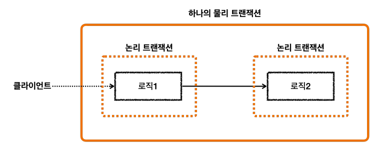
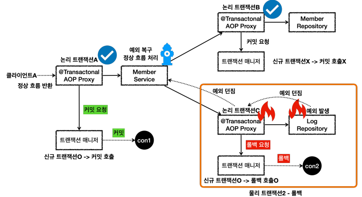
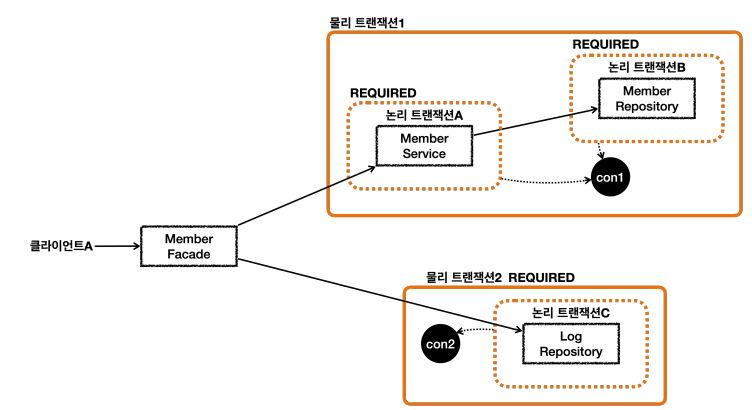

#### 트랜잭션 전파

- `물리 트랜잭션` : 데이터베이스에 실제로 적용되는 트랜잭션
- `논리 트랜잭션` : 트랜잭션 매니저를 통해 트랜잭션을 사용하는 단위

트랜잭션 내부에서 실행되는 다른 트랜잭션들은 하나의 물리 트랜잭션으로 묶인다.

- 모든 논리 트랜잭션이 커밋되어야 물리 트랜잭션이 커밋된다.
- 하나의 논리 트랜잭션이라도 롤백된다면 물리 트랜잭션도 롤백된다.
  - 논리 트랜잭션(**신규 트랜잭션이 아닌 트랜잭션**)이 rollback 된다면 트랜잭션 매니저에 `rollbackOnly = true` 표시를 남긴다.
  - 물리 트랜잭션이 commit 했지만, 논리 트랜잭션이 rollback 한다면 스프링은 `UnexpectedRollbackException` 예외를 던진다.

#### 전파 옵션

##### REQUIRED

- 기본 설정
- 기존 트랜잭션이 있으면 참여하고, 없으면 생성한다.

##### REQUIRES_NEW

- 항상 새로운 트랜잭션을 생성한다. 
- 내부 롤백이 발생해도 새로운 트랜잭션이므로 외부 트랜잭션에 영향을 미치지 않음.
- 데이터베이스에 연결된 connection이 여러 개

##### SUPPORT

- 기존 트랜잭션이 없으면 없는대로 진행하고, 있으면 참여한다.

##### NOT_SUPPORT

- 트랜잭션을 지원하지 않는다.
- 트랜잭션이 있던 없던 트랜잭션 없이 진행한다.

##### MANDATORY

- 의무사항. 기존 트랜잭션이 반드시 있어야 한다.
- 기존 트랜잭션이 없으면 `IllegalTransactionStateException` 예외 발생
- 기존 트랜잭션이 있으면 참여한다.

##### NESTED

- 기존 트랜잭션이 없으면 새로운 트랜잭션을 생성한다.
- 기존 트랜잭션이 있으면 중첩 트랜잭션을 생성
  - 중첩 트랜잭션은 외부 트랜잭션의 영향을 받지만, 중첩 트랜잭션은 외부에 영향을 주지 않음.
  - 중첩 트랜잭션이 롤백 되어도 외부 트랜잭션은 커밋할 수 있다.
  - 외부 트랜잭션이 롤백 되면 중첩 트랜잭션도 롤백 된다.
  - **JPA에서는 사용 불가능**

##### 트랜잭션 전파와 옵션

`isolation`, `timeout`, `readOnly`는 트랜잭션이 **처음 시작될 때만 적용된다.** 즉, 물리 트랜잭션이 시작될 때만 적용.

트랜잭션에 참여하는 경우는 적용되지 않는다.

예를 들어, `REQUIRED` 또는 `REQUIRES_NEW`를 통한 트랜잭션 시작 시점에만 적용된다.

##### 주의!!

###### 기본 Transaction 예외 상황

- transaction_start : 예외 잡아서 정상 처리
  - transaction1 : 정상
  - transaction2 : 예외 발생

`transaction_start`에서 `transaction2`에서 던져진 예외를 처리하여 정상 흐름으로 돌리더라도 **rollback** 된다. (**UnexpectedRollbackException** 발생)

`transaction2`에서 예외가 던져지면 해당 트랜잭션은 rollback 되고, 신규 트랜잭션이 아니므로 트랜잭션 동기화 매니저에 `rollbackOnly=true`가 표시된다. 그 후, `transaction_start`에서 커밋하는 시점에 `rollbackOnly`를 확인하고 롤백한다. 

따라서, 예외를 잡아서 처리한다고 트랜잭션 전파 문제가 해결되는 것이 아니다!

###### REQUIRES_NEW 사용

- transaction_start : 예외 잡아서 정상 처리
  - transaction1 : 정상
  - transaction2 (REQUIRES_NEW) : 예외 발생

`transaction2`는 신규 트랜잭션이다. 따라서, 예외가 발생해도 트랜잭션 매니저에 **rollbackOnly 표시를 남기지 않고**, 예외를 던지고 해당 트랜잭션은 **롤백**된다.

1. `transaction_start`에서 예외 처리 : **rollbackOnly** 표시가 없고, 외부 트랜잭션 밖으로 던져지는 예외가 없으므로 **commit 가능**
2. `transaction_start`에서 예외 처리 x : 외부 트랜잭션에서 예외가 발생하므로 트랜잭션 **롤백**

#### 정리

- 논리 트랜잭션이 하나라도 롤백되면 관련된 물리 트랜잭션은 모두 롤백된다.
- 이 문제를 해결하려면 `REQUIRES_NEW`를 사용해서 트랜잭션을 분리해야 한다.
- `REQUIRES_NEW`를 사용하면 DB 커넥션을 동시에 여러 개 사용하게 된다. 성능이 중요한 곳에선 이런 부분을 주의해야 한다.

- `REQUIRES_NEW`를 사용하지 않고 문제를 해결할 수 있는 단순한 방법이 있다면, 그 방법을 선택하는 것이 더 좋다.

