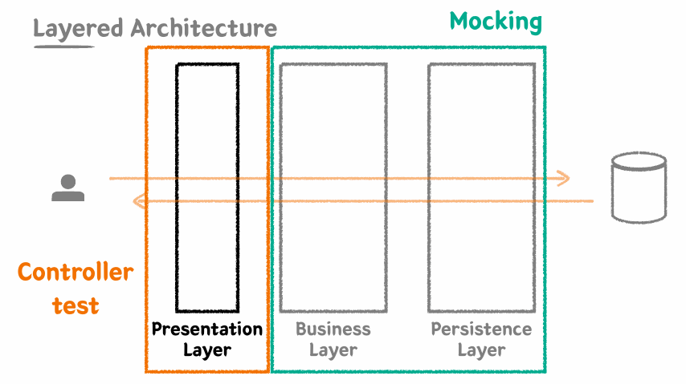

### Persistence Layer

- Data Access의 역할
- 비즈니스 가공로직이 포함되어서는 안된다. Data에 대한 CRUD에만 집중한 레이어

```java
@DisplayName("원하는 판매상태를 가진 상품들을 조회한다.")
@Test
void findBySellingStatusIn() throws Exception {

    //given
    Product product1 = createProduct("001", HANDMADE, SELLING, "아메리카노", 4000);
    Product product2 = createProduct("002", HANDMADE, HOLD, "카페라떼", 4500);
    Product product3 = createProduct("003", HANDMADE, STOP_SELLING, "팥빙수", 7000);

    productRepository.saveAll(List.of(product1, product2, product3));

    //when
    List<Product> products = productRepository.findAllBySellingStatusIn(List.of(SELLING, HOLD));

    //then
    assertThat(products).hasSize(2)
            .extracting("productNumber", "name", "sellingStatus")
            .containsExactlyInAnyOrder(
                    tuple("001", "아메리카노", SELLING),
                    tuple("002", "카페라떼", HOLD)
            );
}
```


### Business Layer

- 비즈니스 로직을 구현하는 역할
- Persistence Layer와 상호작용을 통해 비즈니스 로직을 전개시킨다.
- **트랜잭션**을 보장해야 한다.

```java
@DisplayName("주문번호 리스트를 받아 주문을 생성한다.")
@Test
void createOrder() throws Exception {
    //given
    LocalDateTime registeredDateTime = LocalDateTime.now();

    Product product1 = createProduct(HANDMADE, "001", 1000);
    Product product2 = createProduct(HANDMADE, "002", 3000);
    Product product3 = createProduct(HANDMADE, "003", 5000);
    productRepository.saveAll(List.of(product1, product2, product3));

    OrderCreateServiceRequest request = OrderCreateServiceRequest.builder()
            .productNumbers(List.of("001", "002"))
            .build();

    //when
    OrderResponse orderResponse = orderService.createOrder(request, registeredDateTime);

    //then
    assertThat(orderResponse.getId()).isNotNull();
    assertThat(orderResponse)
            .extracting("registeredDateTime", "totalPrice")
            .contains(registeredDateTime, 4000);
    assertThat(orderResponse.getProducts()).hasSize(2)
            .extracting("productNumber", "price")
            .containsExactlyInAnyOrder(
                    tuple("001", 1000),
                    tuple("002", 3000)
            );
}
```


### Presentation Layer

- 외부 세계의 요청을 가장 먼저 받는 계층
- 파라미터에 대한 최소한의 검증을 수행한다.


#### MockMvc

- Mock 객체를 사용해 스프링 MVC 동작을 재현할 수 있는 테스트 프레임워크



##### GET 요청

```java
@DisplayName("판매 상품을 조회한다.")
@Test
void getSellingProducts() throws Exception {
    //given
    List<ProductResponse> result = List.of();
    when(productService.getSellingProducts()).thenReturn(result);

    //when
    //then
    mockMvc.perform(get("/api/v1/products/selling"))
            .andDo(print())
            .andExpect(status().isOk())
            .andExpect(jsonPath("$.code").value("200"))
            .andExpect(jsonPath("$.status").value("OK"))
            .andExpect(jsonPath("$.message").value("OK"))
            .andExpect(jsonPath("$.data").isArray());
}
```


##### POST 요청

```java
@DisplayName("신규 상품을 등록한다.")
@Test
void createProduct() throws Exception {

    //given
    ProductCreateRequest request = ProductCreateRequest.builder()
            .type(HANDMADE)
            .sellingStatus(SELLING)
            .name("아메리카노")
            .price(4000)
            .build();

    //when
    //then
    mockMvc.perform(post("/api/v1/products/new")
                    .content(mapper.writeValueAsString(request))
                    .contentType(MediaType.APPLICATION_JSON)
            )
            .andDo(print())
            .andExpect(status().isOk());
}
```