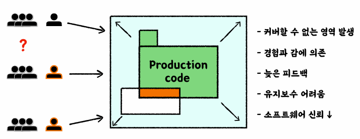
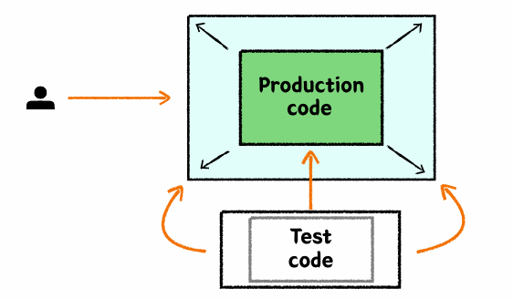
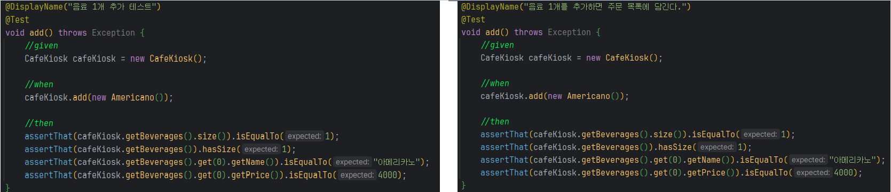

### 테스트는 왜 필요한가?

##### 사람이 직접 테스트

프로덕션 코드가 작성됨에 따라 **사람이 직접 테스트** 해야 할 영역이 증가한다. 

1. 이 때, 기존에 검증을 마친 코드를 수정해서 새로운 기능을 개발한다면 기존에 진행했던 테스트를 다시 진행하는 등 **커버할 수 없는 영역**이 발생한다.

2. 테스트를 진행했던 사람의 경험과 감에 의존하게 된다.
3. 테스트하는 사람의 일정에 맞춰야 하기 때문에 피드백이 늦을 수 있다. (개발 사이클 지연)
4. 유지보수 또한 어려워진다.
5. 결과적으로 소프트웨어의 신뢰도가 낮아진다. `언제 터질지 모르는 시한폭탄`

### 테스트 도입으로 얻고자 하는 것

- 빠른 피드백
- 자동화
- 안정감

#### 테스트 코드를 작성하지 않는다면

- 변화가 생기는 매순간마다 모든 케이스를 고려해야 한다.
- 변화가 생기는 매순간마다 모든 팀원이 동일한 고민을 해야한다.
- 빠르게 변화하는 소프트웨어의 안정성을 보장할 수 없다.

#### 테스트 코드가 병목이된다면

- 프로덕션 코드의 안정성을 제공하기 힘들어진다.
- 테스트 코드 자체가 유지보수하기 어려운, 새로운 짐이 된다.
- 잘못된 검증이 이루어질 가능성이 생긴다.

#### 올바른 테스트 코드는

- 자동화 테스트로 비교적 빠른 시간 안에 버그를 발견할 수 있고, 수동 테스트에 드는 비용을 크게 절약할 수 있다.
- 소프트웨어의 빠른 변화를 지원한다.
- 팀원들의 집단 지성을 팀 차원의 이익으로 승격시킨다.
- **가까이 보면 느리지만, 멀리 보면 가장 빠르다.**

### 테스트는 [문서]다.

- 프로덕션 기능을 설명하는 테스트 코드 문서
- 다양한 테스트 케이스를 통해 프로덕션 코드를 이해하는 시각과 관점을 보완
- 어느 한 사람이 과거에 경험했던 고민의 결과물을 팀 차원으로 승격시켜 모두의 자산으로 공유할 수 있다.

#### DisplayName을 섬세하게 작성하자.

`음료 1개 추가 테스트` -> `음료 1개를 추가하면 주문 목록에 담긴다.` 로 DisplayName을 구체적으로 작성한 것이 코드를 처음 보는 사람도 이해하기 쉽다.

- 코드를 보는 사람이 추가적인 생각, 고민을 하지 않도록 하는 것이 좋은 테스트 -> 직관적

`특정 시간 이전에 주문을 생성하면 실패한다.` -> `영업 시작 시간 이전에는 주문을 생성할 수 없다.` 로 변경했다.

- 도메인 용어를 사용해 한층 추상화된 내용을 담자.
  - 메서드 자체의 관점보다 **도메인 정책** 관점으로!
  - `특정 시간` -> `영업 시작 시간`
- 테스트의 현상을 중점으로 기술하지 말 것
  - `실패한다.` -> `생성할 수 없다.`
