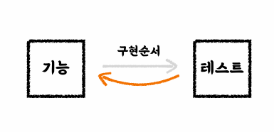
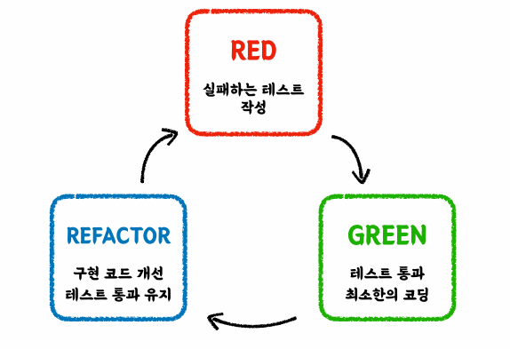

### 단위 테스트란?

작은 코드 단위`(클래스, 메서드)`를 **독립적**으로 검증하는 테스트

검증 속도가 빠르고, 안정적이다.

`tools` : Junit, AssertJ


### 테스트 케이스 세분화하기

- 해피 케이스
- 예외 케이스

`경계값` 테스트 : 범위(이상, 이하, 초과, 미만), 구간, 날짜 등

#### 해피 케이스 예제

```java
@Test	
void addSeveralBeverages() throws Exception {
    //given
    CafeKiosk cafeKiosk = new CafeKiosk();
    Americano americano = new Americano();
    //when
    cafeKiosk.add(americano, 2);

    //then
    assertThat(cafeKiosk.getBeverages()).hasSize(2);
    assertThat(cafeKiosk.getBeverages().get(0)).isEqualTo(americano);
    assertThat(cafeKiosk.getBeverages().get(1)).isEqualTo(americano);
}
```

#### 예외 케이스 예제

```java
@Test
void addZeroBeverages() throws Exception {
    //given
    CafeKiosk cafeKiosk = new CafeKiosk();
    Americano americano = new Americano();
    //when
    //then
    assertThatThrownBy(() -> cafeKiosk.add(americano, 0))
            .isInstanceOf(IllegalArgumentException.class)
            .hasMessage("음료는 1잔 이상 주문하실 수 있습니다.");
}
```


### 테스트하기 어려운 영역을 분리하기


#### 기존 코드

##### CafeKiosk.class

```java
@Getter
public class CafeKiosk {
    
    private static final String SHOP_OPEN_TIME = LocalTime.of(10,0);
    private static final String SHOP_END_TIME = LocalTime.of(22,0);
    
    
    // ...
    
    public Order createOrder() {
        LocalDateTime currentDateTime = LocalDateTime.now();
        LocalTime currentTime = currentDateTime.toLocalTime();
        if (currentTime.isBefore(SHOP_OPEN_TIME) || currentTime.isAfter(SHOP_END_TIME)) {
            throw new IllegalArgumentException("주문 시간이 아닙니다. 관리자에게 문의하세요.")
        }
        
        return new Order(currentDateTime, beverages);
    }
}
```

##### createOrder test

```java
@Test
void createOrder() {
    CafeKiosk cafeKiosk = new CafeKiosk();
    Americano americano = new Americano();
    
    cafeKiosk.add(americano);
    
	Order order = cafeKiosk.createOrder();
    
    assertThat(order.getBeverages()).hasSize(1);
    assertThat(order.getBeverages().get(0).getName()).isEqualTo("아메리카노");
}
```

currentDateTime은 현재 시스템 시간을 가져온다. 따라서 `createOrder()` 테스트가 진행되는 시간에 따라 테스트가 통과하거나, 실패한다. 즉, 일관성 없는 테스트가 작성된다.

여기서 문제는 LocalDateTime이므로 이 값을 제어할 수 있다면 문제를 해결할 수 있다.


#### 수정 코드

```java
@Getter
public class CafeKiosk {
    
    private static final String SHOP_OPEN_TIME = LocalTime.of(10,0);
    private static final String SHOP_END_TIME = LocalTime.of(22,0);
    
    
    // ...
    
    public Order createOrder(LocalDateTime currentDateTime) {
        LocalTime currentTime = currentDateTime.toLocalTime();
        if (currentTime.isBefore(SHOP_OPEN_TIME) || currentTime.isAfter(SHOP_END_TIME)) {
            throw new IllegalArgumentException("주문 시간이 아닙니다. 관리자에게 문의하세요.")
        }
        
        return new Order(currentDateTime, beverages);
    }
}
```

```java
    @Test
    void createOrderWithCurrentDateTime() throws Exception {
        //given
        CafeKiosk cafeKiosk = new CafeKiosk();
        Americano americano = new Americano();

        //when
        cafeKiosk.add(americano);
        Order order = cafeKiosk.createOrder(LocalDateTime.of(2025, 1, 22, 10, 0));

        //then
        assertThat(cafeKiosk.getBeverages()).hasSize(1);
        assertThat(cafeKiosk.getBeverages().get(0).getName()).isEqualTo("아메리카노");
    }

    @Test
    void createOrderOutsideOpenTime() throws Exception {
        //given
        CafeKiosk cafeKiosk = new CafeKiosk();
        Americano americano = new Americano();

        //when
        cafeKiosk.add(americano);

        //then
        assertThatThrownBy(() -> cafeKiosk.createOrder(LocalDateTime.of(2025, 1, 22, 9, 59)))
                .isInstanceOf(IllegalArgumentException.class)
                .hasMessage("주문 시간이 아닙니다. 관리자에게 문의하세요.");
    }
```

제어할 수 없던 LocalDateTime 값을 메서드의 파라미터로 주입하는 방식으로 변경하면 테스트 코드에서도 이 값을 제어할 수 있다. 따라서, 경계값 테스트를 진행할 수 있고 해피, 예외 케이스 모두 작성할 수 있다.

**테스트하기 어려운 영역을 구분하고 외부로 분리하자!**


### 테스트하기 어려운 영역

- #### 관측할 때마다 다른 값에 의존하는 코드

  - 현재 날짜/시간, 랜덤 값, 전역 변수/함수, 사용자 입력 등

- #### 외부 세계에 영향을 주는 코드

  - 표준 출력, 메시지 발송, 데이터베이스에 기록하기 등


### TDD (Test Driven Development)

프로덕션 코드보다 테스트 코드를 먼저 작성하여 테스트가 구현 과정을 주도하도록 하는 방법론





1. `RED` : 프로덕션 코드가 없는 상태에서 우선 테스트 코드 작성
2. `GREEN` : 빠른 시간 내에 테스트를 통과할 수 있는 프로덕션 코드 작성
3. `REFACTOR` : 테스트 통과(초록불)을 유지하면서 프로덕션 코드 리팩토링


#### 선 기능 구현, 후 테스트 작성

- 테스트 자체의 누락 가능성이 있다.
- 특정 테스트 케이스만 검증할 가능성이 있다. (해피케이스만)
- 잘못된 구현을 다소 늦게 발견할 가능성이 있다.


#### 선 테스트 작성, 후 기능 구현

- 복잡도가 낮은, 테스트 가능한 코드로 구현할 수 있게 한다.
- 쉽게 발견하기 어려운 엣지케이스를 놓치지 않게 해준다.
- 구현에 대한 빠른 피드백을 받을 수 있다.
- 과감한 리팩토링이 가능해진다.